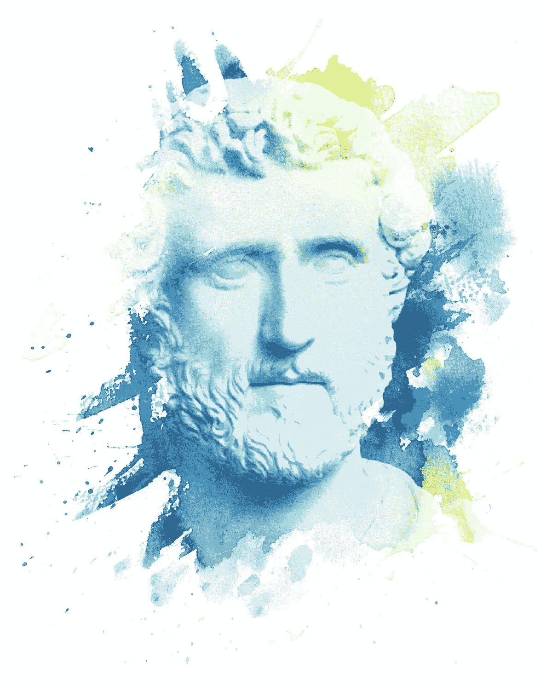

# 马库斯·奥勒留论斯多葛主义和领导力

> 原文：<https://medium.com/swlh/marcus-aurelius-on-stoicism-and-leadership-9bcd3854834f>

## 马可仕从安东尼·庇护皇帝身上学到的五条斯多葛学派的经验

罗马皇帝马可·奥勒留是古代斯多葛派哲学最著名的支持者。他也是欧洲历史上最有权力的领导人之一，在罗马帝国权力最大的时候，他在 39 岁时掌控了罗马帝国。