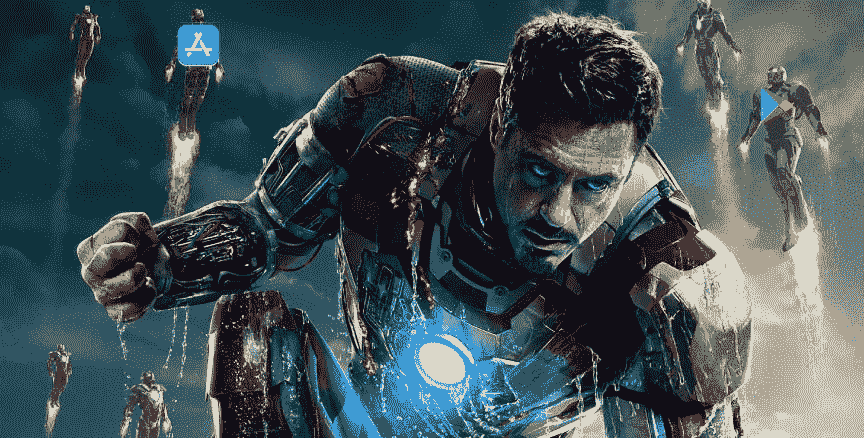
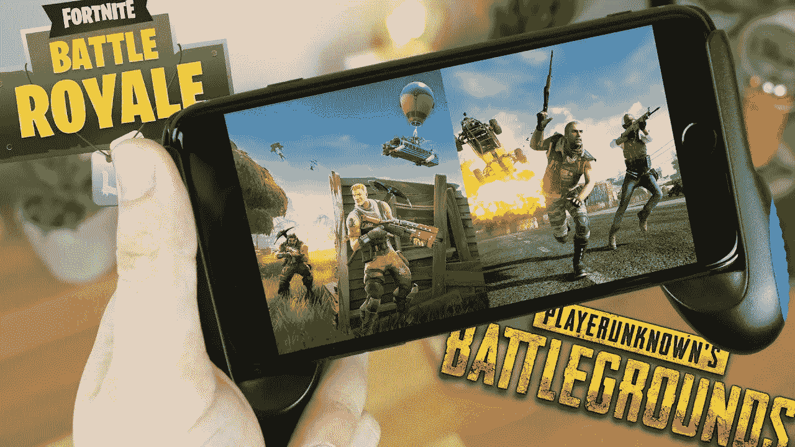
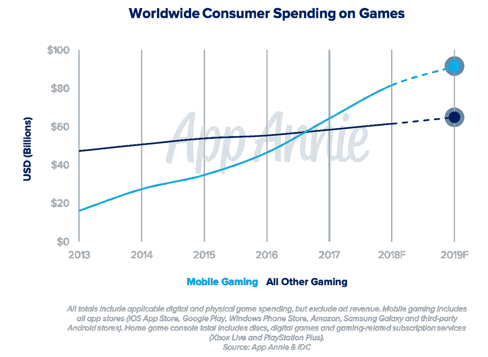
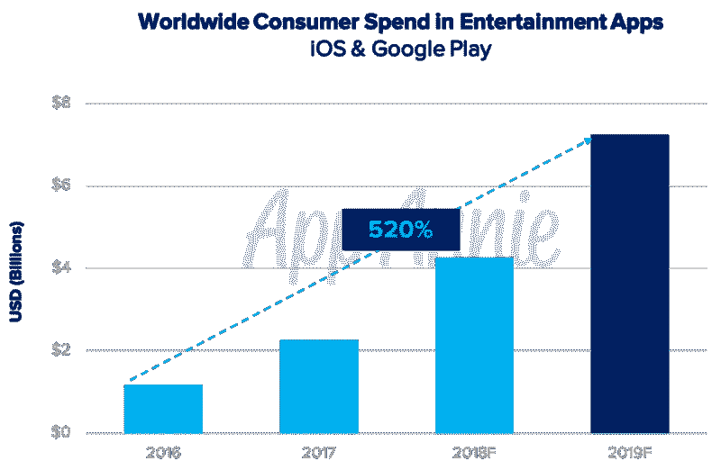
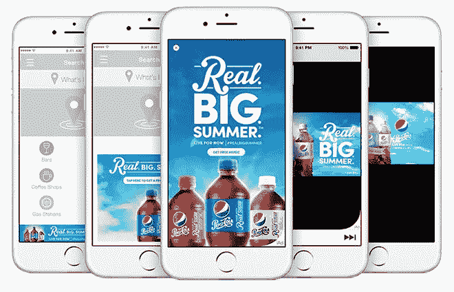
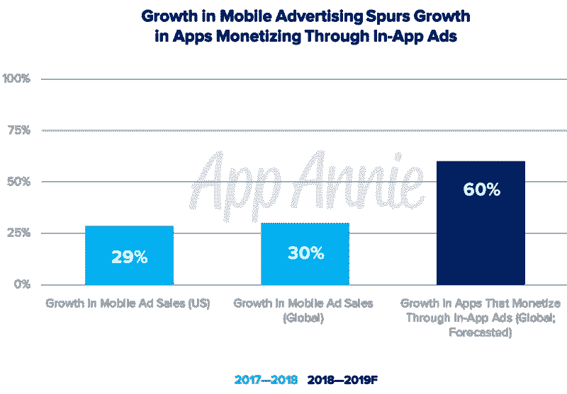
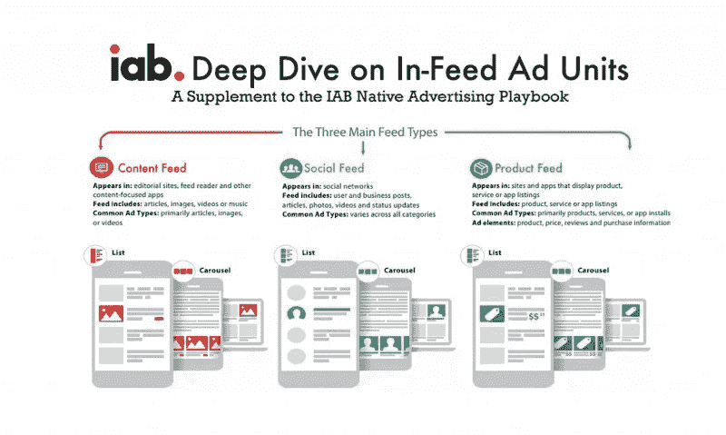

# 推动 2019 年移动应用趋势的市场

> 原文：<https://medium.com/swlh/market-moving-mobile-app-trends-in-2019-4a56723d15ca>

## 你的移动应用业务是否紧跟市场趋势？随着这 4 个市场趋势在 2019 年将应用收入推向新的高度，跟随资金，否则将被落在后面。

2007 年，史蒂夫·乔布斯走上台，介绍了下一代移动设备。快进到 2019 年，移动应用市场已经迅速滚雪球成为现在的****每年 122 亿美元的雪人。****

**可以说，了解最新的移动市场趋势有助于你跟随金钱。在不断变化的目标市场上提供一条指导线，并在你的箭筒中放上额外的箭，以捕捉新客户并保持你现有的基础。**

**所有平台最近的 2019 年移动应用统计数据不仅强调了我们已经走了多远，还帮助描绘了我们将走向何方的生动画面，以及我们在不太遥远的未来都可能接受的移动应用趋势，如果我们还没有接受的话。**

# **1.全球应用商店消费者支出将超过 1200 亿美元**

**[根据另一项最新研究](https://www.appannie.com/en/insights/market-data/2019-in-mobile-5-things-to-know/)，预计 2019 年 App Store 消费者支出将超过 1220 亿美元。客观来看，这大约是主要故事片全球票房市场的两倍。**

****

**Photo: Marvel Comics**

**客观来看，《复仇者联盟 4：终局之战》将于 2019 年 4 月上映，它很可能是今年票房最高的电影之一。全世界数百万人将涌向影院，预计在几周内全球将赚得 20 亿美元。**

**好莱坞将不得不这样做 61 次，以匹配人们今年在应用商店的消费金额。显然，移动消费的便利正帮助资金以前所未有的速度从我们数字化管理的账户中流出，但为什么 App Store 的支出会大幅增长呢？**

****重复的应用内订阅**是造成这种情况的主要原因，因为人们不再一次性购买，而是选择一种计划，这种计划总是允许他们访问他们想要的应用中最新和“最好”的功能。在“游戏”应用类别之外，消费者支出预计也将有令人印象深刻的 2 倍增长率。**

**苹果最近宣布，他们将在 2019 年春季推出 [**新的自动更新订阅功能**](https://developer.apple.com/app-store-connect/whats-new/?id=02222019) ，以提高转化率和恢复留存率。App Store 发行商将很快有机会通过“新优惠”的方式推广他们的订阅套餐。拥有自动续费订阅的应用程序将能够以折扣价向现有客户提供升级，或者向取消订阅的客户提供特别优惠。**

**总的来说，这些新的订购优惠将是**赢回已经取消订购的用户的好方法，同时也是以特价升级到更高等级的可行机会**。即使客户已经完成了某种介绍性报价，他们也可以选择接受报价。**

**免费客户还可以在您选择的特定时间段内访问您的订阅。例如，您可以为订阅提供 30 天的试用期，标准续订价格为每月 4.99 美元。“随用随付”客户还可以为特定持续时间内的每个计费周期支付促销价格。您可以提供为期三个月的每月 1.99 美元，然后是每月 9.99 美元的标准续订价格。“预付”客户可以在订购的前六个月支付一次性促销价格(例如 9.99 美元)，然后转换为每年 39.99 美元的标准续订价格。**

# **2.移动游戏市场份额将增长至 60%**

****

**Fortnite Battle Royal support full cross play with iOS, Android, X-Box One, PS4, PC, and Mac.**

**随着手机技术规格的不断提高，2019 年的游戏将不再专注于平台，而是更加互联。因此，移动游戏将获得约 60%的全球视频游戏市场份额，这在很大程度上是由休闲游戏用户的拥抱推动的(比如那些在地铁线上无聊透顶的人试图粉碎他们的个人糖果粉碎最佳)。总而言之，游戏简单的超休闲游戏将在 2019 年推动下载和采用的增长，抓住很大一部分观众，他们可能甚至不会从传统上把自己视为“游戏玩家”。**

**这在很大程度上是由移动多人游戏机制的进步以及跨平台游戏的重大飞跃推动的。这意味着 iOS 游戏玩家可以与 PS4、PC、Mac、任天堂 Switch、Xbox One 和 Android 上的游戏玩家一起玩堡垒之夜。在原始受欢迎程度方面，移动游戏也有望超过主机游戏，在全球市场上释放出比以往更多的内啡肽，其中一个平台比另一个平台拥有更多的市场份额。**

****

**其中最大的贡献者之一预计是“哈利波特:巫师单元”，这是 Niantic 即将发布的版本。专家们已经同意，消费者支出将在 30 天左右达到 1 亿美元。举个例子，这大约是上一款手机游戏《口袋妖怪 GO》的两倍。5G 和更长电池寿命推进移动游戏的传言在这一点上听起来很有希望，但尚未进入市场。**

# **3.用户每小时会花 10 分钟在移动设备上观看流媒体视频**

****

**每小时大约有 10 分钟的媒体消费时间是 A)在移动设备上，B)使用某种流媒体平台。**

**现在，平均每个人每天花在媒体上的时间约为 7.5 小时，这是一个完整的工作日！自 2016 年以来，到今年年底，仅花在视频流媒体应用上的总时间就将增长 110%。全球消费者在各类娱乐相关应用上的支出将增长 520%。**

****

**Source: [AppAnnie & IDC](https://www.appannie.com/en/go/state-of-mobile-2019/)**

**有趣的是，正是短格式的应用程序推动了这种增长。在美国十大视频流媒体应用中，流媒体服务 YouTube 占了用户每五分钟花费的近四分钟。社交媒体上的短格式内容类型是 Snapchat 和 Instagram 等应用程序也在推动这一趋势。**

# **4.出版商将制作 60%以上的带有应用内广告的应用，占全球 2500 亿美元数字广告支出的 62%**

****

**随着数字广告市场已经发展成为一个价值 2500 亿美元的庞大产业，移动应用开发商继续利用机会将他们的内容货币化——即使这些内容从技术上来说一开始就是“免费的”。这让我们看到了 2019 年需要关注的最后一个主要移动应用趋势:将有超过 60%的应用通过应用内广告赚钱。**

****

**Source: [AppAnnie & IDC](https://www.appannie.com/en/go/state-of-mobile-2019/)**

**这适用于新兴的爱好者应用程序，如[职业钓鱼应用程序](http://proanglerapp.com)以及游戏应用程序，因为这两类应用程序的提供商通过不断发展的广告网络采用了更强大的目标和测试策略。请记住，62%的市场份额(1550 亿美元)正被切割成许多类型的创意。 [IAB](https://www.iab.com) 有一个基于内容、社交和产品应用的广告类型的信息图。**

****

**Source: [IAB](https://www.iab.com)**

**在我们不断努力与消费者保持联系的过程中，你必须投入时间跟上潮流，否则就会在高增长、高速度的移动应用市场中落后。**

****

## **这篇文章发表在[《创业](https://medium.com/swlh)》上，这是 Medium 最大的创业刊物，有+437，678 人关注。**

## **在这里订阅接收[我们的头条新闻](https://growthsupply.com/the-startup-newsletter/)。**

****