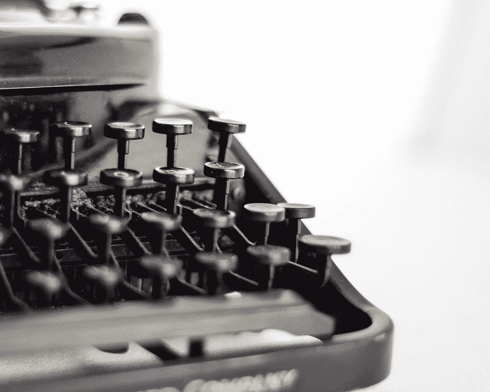

# 自我出版作者的营销

> 原文：<https://medium.com/swlh/marketing-for-self-published-authors-9ae0cf1a39bd>

Photo by [Debby Hudson](https://unsplash.com/@dhudson_creative?utm_source=medium&utm_medium=referral) on [Unsplash](https://unsplash.com?utm_source=medium&utm_medium=referral)

人们常说，每个人都有一本好书，感谢亚马逊、Lulu 和 Smashwords 等数字出版平台，写作、出版和试图向购书公众出售你的作品从未如此容易。

卖书不容易。事实上，作为一名[出版作者](https://amzn.to/2OO5DR5)(与传统出版商和自助出版合作过)，我经常告诉…