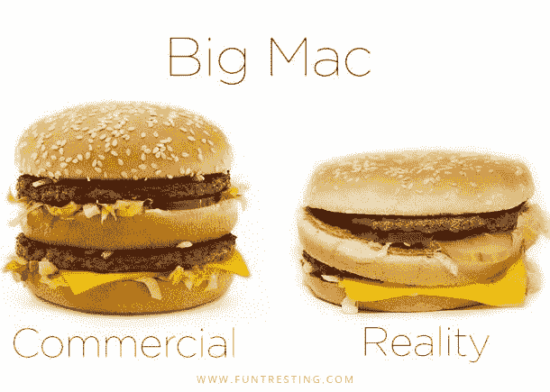
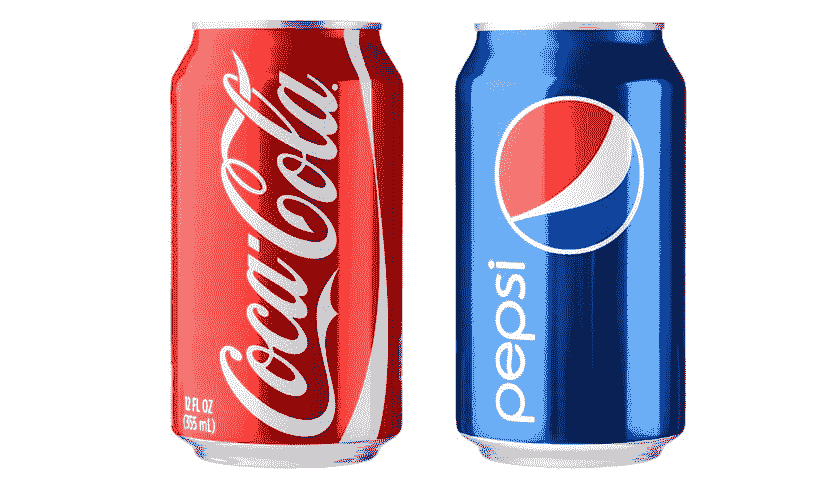
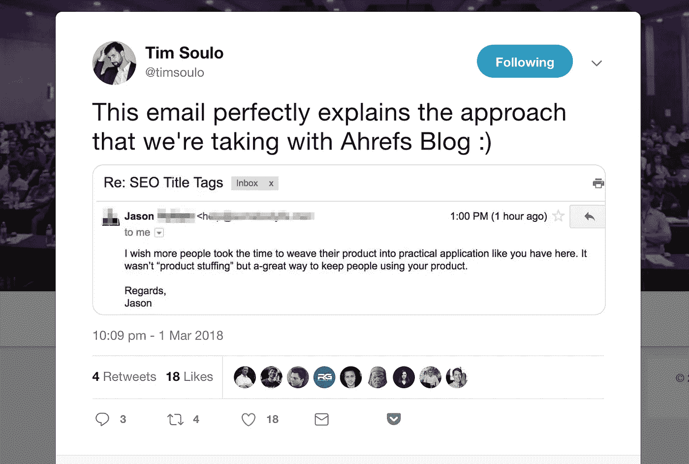
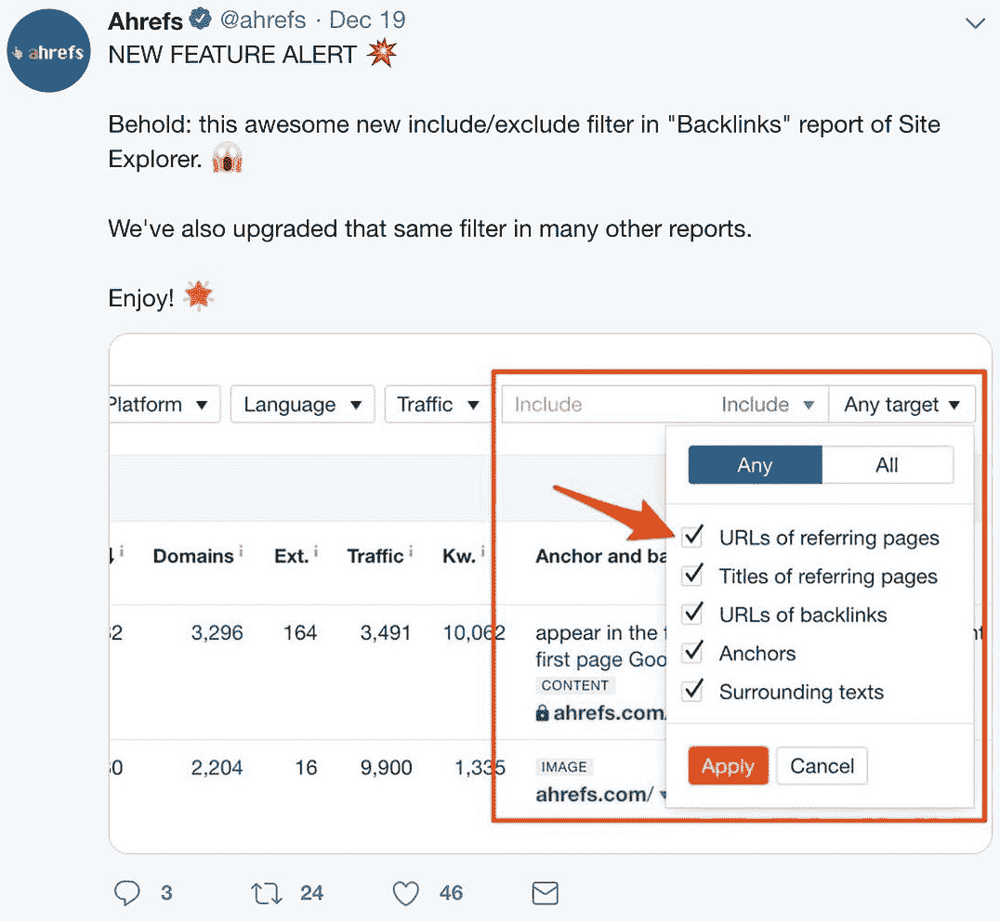
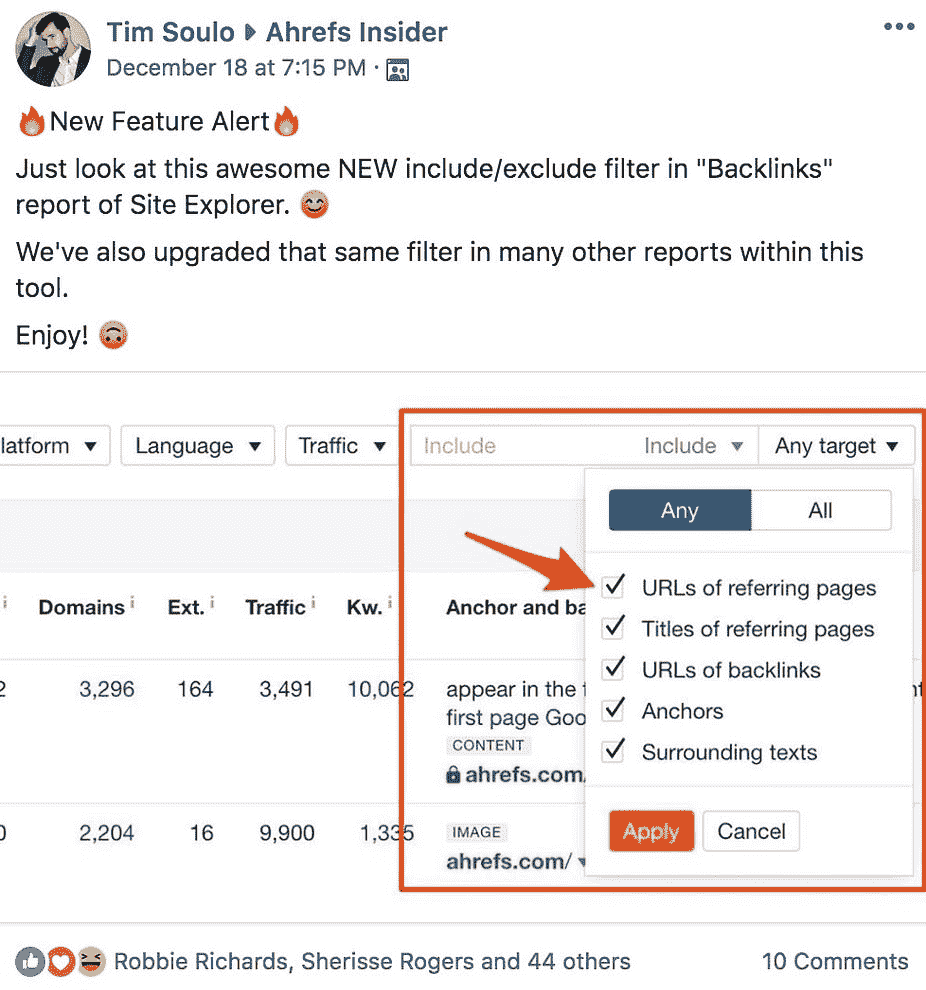

# 当你与一个优秀的产品合作时，市场营销并不困难

> 原文：<https://medium.com/swlh/marketing-isnt-really-that-hard-ebd3cfb8e8a7>

你如何引起别人的注意？

传统的广告公司建议创造华而不实的广告活动。数字机构建议赠送免费的东西。

《赫芬顿邮报》撰稿人[艾伦·伯特建议](https://www.huffingtonpost.com/allen-burt/the-3-secrets-to-building-a-brand-purpose-that-millennials-trust_b_8982154.html)创造一个品牌目标——因为千禧一代喜欢这种东西。

显然，这类问题没有正确的答案*。但是我忍不住不同意我听到的很多东西。*

在我长达十年的职业生涯中，我参与了数百次与商界领袖的对话。我目睹了他们中的许多人过度思考我们的开场问题…很多。

很长一段时间，我也认为营销很难。我认为成功的关键是一些我还没有发现的策略。

于是，我付给所谓的专家几千块钱，试图弥合差距。有时，我学到了有价值的技巧；其他人，我希望我把钱花在一副新耳机上。

直到我见到 Ahrefs 的创始人兼首席执行官 Dmitry Gerasimenko，我才意识到我做错了什么。

营销并不难——我让它变得很难。

以下是我在 Ahrefs 工作时学到的三个“营销秘密”，Ahrefs 是一个由大数据驱动的 SEO 工具集。

# **1。你的产品就是你的营销。**

最近，YouTuber 马克斯·布朗利[问埃隆马斯克](https://www.youtube.com/watch?v=MevKTPN4ozw)除了特斯拉产品，他是如何让人们对特斯拉感到兴奋的。

有趣的是，马斯克没有回答这个问题，因为它有缺陷——产品*就是答案*:

> 马斯克说:“关键是要有一款人们喜欢的产品。“如果你只是喜欢某样东西，而且还不错，你就不会那么在意了。但如果你喜欢什么，你就会说出来。”

人们购买特斯拉的汽车是因为它们与众不同——没有其他汽车能在 2.3 秒内从 0 加速到 60 英里/小时。

他们也非常喜欢汽车，他们情不自禁地在网上告诉同事、朋友、家人和陌生人。

狂热的基础甚至催生了尚未生产的车型的等候名单。这就是为什么该公司不需要在广告或代言上花一分钱。

特斯拉是“[产品第一公司的终极范例。](/ahrefs-marketing/let-your-customers-do-the-work-7a40f62845dc)“与“市场营销第一的公司”不同，产品第一的组织优先在工程、产品设计和 UX 方面投入资源。

显然，这个策略对特斯拉来说非常有效。但是它有益于较小的组织吗？

是的，我们白手起家的 SaaS 也经历了口碑相传的成功。Ahrefs 已经经历了相当快速和持续的增长(仅在过去 3 年就达到了约 60 的年增长率)[，同时忽略了许多传统的营销策略](/swlh/how-we-achieve-65-yoy-growth-by-ignoring-conventional-startup-advice-24a3eef619c1)。

德米特里创建了 [Ahrefs](https://ahrefs.com) ，因为这个行业中没有其他人在做他设想的可能的事情。因此，我们的 SEO 工具包现在拥有许多我们的竞争对手难以复制的高度独特的功能，以及仅次于 Google 的第二好的网络爬虫。

迪米特里不仅优先考虑产品开发，还禁止著名的营销伎俩。

这意味着像这样用免费赠品引诱人们发送电子邮件列表，以及在 Adwords 中押注竞争对手关键词的策略是禁止的。为什么？

1.  他不相信欺骗别人来得到你想要的，而且
2.  他更喜欢投资资源来加强我们的 SEO 工具的技术基础——考虑到他在硬件和技术方面的背景，这并不奇怪。

Dimitry 没有将运行 A/B 测试或开发自动化线索培育序列的任务分派给团队成员，而是优先维护行业最佳的数据和功能。

因此，我们的核心策略是为潜在客户提供优于他们以前尝试过的任何东西的东西。

这就引出了我的下一课…

# **2。营销不能带坏产品**

> 你可以一时愚弄所有的人，也可以永远愚弄一些人，但你不可能永远愚弄所有的人—亚伯拉罕·林肯

在我的职业生涯中，我第一次推销一种有用的、极具竞争力的、很难复制的产品。

这一变化让我的工作轻松了 10 倍，真是太疯狂了。老实说，我很难把我做的事情称为营销。

我的大部分时间包括 a)确保我们的产品到达正确的受众，b)解释他们可以用它做的所有令人敬畏的事情。

许多公司销售平庸的产品，同时期望销售和营销“施展魔法”

> 翻译:加班试验新的战术、软件和心理技巧。

与此同时，每个人都忽略了房间里的大象——他们真的不知道是什么让他们从竞争中脱颖而出。

通常，他们卖的东西没有什么特别独特的地方。而*正是营销变得困难的原因。*

*以麦当劳为例。该公司花费数十亿美元进行广告宣传，以使他们的汉堡包看起来更好。*

*但这是一种错觉——麦当劳出售的是与其他快餐供应商质量相当的便利商品。*

*相比之下，特斯拉通过允许潜在客户试驾汽车，将他们转化为客户。他们不需要制造假象，因为他们产品的真实性已经很棒了。*

*因此，有人可能会说这不涉及“营销”。*

*在他们的书 [*营销战*](https://www.amazon.com/Marketing-Warfare-Ries-Jack-Trout/dp/B007YIUE0C) 中，作者杰克·特劳特和阿尔赖兹讨论了在当今拥挤的市场中持续产品创新对企业的重要性。*

*这本书最有趣的故事之一是“新可乐”的故事。20 世纪 80 年代初，可口可乐发现自己的顾客越来越多地流失到竞争对手百事可乐手中。*

**

*在进行了一系列盲测后，该公司了解到大多数参与者实际上更喜欢百事可乐的甜味。*

*事实上，如果不是可口可乐的大量独家供应商合同，百事可乐的销量会以压倒性优势超过他们。作为回应，该公司用玉米糖浆修改了健怡可乐的配方，创造了一种更甜的替代品，被称为“新可乐”*

*在进行了额外的盲测后，可口可乐确信大多数消费者会更喜欢新配方——而不是普通的可口可乐和百事可乐。*

*不幸的是，该公司的高管低估了他们的忠实客户对原始配方的怀旧情绪，该项目被放弃了。尽管有“沉没成本”，可口可乐仍继续基于客户研究进行创新。*

*在接下来的几年里，该公司发布了几款成功的产品，如*可口可乐零度*。今天，该公司销售 800 多种低热量和无热量的饮料产品。*

*这就是市场营销应该如何运作——不断地与客户互动，在现有产品和服务的基础上进行创新。*

# ***3。创新引发热议***

*最近几年，营销人员一直在强调制造“轰动效应”的重要性。那是什么意思？*

*[Knowledge@Wharton](http://knowledge.wharton.upenn.edu/article/whats-the-buzz-about-buzz-marketing/) 将 buzz 营销定义为:*

> *召集志愿者试用产品，然后将他们派往世界各地，与他们在日常生活中遇到的人谈论他们的体验。*

*换句话说，buzz 营销无非就是战略性的口碑营销。大公司花费数千美元让人们试用他们的产品并不罕见。*

*Ahrefs 采用类似的营销策略，但我们不会付钱给有影响力的人来使用我们的产品。我们的“策略”是提供令人印象深刻的产品体验，从而产生口碑。*

*这就是为什么我们热衷于创建教育内容来帮助我们的客户达到他们的 SEO 目标。*

*例如，访问 Ahrefs 博客或 [Ahrefs 电视](https://www.youtube.com/channel/UCWquNQV8Y0_defMKnGKrFOQ)，你会发现实际使用案例研究，说明如何推动结果。*

**

*这个简单的过程足以产生轰动，原因只有一个:我们对持续产品创新的承诺。*

*作为一家以产品为先的公司，我们从不缺少新产品功能和改进来谈论:*

****

*我们的营销人员没有尝试增长技巧，而是专注于确保 Ahrefs 的访问者理解 a)。他们可以用工具包做什么，以及 b)。是什么让我们的产品成为最好的。*

*换句话说，我们的营销团队是我们的客户和开发者之间的沟通桥梁。*

*我们不仅在内部交流市场需求(即如何改进产品)，还向客户解释我们的开发人员所创造的功能。*

*在我与 Ahrefs 共事的 4 年中，我意识到该公司对发布其他地方找不到的新功能的持续关注带来了比我们尝试过的任何营销策略都要高的投资回报率。*

*这种方法适用于所有人吗？我不确定，但它帮助我们创建了一个忠诚客户社区，他们会毫不犹豫地在公开和私下讨论中提到 Ahrefs。*

# ***底线***

> *大多数停滞不前的公司没有营销问题，他们有产品问题。*

*营销专业人员在处理平庸的产品时只能做这么多。没有一个真正有用的产品，不容易被复制，脱颖而出将永远是一场艰苦的战斗。*

*你呢？你的组织如何进行营销？你有什么小技巧可以让你在压力较小的情况下实现成长吗？*

*请在下面的评论中分享你的经历。*

*//*

**感谢阅读。如果你喜欢这篇文章，请随意点击👏按钮几次(👏👏👏👏)* *帮别人找:)**

*更多深入的营销文章，请访问 Ahrefs 博客。*

*//*