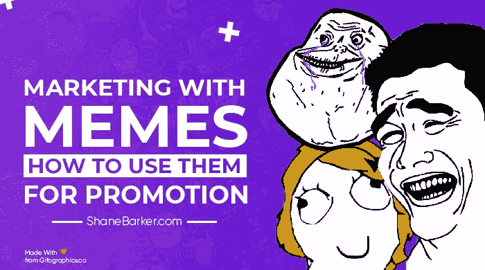

# 模因营销:如何利用模因进行推广

> 原文：<https://medium.com/swlh/marketing-with-memes-how-to-use-them-for-promotion-4d37d39d8774>

模因在社交媒体平台上是天然的。它们有趣、有趣、易于消费。但是它们并不像看上去那样简单。模因营销是一种低调的趋势，很快变得流行起来。

这种做法导致了一个新术语的诞生:模因劫持。当营销者劫持流行的模因来营销他们的产品时，这被称为模因劫持。