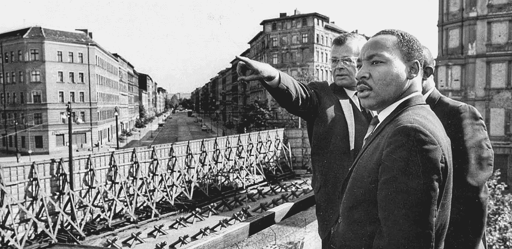

# 马丁·路德·金:“因为在墙的两边都是上帝的孩子，任何人为的障碍都不能抹杀这一事实。”

> 原文：<https://medium.com/swlh/martin-luther-king-for-here-on-either-side-of-the-wall-are-gods-children-and-no-man-made-barrier-17981fd51375>

Martin Luther King, Jr. at the Berlin Wall, 1964

## 需要团结起来拯救我们的星球免受全球变暖的影响

神话学家坎贝尔·约瑟夫有一句名言:当美国宇航员威廉·安德斯在 1964 年从月球上拍摄地球时，一个新的象征…