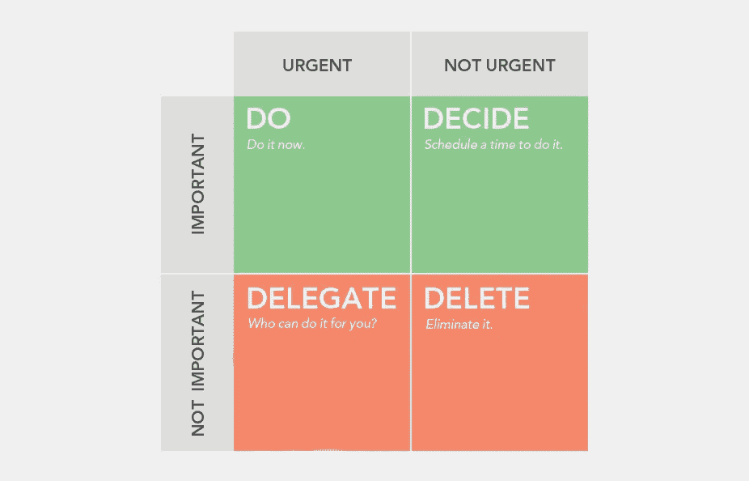
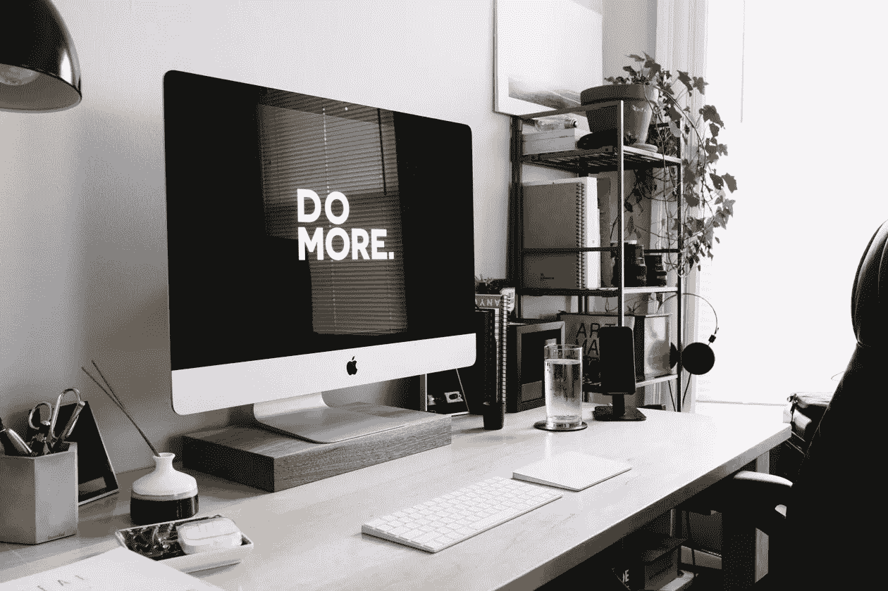

# 充分利用您的一天

> 原文：<https://medium.com/swlh/maximize-your-day-96dd0bc720dc>

## 完成更多工作的 9 个简单策略

如果每天多几个小时，你会做什么？这里有九个简单的策略来重新控制你的时间表，用更少的压力做更多的事情，找到更多的时间做你喜欢的事情。

如果你像我一样，你可能会努力在一天内完成所有需要完成的事情。你的待办事项清单仍然不完整，并延续到第二天，然后又延续到第二天，导致你陷入一个过期项目和扭曲的时间表的恶性循环。有时候，你会觉得自己的工作已经接管了你的工作，你梦想的理想的工作与生活的平衡不再是现实。通过一点前瞻性的思考，你可以重新掌控你的一天，以更少的压力完成更多的事情，并为你喜欢的事情找到更多的时间。

虽然我不希望这是每一篇关于 Medium 的[生产力黑客](/topic/productivity)文章的反哺，但我确实想分享一些方法和技巧，这些方法和技巧让我作为一个自由职业者在家庭和全职工作之间过着更平衡的生活。

> 这些技巧让我能够专注于我的工作，*用更少的分心做更多的事情，优先考虑和委派我的工作，优化我的日常工作，为我自己和我的家人留出时间。*

作为一名自由职业者，白天的工作要求很高，还有年幼的孩子，我不得不学会如何挤出一天中的每一秒钟来完成工作，同时还有时间与家人和朋友相处。如果你是一名全职自由职业者，从事多种工作，或者有一个标准的朝九晚五，这些简单的策略将让你充分利用你的一天。

在过去的几年里，我一直在收集我发现的最好的工具和方法来最大化我的日常事务。这些笔记来自于阅读和吸收他人的习惯和套路，如果你有兴趣更深入地阅读，我将在本文结尾引用。我将它们提炼为九个可行的项目，可以很容易地适应你自己的工作方式:

1.  管理分心
2.  以写作开始新的一天
3.  艾森豪威尔矩阵
4.  时间阻塞
5.  电子邮件
6.  根据需求、创造力和关注度对工作进行优先排序
7.  每天创造休息时间
8.  规划你的一天
9.  创建自己的时间表

# 1.管理分心

我们很多人习惯性地一直把手机放在身边或口袋里。我们睡觉时把手机放在身边，早上用手机叫醒我们，起床前查看电子邮件。这种持续的刺激和分心阻止我们活在当下，进入深度聚焦，或者完成一天中最重要的任务。如果不加控制，使用电话会严重影响你发挥全部潜能的能力。为了克服这一点，我为自己与手机的互动设定了一些界限。

每天早上，我都会把手机放在另一个房间的桌子上，处于“请勿打扰”模式，并选择在完成写作或上午的自由职业工作之前不查看手机。这让我可以在早上完全和家人在一起，并在开始工作前完成最重要的自由职业工作。

白天上班的时候，我把电脑调到勿扰模式，把手机放在我的工作包里，远离我容易拿到的地方。我的手机上没有任何社交媒体应用程序，所以我没有什么动力去使用它。我的所有设置还设置为阻止任何通知出现在我的手机上，包括徽章通知，除了短信和电话。这对我产生了巨大的影响，老实说，我不知道其他人是如何拥有一部每隔几分钟就提醒他们一些新事情的手机的。

我会在午餐、下午和一天结束时查看我的短信和未接电话。远离干扰让我能够进入一种深度专注的工作状态，使我能够在任何给定的时间内完成比我的手机触手可及且嗡嗡作响的情况下多 4-5 倍的工作。

晚上，我已经养成习惯，在睡觉前一到两个小时把手机调成静音，放在另一个房间。我会花时间陪我的妻子和孩子，补上工作，或者读一本书，而不是看屏幕。这让我的身体放松下来，进入更深的睡眠。有无数的研究将蓝光(来自我们的手机和笔记本电脑)与睡眠中断或不足联系起来。在阅读了马修·沃克的《T2》和《我们为什么要睡觉》并理解了睡眠对我们健康的影响后，我成为了追求睡眠与健康关系的强烈支持者。我已经注意到我的创造力、情绪、健康、饮食和注意力有了惊人的变化。如果你没有时间读这本书，我会鼓励你[看](https://www.youtube.com/watch?v=pwaWilO_Pig)一个作者的访谈。

# 2.以写作开始每一天

近年来，我养成的最能改变生活的习惯之一就是每天写作。每天早上上班前以反思和积极的状态开始，专注于我对未来的愿景，这让我在过去三个月比去年实现了更多的个人目标。

虽然写作曾经对我来说很难，但现在它是我每天早上期待的事情，作为一个机会来理清我的思绪，反思我过去的成功和失败，监控我为自己设定的目标的进展，并为一天定下基调。

@kpaxs ，在 Twitter 上更为人所知的名字是 Thibaut，在他的一条我最喜欢的推文中完美地总结了这种情绪:

*写更:*

*   *理清思路*
*   在你的大脑进入之前捕捉那些突触爆发
*   *为了享乐*
*   *用词汇确定一个想法*
*   *为他人*
*   驱逐你的恶魔
*   *创建蓝图，其中一些可能会在以后使用*

虽然在早上花时间做一些看起来没有直接回报的事情可能很难，但我鼓励你尝试一周，看看你会发现什么结果。每天只需 5-10 分钟的自由写作就足以分享你感激的事情，你在未来几个月想要实现的目标，反思过去的经历，或规划未来。我一开始参加了一个为期 30 天的写作课程，这个课程帮助我巩固了写作习惯，并且比我想象的更喜欢写作。我开始用纸和笔写日记，但后来开始使用写作应用 Ulysses，这对我很有帮助，因为我现在可以轻松地将我的日常写作转化为博客帖子、电子邮件通讯和文章。(事实上，这篇文章的几篇已经是我日常写作的一部分了。)

通过每天早上写作，我能够:

*   每天早上清理我的思绪
*   检查我今年为自己设定的目标的进展情况
*   在新的一天开始之前，放松、冥想和减压
*   为博客文章和商业创意产生新的想法
*   解决我一直面临的问题
*   为当天制定一个进攻计划
*   跟踪我一年来的进步
*   被视为我所在领域的专家
*   提高我的思路、打字速度和沟通技巧

> 即使每天只写几分钟，每天只写几分钟也能改变你生活和事业的轨迹。

# 3.艾森豪威尔矩阵

在计划每一天之前，我会先列出我需要完成的任务，然后用艾森豪威尔矩阵对它们进行排序。艾森豪威尔矩阵是一个简单的四象限网格，允许你按照紧急程度和重要性来组织你的任务。虽然这非常简单，但我发现这是一个快速区分真正影响我长期目标的任务和没有影响的任务的简单方法。

艾森豪威尔包厢途经[jamesclear.com](https://jamesclear.com/)

# 重要/紧急(现在就做)

矩阵的左上象限表示绝对需要在今天(或很快)完成的任务，这些任务对您的业务运营非常重要。例如，如果你明天要向一个潜在的大客户推销，那么今天花时间擦亮桌面，练习你的方法是至关重要的。让我区分重要任务和不重要任务的一个简单规则是，确定它们是否与为你的企业创造收入有关。这将包括销售活动，如新客户会议、提案、客户入职、关键项目交付日期等等。诚然，这些可能都不紧急，但它们很重要。

# 重要/不紧急(决定/安排时间做这件事)

矩阵右上角的任务很重要，但不一定紧急。根据我的经验，这些任务很难管理，也很容易推迟，因为它们通常没有严格的截止日期，或者看起来与创收没有直接联系。重要但不紧急的任务的一个很好的例子是更新你的投资组合，改造你的网站，重塑品牌，或致力于业务发展。这些都是你的企业如何运作和吸引新客户不可或缺的任务，但通常不与具体的到期日挂钩。解决这个问题的一个好方法是每天、每周或每月花一定的时间在这个项目上，并且警惕地保护这些时间。这种方法被称为时间阻塞，我将在这篇文章的后面谈到。

# 不重要/紧急(谁能帮你做？)

右下象限用于不重要但紧急的任务。这些是我知道自己很多天来最有负罪感的任务，因为它们通常是简单的任务，并且有一种重要的气氛，仅仅因为它们是紧急的。人们很容易将紧迫性误认为重要性。仅仅因为事情紧急并不意味着它就是你需要关注的事情。在这些情况下，最好是委派这些任务。这可能包括较小的紧急任务，如安排会议、在社交媒体上发帖或与较小项目相关的事情。这仍然是我有改进空间的一个领域，因为我目前没有全职员工，尽管我经常给我的自由职业者团队分配一些我不应该花时间去做的项目。

# 不重要/不紧急(删除/消除)

最后一个象限是那些对你的业务发展(甚至对你个人)没有任何帮助的任务。这可能包括花不必要的时间在社交媒体上或看网飞，或为新产品“购物”太长时间，这是我经常做的。这些是需要完全消除的领域，因为它们不允许你进步。随着时间的推移，我发现我很少有属于这一类的东西，仅仅是因为我已经把我的一天安排得不再有时间做这些事情了。

# 4.时间阻塞

时间块是我每天用来计划我的一天并估计我每天要花多少时间在一个给定的项目上的一种方法。时间块就是简单地把你的任务分成一段一段地计划，通常提前一两天，并计算你在每项任务上实际花费的时间。有几种方法可以用来划分时间，从使用[日志](https://seanwes.com/podcast/257-planning-your-day-for-maximum-efficiency-in-under-5-minutes-and-still-accounting-for-unplanned-events/)，应用程序，或日历，但重要的是你要使用最适合你的方法。我个人使用谷歌日历，因为它可以在我的设备上同步，很容易修改，并且不需要我每天随身携带任何额外的东西。

当我划分时间块时，我首先使用艾森豪威尔矩阵来查找我为自己创建的任务，并估计我完成每项任务所需的时间，在我的估计值上加上 25-50 %,以考虑任何障碍。对于全新的任务(我以前从未做过的，或者我还在学习的)，我会乘以 2 或 3 倍，让自己解决新问题而不会感到匆忙。

对于大多数任务，我从最少 30 分钟的时间段开始。一天中很少有任务花不到 30 分钟，如果是这样，我会直接进入下一个任务。

我从一天中最重要和最紧急的任务开始(我发现这些任务通常是我最不想做的)，以便为一天定下基调。我也会按照我所需要的专注度和创造力来安排我的任务(下面会有更多)。

如果可能的话，我还会根据活动类型对任务进行分组，这有助于我保持目前的心态，让我不必经常在不同类型的任务之间转移注意力。例如，如果我有几个小的设计任务(例如电子邮件标题)需要处理，但是是针对不同的项目，我会将这些任务集中在一起以改进我的工作流程。这也适用于更大、更重要的电子邮件、发送发票或更新项目时间表等。

通常，在我的一天变得充实之前，我每天只能添加 4-7 个任务。我发现，为一天中的每个项目增加时间段可以显著减轻压力，提高效率。当你能够看到一整天在时间块中的安排时，你就能够确定你是否能在分配的时间内成功地完成你的任务，并能发现你在哪里可以有额外的时间花在其他项目上或花时间给自己充电。

当时间阻塞时，除了吃午饭、发邮件和打电话的时间之外，记住一天中留出 2-3 次(或更多)的休息时间是很重要的。人们很容易对自己处理待办事项的能力过于自信，一整天都没有时间重新安排。我通常会花 5-15 分钟站起来，煮咖啡，读一本书或一篇文章，或者每 60-90 分钟去散步。

# 分解大型和创造性要求高的项目

当我计划我的一周时，我也利用这个机会分解我的任何重要但不紧急的大目标。我发现，当我的待办事项清单上有大型的、模糊的、没有具体结束日期的项目时(尤其是个人项目)，我很难开始它们或取得重大进展。像更新我的投资组合、补上会计、制定营销计划和业务发展这样的项目，在我接触它们之前，会在我的任务中几个月不动，如果有的话。

具有讽刺意味的是，我没有时间去做的项目实际上是商业成功最重要的组成部分。如果你从来不花时间推销自己，你就不会在商界待很久。然而，许多创意人员更专注于完成付费客户项目，而不是做可怕但必要的工作。

> 我发现处理这类项目最有效的方法是将项目分解成尽可能小的部分。

例如，在你的网站和文件夹休眠了一年多之后，更新它们可能会感觉是一项重大任务，但是如果你把它分成更小的部分，每天拿出 15 或 30 分钟来完成这些小任务(例如:创建一个你想添加到文件夹中的项目列表，收集一个项目所需的文件，模拟一个项目，为一个项目写一份描述， 在你的文件夹上创建一个新项目，将图像添加到那个新项目，等等)你将很快完成这个项目。

对于更大、更紧急的项目，比如为客户开发品牌形象，我会在每天早上的第一件事就是抽出 2-3 个小时，在检查电子邮件或社交网站(或做任何其他事情)之前处理这个创造性的问题。提前为这个项目计划一个完整的时间表也非常有帮助。

我明白了，每天花 6-8 个小时在一个创造性的项目上对我来说几乎不起作用。虽然有时候当我在一个特定的项目上找到进展时，我会清空我的时间表，但我知道我一天中批判性思维和创造性解决问题的能力是有限的。经过 2-3 个小时的深度专注后，我不能再从事高层次的项目，需要转向更浅层次的工作，如回复电子邮件、导出和组织文件，以及其他要求较低的任务。

# 辅助项目会计

如果你有一个让你每周都兴奋不已的激情项目，你可以用上面同样的方法来计划你的一周并保持动力。我通常会每周安排一个上午来做我的个人项目，并把这个时间限制在其他需求之外。

# 5.电子邮件

不要整天开着邮箱或者不停地查看收件箱，每天留出 15 到 30 分钟的时间，一次回复几封邮件。许多人成为电子邮件所承载的虚假的紧迫性和重要性的受害者，但重要的是不要让这些打乱你一天的计划，阻止你完成最重要的工作。

电子邮件的一些规则:

# 不要以查看电子邮件开始你的一天

在处理当天的重要任务之前查看邮件会让你无法专注于手头的重要任务，会让你思考邮件，即使你并不打算稍后回复或处理邮件中的任务。我发现推迟检查邮件，直到我写完当天的文章和完成重要的任务，通常是在上午 10:30 以后，这非常有帮助。我建议不要用你的电子邮件来创建你当天的待办事项，除非你期待的是与当前项目相关的事情。使用 Asana 这样的项目管理平台，甚至是记事本。在繁忙的收件箱之外跟踪和管理您的项目。

# 设定检查电子邮件的具体时间

我通常会留出 10:30-10:45、1:00-1:15 和 4:30-4:45 的时间来检查和回复邮件，尽管我通常不需要所有这三个时间段。在检查邮件之前，我通常会完成 2-3.5 个小时的工作，这让我有一个清晰的头脑，知道一天应该关注什么。你可能很容易觉得自己“需要”一整天不停地查看电子邮件，以防有人需要快速回复，但 99.9%的时候，这根本不是真的。很少有人会在几个小时内收到回复，如果他们收到了，他们通常会以另一种方式联系你。人们会很快适应你回复邮件的速度，你也可以告诉他们，一天中分批查看邮件可以让你更专注于工作。有些人甚至会不厌其烦地在他们的邮件签名中加入免责声明，包括他们典型的回复时间。简而言之，用这种方法花更少的时间检查邮件，花更多的时间处理一天中重要的项目。

# 6.根据创造力、需求和关注度对工作进行优先排序

我发现的另一个对我的工作流程非常有效的方法是根据需要的关注度和创造力来安排我的任务。例如，开发一个新的品牌标识或标志需要我全神贯注，排除任何干扰，一次工作 2.5-3 小时，让我熟悉项目并解决创意问题。另一方面，电子邮件、发票、要求较低的创造性工作和会议对我的创造性能力的要求较低，所以我通常把这些活动留到一天的晚些时候，在我把精力用在一天中最重要或要求最高的项目上之后。

# 知道你什么时候效率最高

我从事自由职业和在机构内部工作的这些年里学到的另一件事是知道我一天中什么时候最有效率。我做了笔记，观察了一天中我完成任务最多的时间，以及我努力完成简单任务的其他时间，我已经能够确定我在 7:30 到 1:30 之间效率最高，我最有创造力的工作在 8:30 到 11:00 之间完成。早上早些时候，我还在清理头脑，为一天做准备，所以我会从 30 分钟或更长时间的自由写作开始，为一天定下基调，然后进入最终确定当天的计划，然后坐下来完成一天中最重要的项目，使用像 [brain.fm](https://www.brain.fm/) 这样的工具来增强我的注意力。

我已经痛苦地认识到，我不能把重要的项目推迟到晚上，因为我会用尽我储存的创造性能量，最终会在项目上花费太长时间，交付低于标准的工作，或者被迫推迟项目的时间表。

同样，我也把尽可能不在下午 3:00 之前安排会议作为一条通用规则。会议虽然有时很有帮助，但会令人难以置信地分散注意力，妨碍你在效率最高的时候工作。它们通常比需要的时间要长，很容易消耗掉你一天的时间。通过在一天中的晚些时候开会，我能够完成我需要完成的工作，充分参与我的会议。在一天中的这个时候，我也准备好离开屏幕休息一下，和某人一起喝咖啡是打断我的时间表的一个很好的方式。

# 7.每天创造休息时间

作为一个每天在电脑前工作 9-14 个小时的人，当我觉得我的日程已经排得满满的时候，很难优先安排休息时间。我经常觉得停下手头的工作休息会妨碍我的工作效率，但我发现事实正好相反。我们的身体需要时间充电和脱离工作，以便比以前更专注、更有活力、更有创造力。

每天花 30 分钟做一个快速的体重锻炼，瑜伽，甚至是在附近散步。到户外呼吸新鲜空气，体验新的景象和声音，可以让你的思维开小差，解决你可能陷入的难题。对于我们这些在家工作的人来说，利用你拥有的灵活性和自由，将更多你喜欢的事情融入到你的日常生活中。午餐时骑自行车，在附近的公园里漫步，在户外读一本书，或者做几分钟瑜伽。

如果像我一样，你发现很难从工作中休息一下，那么就找一个能让你保持责任感的锻炼伙伴，或者报名参加健身班。对你将会在场的期望足以激励你每周离开办公桌几个小时。你也可以每天跑步或骑自行车上班，将运动融入你的一天。我最近从使用公共交通工具转向骑自行车上班，现在我能够在同样长的时间内到达工作地点，同时在每天开始和结束时进行一些高质量的锻炼。

# 8.计划即将到来的一天

在每个工作日结束时，我会列出我已经完成的任务以及未完成的任务，并开始为第二天制定计划。理想情况下，我发现提前两天或两天以上做计划很有帮助，尤其是在处理较大的项目或处理多个时间敏感的项目时，但提前至少 24 小时做计划是最理想的。这可以让你看到什么项目即将到来，如果需要的话，你可以提前重新安排你的时间表。这也是一个很好的时间来看看你是否重复预订了自己或者需要雇人来帮助一个项目。

# 9.创建自己的时间表

现在我已经分享了我用来最大化我的一天的所有策略，我想让你制定你自己的时间表。我发现为不同类型的日子制定一个模板很有帮助——标准工作日和周末，晚开始的日子，或者有时间和朋友一起吃午餐的日子——这是你的时间表，让它为你服务。

下面是本文中引用的参考资料列表，供那些对深入研究这个主题感兴趣的人参考。这些都是让我制定自己理想的日常工作和工作时间表的关键:

*   [Alex Mathers 的每日 10x 目标工作表](https://artplusmarketing.com/how-this-daily-worksheet-improves-my-life-by-10x-c08c09fa2bf3)
*   [用了六年没有分心的 iPhone](/s/story/six-years-with-a-distraction-free-iphone-8cf5eb4f97e3)
*   [我们为什么睡觉](https://www.amazon.com/Why-We-Sleep-Unlocking-Dreams/dp/1501144316)马修·沃克著
*   [深度工作](https://www.amazon.com/Deep-Work-Focused-Success-Distracted/dp/1455586692)由加州纽波特
*   [为你的一天做最有效率的计划](https://seanwes.com/podcast/257-planning-your-day-for-maximum-efficiency-in-under-5-minutes-and-still-accounting-for-unplanned-events/)
*   [brain.fm](https://www.brain.fm/)

-

*本文最初与* [*HolaBrief 社区*](https://www.holabrief.com/community) *合作发表。*