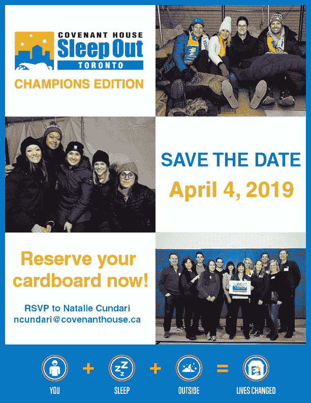

# 在 2019 年最大化您的营销成本

> 原文：<https://medium.com/swlh/maximizing-your-marketing-dollar-in-2019-190a44330fb2>

## 简单的调整可能是你所需要的，以帮助提高 2019 年营销战略的投资回报率

Marketing Strategy 2019

新的一年即将来临，没有比现在更好的时间来审视你的营销策略，看看什么是有效的或无效的，以及在哪里进行调整。比起脸书，你应该更关注 Instagram 吗？Pinterest 呢？如果你的业务是可视化的(产品、食品等)，那么 Pinterest 可能值得你付出营销努力。为了搜索引擎优化，你会在发帖之前重命名你的照片文件吗？你在你的社交媒体工作中采取了人性化的方法还是仅仅发布广告？

让我们来看看你的营销策略的一些核心部分，以及可能需要增加或调整的地方:

电子新闻:电子新闻是与客户保持联系的一种很好的低成本方式，但是你滥用它了吗？你的电子通讯提供了真正有价值的东西吗？还是纯粹的广告？你多久发一次？

我知道有一家公司，收到电子通讯的人实际上在谈论他们如何享受收到电子通讯的乐趣。它来自一家名为 [Throat Threads](http://www.throatthreads.com/) 的服装分销公司，该公司每年通过电子邮件宣布 4 次为期 3 天的促销活动。他们只通过电子邮件宣布，他们一年只做 4 次销售，这是他们联系你的唯一原因。句号。

大多数电子通讯都很烂。他们滥用收件箱，而我，我自己，每天花一点时间退订那些我从未注册过的和那些我注册过的，现在后悔这么做了。然而，如果做得好，电子通讯可以是一个非常有价值的营销工具。

不要。只是。打广告。提供每日励志引语，如来自 StartWithWhy.com 的西蒙·辛奈克的[、](https://startwithwhy.com/)或来自数据医生的**、**、、**、*提示、技巧和警告的*、、**电子通讯给了我有价值的提示。每天出现在一个人的收件箱里，声称又有一笔销售，但实际上并不是销售，这很烦人。

想想你能提供什么，然后决定你的电子通讯的时间表。大多数公司不需要每天发邮件给任何人，每周发邮件也是有问题的，这取决于你的业务和你想与客户建立的关系类型。如果你在回顾 NFL 比赛，展望未来一周的足球比赛，那么每周一次是有意义的。

**影响者营销:**消费者想要的是真实性。由 [Stackla](https://stackla.com/wp-content/uploads/2018/05/Stackla-Data-Report-FINAL.compressed.pdf) 进行的一项调查显示，对于 86%的受访者来说，在选择和忠于品牌时，真实性是一个重要因素。名人在视频或播客中宣传你的产品是不够的。更多地考虑与用户建立长期关系——让你的产品或服务得到真实用户的有机推广，并自然地交织到文章、博客和社交渠道中。

拥有大量追随者的影响者不一定会产生有意义的投资回报。想想微小的影响者。寻找与你的品牌相符的人才或在线用户。这可能是你的健身伙伴，也可能是每天使用你的产品并与她的追随者分享经验的母亲。与您的客户一起创建社交媒体竞赛，并奖励他们的参与。多伦多[的一家名为 Morso Me](http://www.morso.me/) 的小餐馆每月举办一次比赛，鼓励顾客分享自己在餐馆里咬食物的照片。他们让客户为他们创造有趣和独特的内容。

Morso Me 咬我比赛

**直播:**这并不新鲜，至少在过去的一年里，它应该是你战略的一部分。YouTube、脸书和 Instagram 的直播视频平台已经在相当一部分人当中掀起了波澜，2018 年，Instagram 推出了 IGTV——insta gram TV。IGTV 是一款用于在智能手机上观看长格式垂直视频的新应用。IGTV 上的视频可以持续一分钟以上，甚至长达一小时。为什么是垂直的？人们更喜欢在垂直位置使用智能手机。

不要让制作精良的视频的想法阻止了你的直播；人们想要真实可信的。如果你还没有将这作为你营销策略的一部分，也许 2019 年就是这样做的时候了。

**社交媒体帖子**:花几分钟时间了解每个平台的基础知识以及它们的算法是如何工作的。并非所有的社交媒体渠道都是平等的，在 Twitter 上有效的不一定在脸书也有效。有了 Twitter，你可以比脸书和 Instagram(每天 2 到 3 次)更频繁地发帖。脸书给予直接来自其平台的帖子更多的排名优先权，而不是让你自动发帖的平台。你有没有注意到脸书上的一些帖子没有图片，但会显示一个 Instagram 照片的链接？社交媒体渠道的交叉发布功能使之变得很容易…但这并不一定能转化为有效的参与。注意交叉发布在各种社交媒体平台上的样子。如果你交叉发布的图片只是在不同的平台上发布原帖的链接，我建议你不要这样交叉发布。

保持个人页面的个性化，保持你的商业帖子在你的商业页面上。很可能你的大部分朋友和家人都不想没完没了地看到你的商业帖子。

参与——提出有意义且相关的问题，并关心答案。分享重要的信息。尽可能多地回复评论。

## **SEO——搜索引擎优化**

消费者在网上搜索品牌，大部分搜索是通过搜索引擎或 Yelp、猫途鹰和脸书等在线平台完成的。除非你是在一个独特的情况下，潜在的消费者需要找到你在线和搜索引擎优化，如果不是已经成为一个焦点，需要优先考虑你的营销策略。

**语音识别搜索:**我在 2018 年 6 月写了一篇文章，讲述了[语音识别搜索](/@audrey.nesbitt/is-your-website-ready-for-voice-recognition-search-33e9b7512e18)变得多么重要，以及如何为语音识别搜索改造你的网站 SEO。根据[搜索引擎 Land](https://searchengineland.com/how-visual-and-voice-search-are-revitalizing-the-role-of-seo-303958) 的数据，2017 年美国基于语音的商务销售额达到 18 亿美元，预计到 2022 年将达到 400 亿美元。

该技术主要用于获取关于我们想去的地方的信息，例如“找到离我最近的墨西哥餐馆”或者，当我们在另一个城市时，“在奥斯汀找一家假日酒店。”语音搜索会识别“在我附近”或“离我的位置很近”这两个词，然后访问您的物理位置，为您提供查询结果。因为越来越多的人使用语音搜索，所以你的网站必须针对这种搜索进行优化，并且尽可能具体地列出你的商业信息和相关类别。

**下一级图片搜索**:使用照片来帮助你的搜索引擎优化工作是任何搜索引擎优化战略的关键部分，许多企业都错过了，现在比以往任何时候都需要成为一个焦点。 ***视觉搜索*** 的使用越来越多，尤其是通过谷歌镜头和 Pinterest 镜头，“抓拍和冲浪”正在兴起。这些应用程序允许用户拍摄一张照片，并使用该照片在互联网上搜索相关主题的信息。

虽然图片搜索仍处于起步阶段，但你应该已经在为搜索引擎优化你的照片了。你如何告诉谷歌你的照片是关于什么的？从文件名开始。“照片”会自动以 img123456 这样的文件名存储您的照片。对于谷歌来说，这并不能说明照片中有什么，因此对搜索引擎排名没有帮助。您需要重命名这些文件，以便搜索引擎友好。如果你的图片是你餐馆的一道特别的菜，而不是 img123456，它应该被重新命名为类似多伦多-千层面-餐馆名称的东西。现在它对谷歌和你的网站排名有意义了。

***图片 Alt 文本或 Alt 属性:*** 这些是大约 100 个字符的简短描述，您可以将其分配给网站或博客上的图片。在你的照片上使用替代文字或替代属性有助于搜索引擎了解照片的内容。与 img123456 相比，人们更有可能搜索最好的多伦多千层面，或黄色的 Kate Spade 包 2019。

***自 2017 年初推出以来，Pinterest 镜头功能每个月都经历了超过 6 亿次的视觉搜索。这是一个 140%的年增长率，也是一个商业不能忽视的巨大搜索量。***

**添加 Z 世代:**Z 世代年龄越来越大，他们的购买力越来越强，他们希望世界变得更美好。他们希望与想法相同的品牌做生意。他们生活在手机上，有寻找最佳交易的应用程序，他们应用广告屏蔽技术，比传统电视更喜欢看 Youtube。

你能做些什么来接触 Z 世代？诚实，关心人类和环境，并与他们在一起。Instagram、YouTube、Snapchat 和抖音。不要向 Z 世代强行推销——成为 Z 世代的有机组成部分。

**体验式营销** **或参与式营销**:体验式营销专注于帮助消费者体验一个品牌，而不仅仅是在活动中派发明信片。品牌体验导致 85%的购买意愿。他们与潜在消费者建立情感联系，建立信任，培养客户忠诚度。

美好的体验会创造出新的品牌战士，他们会毫不费力地与他们的朋友分享你的信息。想想消费者会如何体验你的品牌。我喜欢用一个很好的例子，因为我喜欢辛普森一家，是在辛普森电影的情况下。7-Eleven 实际上把几个地方变成了 Kwik-E-Marts 来帮助宣传这部电影。

另一个参与/实验性营销的例子来自圣约之家，这是一个为处境危险、无家可归和被贩卖的青年提供服务的机构。该服务通过在一个屋檐下提供最广泛的服务和支持来帮助改变生活。圣约社通过影响公共政策和实施预防和宣传计划来实现这一切。圣约社筹集资金的方式之一是举办“露宿”(Sleep Out)，这是一项筹款活动，100 名专业人士在户外度过一个寒冷潮湿的夜晚，以提高对无家可归和被贩运青年困境的认识。圣约之家的参与者配备了睡袋和纸板，他们露宿街头:一窥年轻人在街头面临的困难，每次活动筹集近 50 万美元。

2019 年应该是创造价值，与客户建立双向关系。让他们成为你公司流程的一部分，鼓励他们让你和你的产品成为他们生活的一部分。首先关注消费者及其体验，你的营销策略应该在 2019 年取得成功。

奥黛丽·奈斯比特

[螺旋营销&公关](http://www.spinspirational.com)

[奥黛丽·奈斯比特在 Linkedin 上](https://www.linkedin.com/in/audrey-nesbitt-0388a52a/)

[@ audreynesbit 11 在推特上](https://twitter.com/AudreyNesbitt11)

原故事发布在[SpinSpirational.com](http://www.spinspirational.com/maximizing-your-marketing-dollar-in-2019/)

## 这篇文章发表在 [The Startup](https://medium.com/swlh) 上，这是 Medium 最大的创业刊物，拥有+405，714 名读者。

## 在这里订阅接收[我们的头条新闻](http://growthsupply.com/the-startup-newsletter/)。

