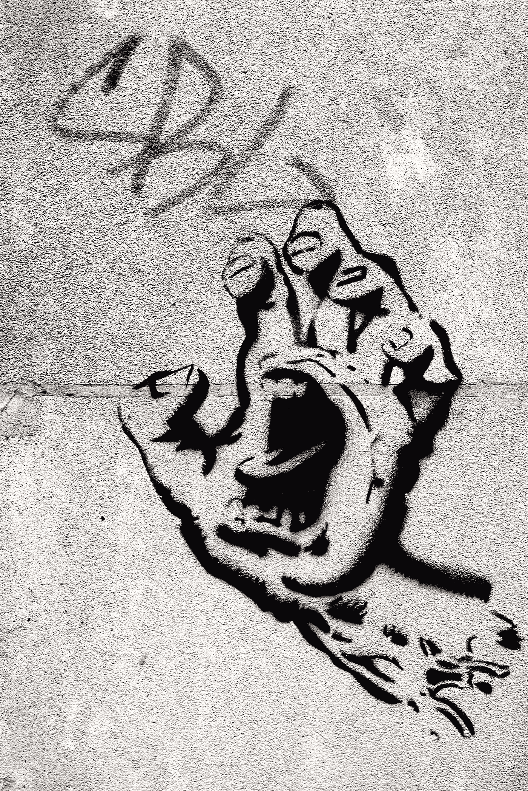

# 也许只是你

> 原文：<https://medium.com/swlh/maybe-its-just-you-b5faab4c35c2>

## 恶意会是误解吗？

Photo by [Heather M. Edwards](https://unsplash.com/@heathermedwards?utm_source=medium&utm_medium=referral) on [Unsplash](https://unsplash.com?utm_source=medium&utm_medium=referral)

> “当你早上醒来时，告诉自己:我今天打交道的人会多管闲事、忘恩负义、傲慢、不诚实、嫉妒和乖戾。”
> 
> —马库斯·奥勒留，《沉思》