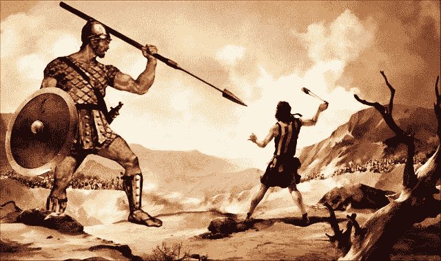

# McAfee 支持的 DEX 挑战集中式交换。

> 原文：<https://medium.com/swlh/mcafee-supported-dex-challenges-centralized-exchanges-7b685b28c95a>

> 最新的[加密货币新闻](https://www.coincurb.com/news/)、[空投清单](https://www.coincurb.com/airdrop/?status=active)、[赏金清单](https://www.coincurb.com/bountyc/?cat_id=188)、 [IEO 清单](https://www.coincurb.com/category/active-ico/)，请访问 CoinCurb.com。

上周，Bithumb 因黑客攻击损失了近 2000 万美元的加密货币。这是全球最大的交易所之一 Bithumb 在 12 个月内第二次遭到黑客攻击。就在此之前几个月，加拿大领先的交易所 QuadrigaCX 失去了用户资金的使用权，因为其创始人兼首席执行官可疑地死于国外旅行，而他是唯一能够访问该交易所加密存储的人。

由于交易所的首席执行官是唯一有权使用私人密钥的人，交易所无法将资金返还给用户。

鉴于集中式交易所面临的越来越多的问题，Switch.ag，一个旨在让用户匿名将以太坊或任何 ERC-20 代币换成其他 ERC-20 代币、礼品卡或慈善捐赠的平台，推出了一个 [DEX。SwitchDex 允许用户用以太坊交易 ERC-20 代币，得到了包括约翰·迈克菲在内的密码领域知名人士的支持。](http://bit.ly/STEEMswitch)

> 最新的[加密货币新闻](https://www.coincurb.com/news/)、[空投清单](https://www.coincurb.com/airdrop/?status=active)、[赏金清单](https://www.coincurb.com/bountyc/?cat_id=188)、 [IEO 清单](https://www.coincurb.com/category/active-ico/)，请访问 CoinCurb.com。

# 分配给社区的费用

有许多分散的交易所，但 SwitchDex 是第一个得到加密领域主要机构支持的交易所。首先，这是第一个[分散市场](http://bit.ly/STEEMswitch)，对密码领域的新手很友好。Switch.ag 旨在方便大众使用，因为他们可以看到自己的交易比赛。SwitchDex 通过给更有经验的交易者机会和自由来进行更灵活的交易，扩展了生态系统。

尽管该交易所打造一个能够满足任何人需求的去中心化市场的目标广受欢迎，但它获得如此多支持的可能原因是该交易所处理费用的方式。

# 分配给代币持有者的费用

现有的分散式交易所如 DDEX 和福克德尔塔保留所有费用。具有讽刺意味的是，即使是集中式交易所也会将费用返还给代币持有者。例如，币安以回购的形式返还 20%，Bibox 与代币持有者分享 50%的费用。

SwitchDex 是第一家将所有费用分配给代币持有者的交易所。因此，这是第一个将费用返还给社区的分散式交易所，而且自 [SwitchDex](http://bit.ly/STEEMswitch) 不会保留任何资金以来一直如此。这些费用被空投到持有 Swtch.ag 的原生令牌 ESH 和 SwitchDex 的原生令牌 SDEX 的钱包中。

> 最新的[加密货币新闻](https://www.coincurb.com/news/)、[空投清单](https://www.coincurb.com/airdrop/?status=active)、[赏金清单](https://www.coincurb.com/bountyc/?cat_id=188)、 [IEO 清单](https://www.coincurb.com/category/active-ico/)，请访问 CoinCurb.com。

# 便宜多了

集中式和分散式交易所都倾向于向做市商和做市商收取费用。例如，Bitfinex 向市场参与者收取 0.2%的费用，向做市商收取 0.1%的费用。因此，索赔净额合计为 0.3%。分散式交易所遵循了这条道路:

IDEX:市场参与者 0.2%；做市商 0.1%(净索赔 0.3%)
DDEX:做市商 0.3%；做市商 0.1%(净索赔额 0.4%)
fork delta:做市商 0.3%(净索赔额 0.3%)

另一方面，SwitchDex 只收取一种费用:市场参与者的 0.2%，这些费用无论如何都会返还给令牌持有者。因此，该交易所提供了一个以交易者为中心的平台，不仅费用低，而且还回馈给社区。

会员资格让事情变得更有趣，因为它可以将费用降低到零。

# 会员资格

交换会员的概念在过去已经被使用。领先的集中交易所 Huobi 出售数百甚至数千美元的会员资格。作为回报，会员可以享受费用折扣。Huobi 的会员资格对大型市场参与者来说是一个巨大的资源，但不太可能被散户和投资者使用，因为大量的前期费用将无法与费用节省相匹配。

SwitchDex 注意到会员制的潜力，创造了交易所历史上最强大的会员制项目。通过一次性付款，交易者将成为 SwitchDex 会员，使他们能够永远在该平台上免费交易。甚至会员费也被空投给平台令牌持有者(ESH 令牌和 SDEX 令牌)。

会员费从 4 月份开始为 20 澳元，以后每月增加 10 澳元。目前，目的是到 2019 年 12 月将最高费用限制在 100 美元。会员费是这样运作的:

四月:一次性 20 美元的费用。
阿美:一次性 30 美元的费用。
6 月:一次性 40 美元费用。
……
12 月:一次性 100 美元费用。

# DEX 的新层

到目前为止，分散交易所的受欢迎程度有限，但这在很大程度上是因为集中交易所要么提供较低的费用，将部分费用返还给代币持有者，要么提供会员费折扣。

SwitchDex 是第一个提供可以对抗任何 CEX 的功能的分散式交易所。SwitchDex 只收取会员费，20 美元的终身免费会员费，并将收取的所有费用返还给 ESH 和 SDEX 持有者，从而开创了一个新的 DEX 等级。

> 最新的[加密货币新闻](https://www.coincurb.com/news/)、[空投清单](https://www.coincurb.com/airdrop/?status=active)、[赏金清单](https://www.coincurb.com/bountyc/?cat_id=188)、 [IEO 清单](https://www.coincurb.com/category/active-ico/)，请访问 CoinCurb.com。

