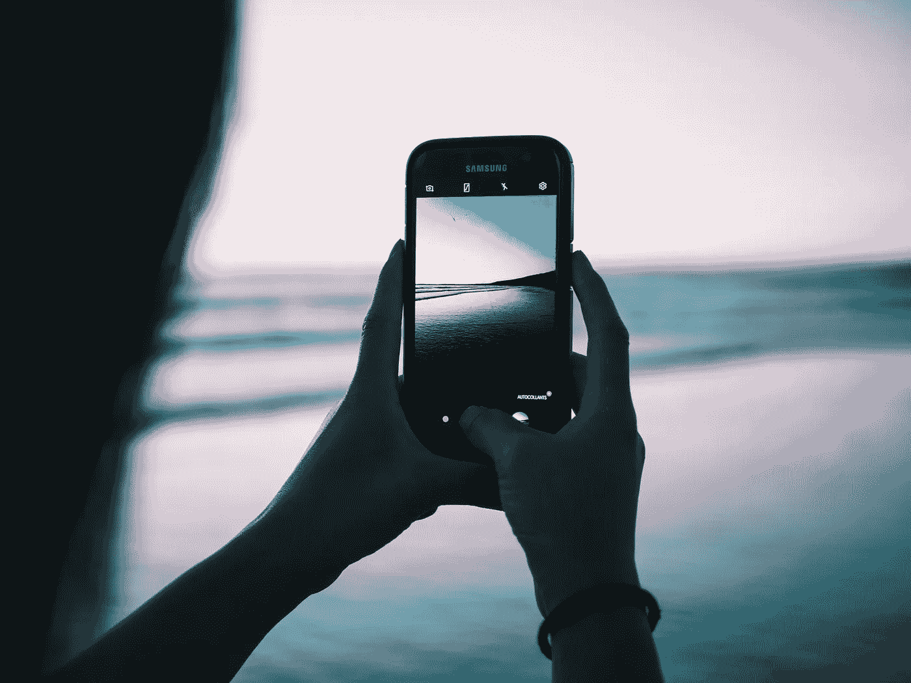

# 我(和我的家人)与智能手机

> 原文：<https://medium.com/swlh/me-and-my-family-versus-the-smartphone-ddaf29cd7d33>

Reality is beyond the screen… (Photo by [Cyriac Jannel](https://unsplash.com/photos/6kdBHgH-P4k?utm_source=unsplash&utm_medium=referral&utm_content=creditCopyText) on [Unsplash](https://unsplash.com/search/photos/smartphone?utm_source=unsplash&utm_medium=referral&utm_content=creditCopyText))

# 努力夺回注意力、专注力和自立

我最近读了许多文章，描述了智能手机及其使用对我们生活的所谓有害影响(讽刺的是，在许多情况下是通过我 iPhone 上的一个应用程序)。我相信你也是。我转而相信它们潜在的有害影响以及其程度…