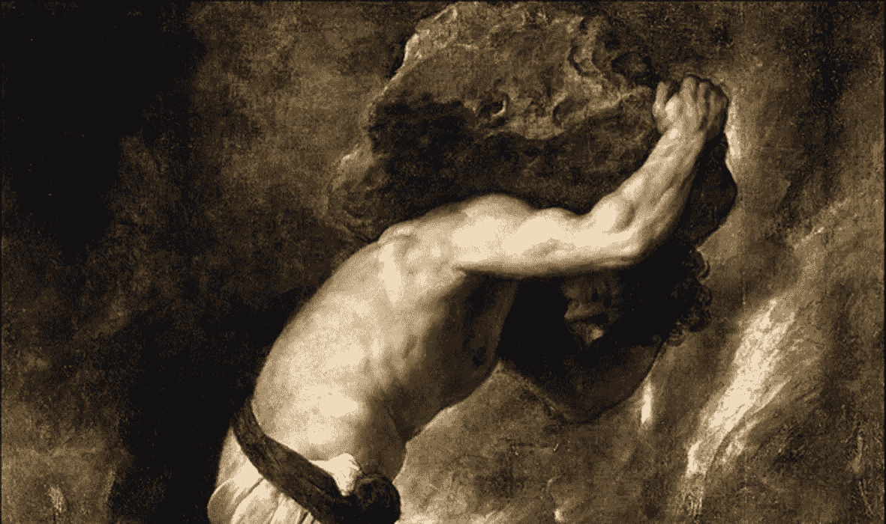

# 是意义，而不是快乐，让生活变得有价值

> 原文：<https://medium.com/swlh/meaning-not-happiness-makes-life-worth-living-fc09c2b26ef>

Sisyphus

> 判断生命是否值得活下去相当于回答了哲学的基本问题—阿尔贝·加缪

根据这个传说，西西弗斯是一个给死神戴上镣铐的人。然而，将人类从死亡中解放出来是对神的不良反映，这…