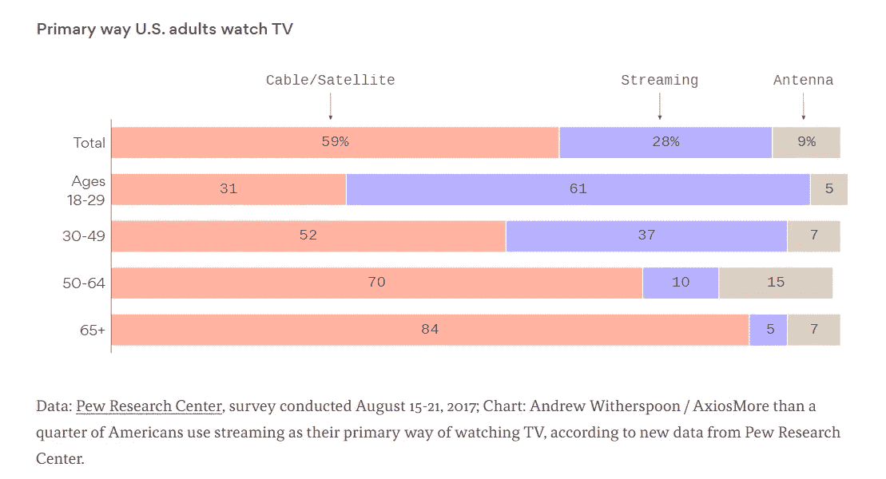
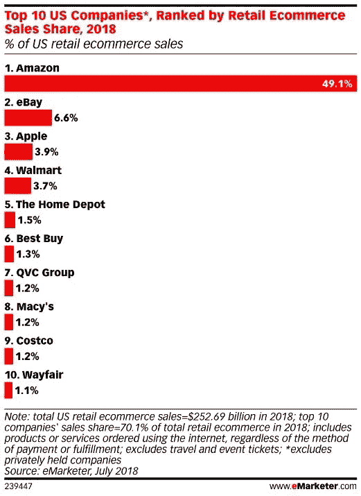
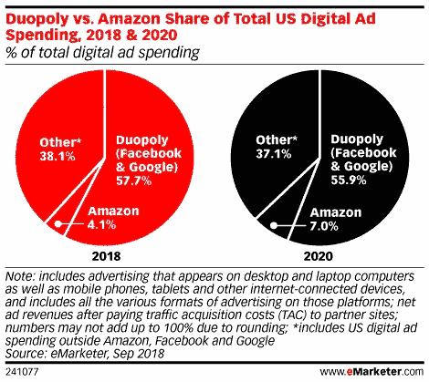

# 来自千禧一代营销人员的媒体预测

> 原文：<https://medium.com/swlh/media-predictions-from-a-millennial-marketer-4884a5f6c778>

年复一年，我在堆积如山的未来预测中筛选像我一样的千禧一代正在发布、购买和做什么。除了泛泛而谈(我说的是你们这些“千禧一代喜欢体验”)，大多数分析局限于今天的策略，而不是明天的策略。尽管[千禧一代现在构成了劳动力的最大部分，但](http://www.pewresearch.org/fact-tank/2018/04/11/millennials-largest-generation-us-labor-force/)我很少听到来自未来的决策者和高管的意见。

看了大家的预测，这个 27 岁的娱乐营销人有些想法了！虽然我不会要求明确的时间表，但我会努力勾勒出将对行业产生重大影响的宏观媒体趋势。我相信所有这些趋势都将在未来 1 到 5 年内实现。为什么不呢？预测很有趣，很流行，给了我们后知后觉的天赋。

话虽如此，以下是千禧一代营销人员的 3 个未来媒体趋势:

## **预测 1 —所有媒体都将是数字媒体**

[随着 NBC 的宣布，](https://www.cnbc.com/2019/01/14/nbc-to-launch-free-streaming-service-in-2020.html)每一个主要的网络，无论是广播还是有线，都推出了流媒体频道。更多的公司正在准备推出自己的流媒体平台，如 AT & T、迪士尼和苹果。

[Source Axios Primary way U.S. Adults Watch TV](https://www.axios.com/how-americans-watch-tv-1513305757-5fef4228-4986-4daf-ab33-564bd4054841.html)

电视没有消亡，但过时的传播方式正在消亡。30 岁以下的人不再拥有有线电视盒。老实说，埋卫星和有线电视是最好的。数字发行让媒体变得更好，这种不可避免的转变背后有三个主要驱动力:

1.  对于广告客户来说，数字媒体提供了更精细的指标，超越了简单的接触和印象，如参与度和转化率。它还提供了更好的定位能力，为品牌节省成本和相关性。一个婴儿品牌可以根据每个广告的转换率，突然准确地知道他们的广告接触了多少预期的父母，以及哪个效果最好。浪费 50%营销资金的大市场营销将成为过去。
2.  数字媒体为媒体发行商提供了更多的优势。有了数字媒体，网络拥有了更深层次的数据，让他们能够测量到独特的观众。当你能准确地知道谁在看，他们什么时候离开时，编程决策就变得容易了。除了节目之外，媒体网络可以根据观众的行为做出 UX 和产品决策，以使他们的娱乐产品更好。受众对广告商来说也变得更有价值，因为 CPM 和 CPV 通常越有针对性就越高。此外，瞄准能力也会拓宽市场。当一个较小的品牌可以瞄准纽约三州地区，而不是购买一个全国性的位置，你的潜在广告赞助商的池增长。最后，数字媒体提供了对抗尼尔森这样的测量公司的杠杆。当你不需要调查来告诉你你的评级时，第三方测量合同变得更受欢迎
3.  数字媒体只是一种更好的消费品。设置带有连接的电缆箱是很麻烦的。只需点击一个按钮就能点播你的娱乐节目，而不是按照一个不灵活的时间表，这是不方便的。在多种设备上以及在旅途中灵活观看，让消费者可以观看更多内容。

## **预测二——娱乐捆绑销售回报丰厚**

传统上，有线电视公司将你所有的娱乐、电视、互联网和电话打包成一个 125 美元的套餐。捆绑包装已经被拆散了二十多年。有线电视终结了拨号上网，手机终结了固定电话，全能的路由器将很快取代你的有线电视盒。

纵观媒体的历史，颠覆性技术通常围绕着发行方式展开。一两家先锋公司打破了这种模式，催生了令人眼花缭乱的消费者选择。然后市场收缩，在这个过程中杀死或合并许多公司，成为一个必要的可管理的包。

你可以看到流媒体电视的周期已经开始收缩。网飞展示了流媒体订阅模式的市场可行性，随后是 Crackle、FilmStruck、Go90、Seeso、全屏电视、Edge、Aereo、富波电视、SlingTV、Joosts、Redbox Instant、Presto、Shomi、Vessel、Hulu、YouTube Red 和亚马逊 Prime Video。在这份名单之外，只有网飞、富波电视、SlingTV、Hulu 和亚马逊还活着。既然像迪斯尼、& T、NBCU 和哥伦比亚广播公司这样的[传统媒体公司已经进入，预计会有更多的死亡和破坏。](https://variety.com/2018/digital/features/media-streaming-services-netflix-disney-comcast-att-1202910463/)

这一切将走向何方？我的猜测是——历史会随着数字捆绑而重演。当市场选择的范围变得太大时，它们会向内折叠成束。媒体风暴已经开始酝酿。T-Mobile 提出将手机服务与网飞捆绑销售。 [AT & T 收购了 WarnerMedia，并计划创建一个捆绑包](https://www.theverge.com/2018/11/29/18118877/att-warnermedia-streaming-service-subscription-disney-bundle-price)，包含手机服务、内容和 AT & T 互联网。聪明。

当消费者可以通过分别购买不同的零件获得同等或更多的价值时，捆绑销售就不再有意义了。如果我能以便宜一美元的价格买到我的汽水、汉堡和薯条，我为什么要选择套餐 1 呢？在媒体世界，消费者不再需要固定电话，只需要观看体育比赛，或者只需要付费频道，他们可以以很小的价格单独购买所有这些节目。

然而，随着市场的成熟，消费者服务的集体成本变得更高。增长数字表明[美国正在接近流媒体电视饱和点](https://adage.com/article/media/netflix-amazon-leave-room-streaming-latecomers/315321/)。具有讽刺意味的是，提供消费者正在抛弃的过时有线电视盒的公司也提供他们的互联网。我认为互联网提供商正在成为娱乐捆绑包的新主人，特别是考虑到 FCCs 最近对网络中立性的破坏。这给了互联网提供商额外的杠杆来推动流媒体服务进入他们的捆绑包，否则将面临娱乐灭绝。

不用担心，捆绑包并不都是坏的，有两个主要原因:

1.  如果捆绑得当，包装可以提供巨大的消费者价值。如果美国电话电报公司能把我的手机、网飞、华纳媒体(HBO，Warnerbros，CNN 等)、ESPN +和互联网捆绑成每月 100 美元的账单，我就获得了价值。
2.  一捆捆分散财富，撑起小人物。cable 能够支持 400 多个频道的主要原因是因为每个频道都从捆绑包中获益。虽然捆绑可能会损害大型网络，但它资助了更多小众流媒体频道，如果没有它，这些频道将无法吸引消费者。这对独立电影爱好者、动漫爱好者以及仍然喜欢观看家庭购物网的人来说是个好消息。

捆绑甚至可以延伸到屏幕之外。许多媒体公司已经建立了强大的现场娱乐部门。我可以看到特别聪明的媒体高管将购买现场门票与访问数字频道结合起来。鉴于“千禧一代喜欢体验”的观点，直播和在线内容的捆绑将是一种让媒体公司脱颖而出的创新方式。

## **预测三——方去卡邦！亚马逊被拆分了。脸书和谷歌受到监管。网飞失去了价值。**

这是一个艰难的预测，因为美国反垄断法案件历来都是基于一家公司对消费者造成伤害。然而，尽管在简单的研究(我通过谷歌找到了几乎所有这些统计数据)和直接面向消费者的运输(我的咖啡类似亚马逊)中提供了巨大的消费者价值，公众情绪已经发生了变化。如今，大型科技公司在华盛顿几乎没有朋友，共和党和民主党都叫嚣着要进行数字报复。

毫无疑问，**谷歌、脸书和亚马逊是垄断企业。**脸书和谷歌控制了 57.5%的数字广告收入，[谷歌拥有 92%的搜索市场](https://www.statista.com/statistics/216573/worldwide-market-share-of-search-engines/)。亚马逊控制了大约 50%的电子商务。这意味着每两次网上购物中就有一次发生在亚马逊。

这种趋势只会越来越强。这些公司通过拉近广告商和消费者之间的数字距离，提供了巨大的价值。最近和未来的隐私丑闻不会阻止广告商的支出或消费者的使用。

**亚马逊被拆分**:

当亚马逊的基础和声音得到认可时，亚马逊将面对美国司法部。Basics 已经取代了许多名牌产品，如电池、灯和家具。随着语音的引入，消费者将简单地要求并获得通用的亚马逊基础服务。

有了语音和亚马逊基础，亚马逊将不再是其他公司商品的市场。一家公司拥有所有的产品、分销、运输、广告和超过 50%的在线市场份额的前景太过光明，司法部将会介入。

我猜测亚马逊会分成两三家公司，一边是电子商务+航运，另一边是他们的网络服务、媒体(Twitch 和 IMDb)和工作室/Prime Video。

**谷歌和脸书受到监管，之后可能会分手:**

GDPR 是欧洲市场的一个重大举措。尽管令人尴尬的立法祖父母小组询问科技高管如何上网，但我们将会看到联邦隐私立法在很大程度上以 GDPR 为蓝本。

事实上，许多州[已经仿照欧洲法律通过了个人隐私立法](https://www.dataprotectionreport.com/2018/07/u-s-states-pass-data-protection-laws-on-the-heels-of-the-gdpr/)。这些平台甚至要求联邦政府采取行动，因为遵守一项联邦法律比 50 个州的命令更容易。鉴于两党对某种法规的需求，特朗普政府可能会在未来两年内通过一部类似 GDPR 的法律。限制旗下服务之间数据共享的监管，将是一种不通过法院制定反垄断法的有效方式。

有效的监管、进一步的隐私泄露和维权投资者可能会为未来的拆分创造动力。对脸书来说，阻止[他们计划中的消息传递](https://www.nytimes.com/2019/01/25/technology/facebook-instagram-whatsapp-messenger.html)后端合并将是允许其他公司竞争显示和视频收入的谨慎的第一步。如果他们计划的 messenger 合并成功，那么他们的显示属性(脸书和 Instagram)和 messenging 应用程序将会分离。对于谷歌，我可以看到谷歌搜索/double click 和 YouTube 之间可能的分裂。提起诉讼的具体案件或者司法部是否提起诉讼，谁也说不准。

**网飞失去价值**

截至 2 月 23 日收盘，网飞仅比迪士尼市值少 100 亿英镑。没错——市场认为网飞这个全球电视流媒体平台的发行成本基本为零，其价值与迪士尼相当，[拥有 12 个全球主题公园、4 个主要电影电视工作室(迪士尼、漫威、卢卡斯影业和皮克斯)、ESPN、美国广播公司、A & E、迪士尼音乐集团和一条游轮线。](https://en.wikipedia.org/wiki/List_of_assets_owned_by_The_Walt_Disney_Company)

我们上面提到，每个媒体公司都在加入流媒体业务。然而，根据 Adweek 的数据，大多数消费者只订阅了 3 [。随着 AT & T、Disney+和苹果等新进入者准备加入竞争，流媒体市场将比高峰时段的纽约地铁还要拥挤。我不认为网飞在 2019 年](https://adage.com/article/media/netflix-amazon-leave-room-streaming-latecomers/315321/)[150 亿的内容投资](https://variety.com/2019/digital/news/netflix-content-spending-2019-15-billion-1203112090/)会改变这一点。随着更多的内容提供商和比以往任何时候都多的选择，流媒体的差异化将会直线下降，利润将会受到挤压，因为更多的公司牺牲利润来获得用户。

网飞无论如何也不会离开。它仍将是一个强大的渠道，对消费者购买的任何内容捆绑包都至关重要。它只是不会像今天这样相关和占主导地位。

韦斯·莫顿是洛杉矶的营销经理和自由撰稿人。

*原载于 2019 年 2 月 23 日*[*https://www.wesmorton.com*](https://www.wesmorton.com/thethoughts/media-predictions-from-a-millennial-marketer)*。*