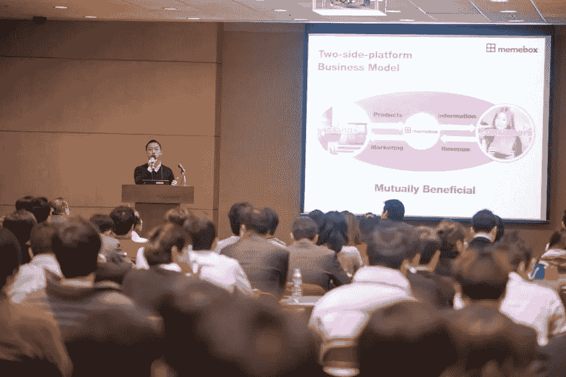
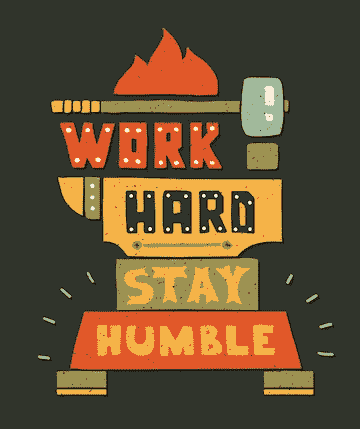
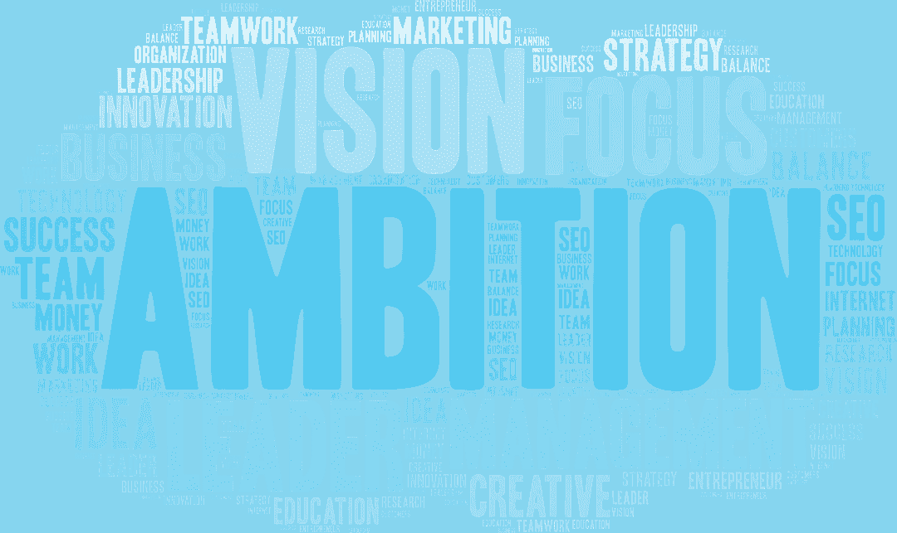

# Memebox 的全球统治之路

> 原文：<https://medium.com/swlh/memeboxs-path-to-global-markets-ef78a944de6f>

Dino Ha, Co-founder & CEO of Memebox

( [*原载于韩国商业报纸*](http://news.mk.co.kr/newsRead.php?year=2019&no=40459&fbclid=IwAR2fB-dqdlE4M7cakp8uDYOsQwnjcnIOUUfabsV2rUcNcE64WSl9PJFWzPc) *，即韩国的《华尔街日报》，其中 SparkLabs '有每月专栏*)

本周，在与 [Memebox](https://us.memebox.com) 的联合创始人兼首席执行官 Dino Ha 会面时，我想起了为什么我们在 2012 年 11 月推出 [SparkLabs Korea](http://www.sparklabs.co.kr) 时接受他加入我们的第一批加速器。

SparkLabs’ first Demo Day on March 7, 2013 where Dino presented

我们作为新加速器的定位是“帮助韩国创业公司走向世界”，Memebox 是迄今为止 SparkLabs 韩国投资组合公司中最好的体现。但这不仅仅是关于 Memebox，而是关于作为领导者和首席执行官的 Dino，以及我们为什么接受他加入我们的计划。他仍然在自信和谦逊之间保持着巨大的平衡。自从参加了 Coro Fellowship(1996 年)以来，我对领导力有点着迷，这是美国公务员的顶级领导力发展项目之一，之后我转向了创业和技术领域。它拥有校友，如参议员黛安·范斯坦，参议员蒂姆·凯恩(前副总统候选人)，众议员安娜·埃舒，克雷格·埃利希(GSM 协会前主席)，以及许多其他人。领导力有多种形式，但在许多部门和组织中，有一种品质是一种资产，那就是知道自己不知道什么，并据此执行。这在实践中很难，因为这需要谦逊和真诚，而这是许多强有力的领导者所不具备的，但这正是伟大领导者的特质，迪诺绝对具备这一点。

(Adobe Stock Image)

随着我们了解 Memebox 最近的里程碑，我们还讨论了他作为首席执行官的想法以及他迄今为止学到的东西。Memebox 已经筹集了超过 1.9 亿美元，最近与丝芙兰签署了合作伙伴关系，并将在未来几个月推出另一个共同开发的系列。

“嗨，迪诺。回顾过去，Memebox 在美国、中国和其他地方取得成功的驱动因素是什么？”我问。

"**作为一家公司，走向全球必须是你所相信的事情，因为就公司的管理、财务成本和沟通成本而言，这要复杂得多。**如果 Memebox 只专注于韩国，我们在这一点上会增长得更快，收入也会更高，但这是值得的。”

“为什么值得？”我跟进了。

“我们从进入美国市场中学到了很多。这是单纯在韩国无法获得的人才素质。例如，我们的人力资源副总裁是 Salesforce 的人力资源副总裁。她带来了她的全球专业知识，以及她的人才网络。不仅仅是她，还有其他帮助我们进入硅谷网络的人。尽管 Memebox 只有少数人，但这些注入，尤其是领导层的注入，确实是我们成功的一个因素，”迪诺解释道。

"在美国，成功的转折点是什么？"我问。

“这不是一个转折点，而是我们学到的一种心态。这不是在比较我们自己，也不是在走优步或 AirBnB 走过的路。我们了解到，尤其是在过去 3 年里，这不仅仅是收入的问题。**一旦我们专注于我们作为一家公司的优势，这使我们能够吸引并确保与丝芙兰等公司的合作关系。**

(Adobe Stock Image)

对我们来说，这是一个令人兴奋的成长阶段。甚至是你提到或写到的事情，比如韩国的创新领导力。**朝鲜是世界上第一个将创意推向市场的国家，但总是别人将创意推向市场。Memebox 想双管齐下。**例如，我们希望将 Kpop 和 Kbeauty 结合起来，使两者都具有可扩展性和可持续性，因此我们与一些 Kpop 艺术家签署了内容合作协议，并将他们带到了旧金山。这项工作将于 2019 年初宣布，”迪诺说。

"进入美国市场最困难的方面是什么？"我问。

“没那么难，但更令人困惑。这很令人困惑，因为有太多的信息和太多的选择，”迪诺说。

“好吧，那你花了多长时间才想明白？”我跟着。

“我认为我们仍在解决问题。就收入和利润而言，我们的潜力尚未释放，但基础已经奠定。作为一家运营公司和公司，我们在许多方面都真正成为了世界级的企业。

**这之所以成为可能，是因为我们从一开始就有这个雄心，SparkLabs 从一开始就有这个雄心。我相信你必须有这样的雄心壮志，还要有超越五年的愿景，才能让公司取得成功。你必须更多地考虑 15 至 20 年的回报和成功。**

(Adobe Stock Image)

如果让我再做一次，我会从美国开始，同时在韩国有一个规模不错的团队。韩国人才济济，但本土竞争激烈。首先进入美国市场将使我们尽早获得知识和网络，”迪诺详细解释道。

“太神奇了。我以前从没听你告诉过我。嘿，迪诺，感谢你抽出时间，与韩国和全球成千上万的企业家交流并分享你的见解。”

## 这篇文章发表在 [The Startup](https://medium.com/swlh) 上，这是 Medium 最大的创业刊物，拥有+417，678 名读者。

## 订阅接收[我们的头条](http://growthsupply.com/the-startup-newsletter/)。

