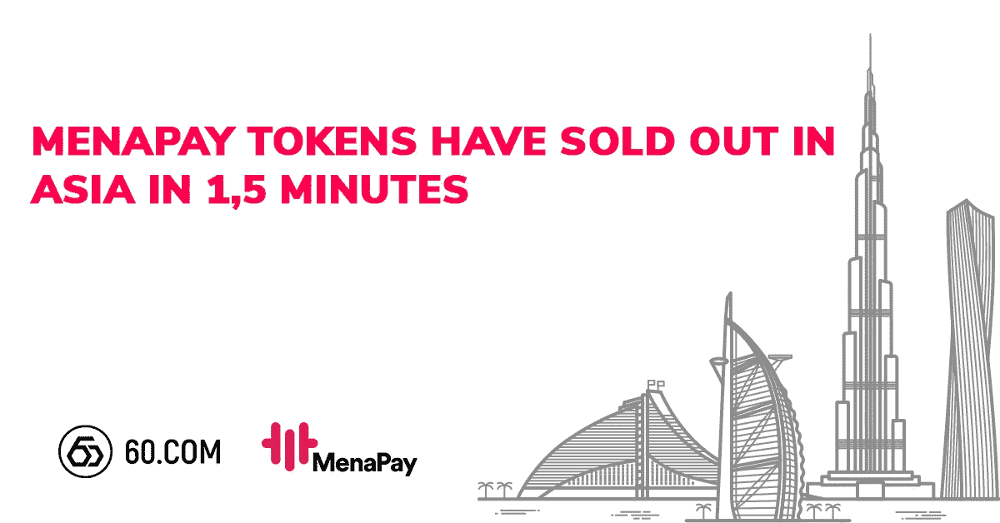

# MenaPay 代币在亚洲首日售罄

> 原文：<https://medium.com/swlh/menapay-tokens-sold-out-on-the-first-day-in-asia-4240a0279a91>

MenaPay IEO has launched on 16th of March!

[60.COM](https://60.com/cn/#/index)于 3 月 16 日推出了 MenaPay，所有每日储备的 5 万枚 [MPay 代币](https://60.com/cn/#/tradeCenter?payCoinName=USDT&coinName=MPAY&coinId=170&payCoinId=69)在推出的前 1.5 分钟内售罄。截至今日；他们总共卖出了 402，673.7 枚代币。

加密银行的一种新的筹资方式是**首次公开募股(IEO)** 。它引起了全球 ico 和贸易商的关注。当首次交易所发行开始时，投资者可以从商定的加密交易所购买代币。这个系统就像是创业公司和贡献者之间的中间人。60.COM 选择举办将于 5 月 15 日结束的 MenaPay IEO，MenaPay 的目标是达到 10 亿美元的市值。

60.COM 加密交易所在新加坡运营，并在香港、菲律宾、马来西亚、新加坡、台湾、澳大利亚和其他国家提供交易服务。投资者可以在早期投资阶段用新项目交易他们的 ETH 或 BTC。

**关于 MenaPay:** [MenaPay](https://www.menapay.io/) 用基于区块链的完全支持的加密货币取代传统支付，并提供安全透明的支付网关，使日常生活的方方面面都能进行 P2P 交易。

## 这篇文章发表在 [The Startup](https://medium.com/swlh) 上，这是 Medium 最大的创业刊物，拥有+436，678 名读者。

## 在此订阅接收[我们的头条新闻](https://growthsupply.com/the-startup-newsletter/)。

