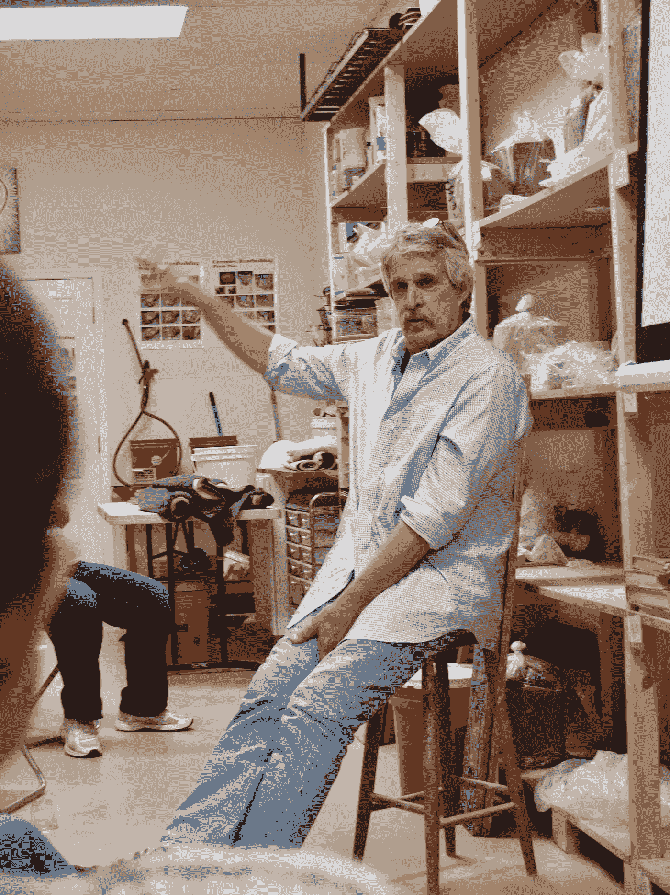

# 指导和艺术家的生活

> 原文：<https://medium.com/swlh/mentoring-and-an-artists-life-e4dc8327353e>

比尔·范·吉尔德作为一名陶艺家的职业轨迹是从指导开始的。

Bill van Gilder teaching a workshop. Photo by Diane Helentjaris.

利斯堡已经夜幕降临。弗吉尼亚。夜晚的空气，不冷不热，飘过粘土和金属阁楼的支撑门。比尔·范·吉尔德用一个预热的幻灯片开始了他的周末陶艺研讨会。终生学习者啜饮着葡萄酒，啃着奶酪，全神贯注地听着。现在，范·吉尔德可以用电源点和…