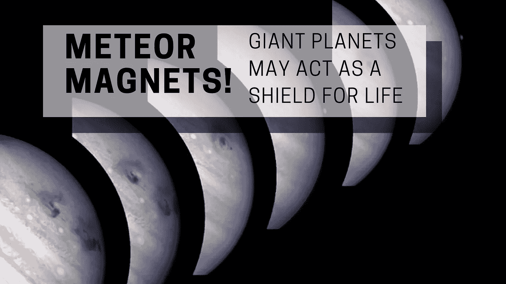

# 陨石磁铁！巨大的行星可能充当生命的盾牌

> 原文：<https://medium.com/swlh/meteor-magnets-giant-planets-may-act-as-a-shield-for-life-aeb75c4cc71f>

## 天文学家已经发现了进一步的证据，表明像木星这样的行星起到了流星磁铁的作用——保护我们免受太空物体的撞击，否则这些太空物体会撞击地球。质疑巨行星是否在地球的其他地方充当太阳系的守护者…