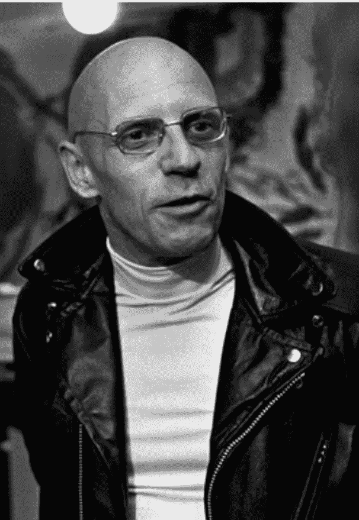

# 米歇尔·福柯:权力的结构

> 原文：<https://medium.com/swlh/michel-foucault-the-structure-of-power-4d8b8fae4d7a>

当我们阅读历史时，我们通常通过一个线性的进程方程来理解它。换句话说，我们通常把过去视为不可复制的东西，把现在视为历史上活着的最好时机。有一种观念认为，过去的社会比我们今天的社会更不人道，受教育程度更低，总体上也更不富裕。在某些情况下，这可能是真的，尤其是从技术角度…