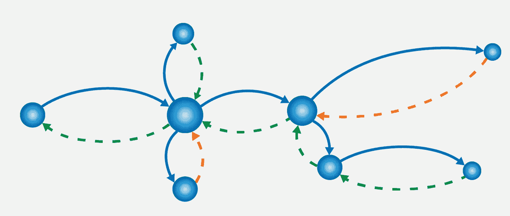

# 分布式跟踪的微服务可观测性。

> 原文：<https://medium.com/swlh/microservices-observability-with-distributed-tracing-32ae467bb72a>

Distributed Trail by Uzziah Eyee

荷鲁斯计划的持续案例研究。

# 介绍

观察微服务的数据收集方式有三种:*日志*、*度量*、*分布式跟踪*。在上一篇文章中，我使用一个示例应用程序 *Project Horus —* 讨论了日志记录，这里我们将为这个应用程序设置分布式跟踪。