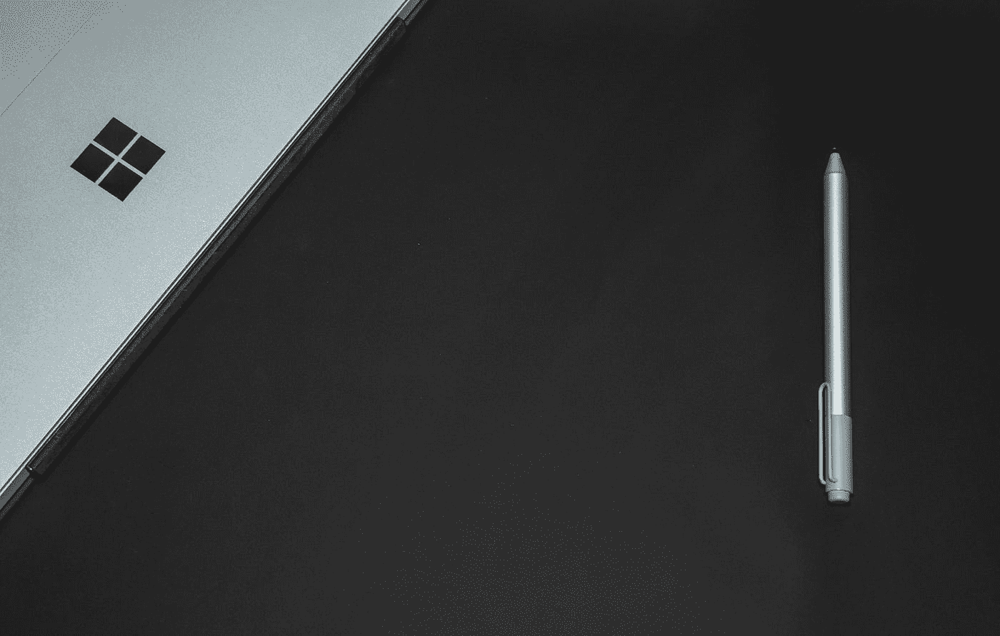
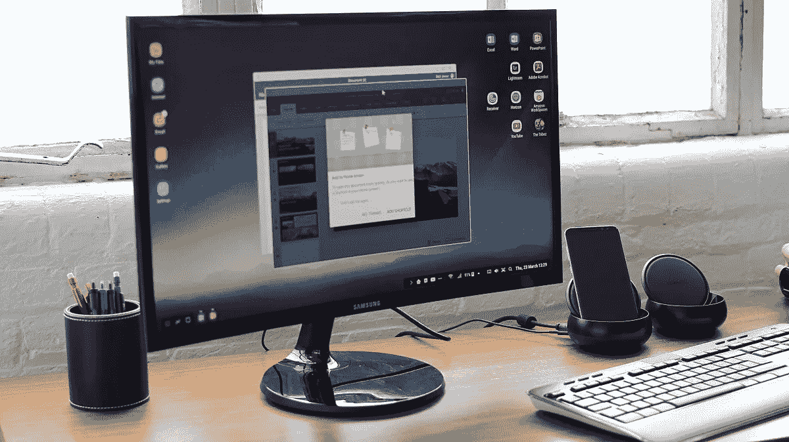
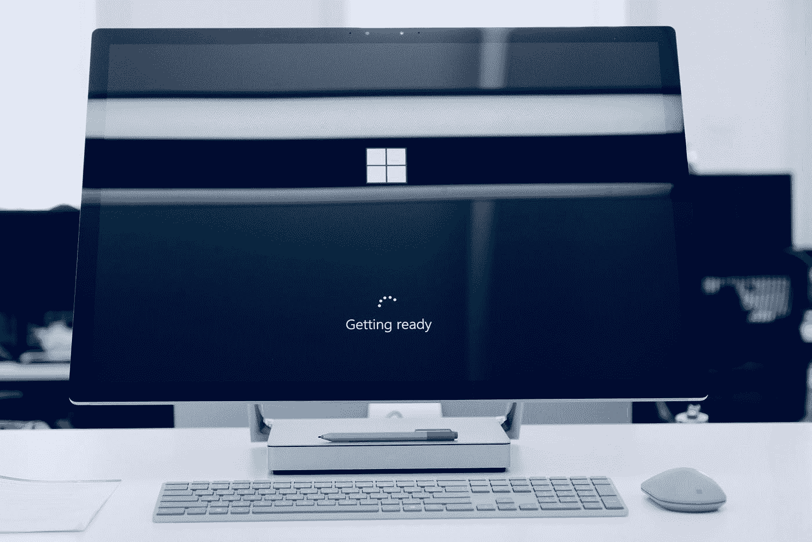

# 微软可能会赢得智能手机游戏。

> 原文：<https://medium.com/swlh/microsoft-could-win-the-smartphone-game-f71f4e3f1a91>

Photo by [Ashkan Forouzani](https://unsplash.com/@ashkfor121?utm_source=medium&utm_medium=referral) on [Unsplash](https://unsplash.com?utm_source=medium&utm_medium=referral)

计算机，超越了它们的产品性质，是**平台**。它们释放了个人或家庭消费软件、电子服务和虚拟内容(媒体/信息)的能力。

假设处理能力足够，可以有把握地说**今天**的智能手机和平板电脑与电脑服务于同样的目的，唯一的区别是执行。

在 21 世纪初开发智能手机就像是重新发明了电脑，但始终牢记着**用户体验**和**可访问性**。不像它的哥哥，它是为更广泛的目标设计的，不仅仅是科学家和专业人士。智能手机极大地受益于针对消费者电脑的反馈:一个专业工具**使**适应**普通**消费者。但与此同时，开发智能手机意味着必须适应设备的尺寸。你不能指望在这么薄的硬件上运行一个笨重的桌面操作系统。

重新发明电脑包括重新发明操作系统。今天的 *Android* 和 *iOS* 系统几乎是从零开始构建的。工程师们不得不重新思考系统，以尽可能获得最流畅、最直观的用户体验。你不能只在移动平台上使用 Windows 或 OSX:首要问题是计算机处理单元架构的兼容性。智能手机通常运行在 ARM 架构上(更适合便携式低功耗设备)，而计算机则使用 x86 或 x64 CPUs(功耗更高、硬件空间更大)。今天的移动 OSs 的局限性直接来自于开发者需要**框架**和**控制**用户活动，以保持系统**稳定**可靠。

## 新电脑

但是，随着这些移动系统变得越来越先进(也感谢随之而来的技术)，很明显，今天，它们代表了**理想的高效消费者导向系统**。它们不仅速度快、用户友好、可靠，而且新的功能每年都以极快的速度增加。有时甚至会在桌面操作系统上弹出的功能(通知、应用商店、语音助手……)。

> 他们的能力越强，就越清楚智能手机是新的“电脑”。

另一个需要记住的趋势是，智能手机硬件正在达到顶峰，制造商很难为他们的旗舰产品提供更多附加值。自 2018 年第四季度以来，智能手机销量增长[一直在下降](https://www.computerworld.com/article/3337529/its-been-the-worst-year-ever-for-smartphone-shipments-heres-why.html)。当一个市场参与者敢于走出并重新定义智能手机的使用时，智能手机的新时代将会到来。

从**硬件**的角度来看，我们已经将这些设备的基本潜力发挥到了极致。然而，在**软件**方面有巨大的机会，可以为智能手机游戏带来一系列全新的体验。

By Maurizio Pesce from Milan, Italia — Samsung’s S8 DeX dock, CC BY 2.0

你认得这个装置吗？那是三星 DeX:一个你插显示器、键盘、鼠标的 dock 一旦你把手机放在上面，它就变成了一台完全可用的电脑。它似乎从未真正引起公众的注意，主要原因是它仅限于 android 设备所能提供的功能，但它也可能是对未来计算的一次窥探。

这个想法很明确:只有一个设备或一个平台来满足你所有的计算需求。在许多层面上，这可能是理想的设置:

*   **用户**享受一体化设备或者至少它们之间的完美兼容性。
*   **App 开发者**不需要担心跨平台开发。一个应用程序只需要开发一次(遵循正确的指导方针)，最好能在所有类型的设备上访问。
*   操作系统开发人员可以将精力集中在一个平台上，极大地提高了安全性和稳定性。

三星不是唯一一个看到这个想法潜力的人。事实上，我们不需要看得比苹果或谷歌更远。两家公司都在拓展其移动平台的界限，为台式电脑服务。谷歌试图用他们的 Chrome 操作系统平台*加入电脑和移动设备已经有一段时间了(最近，Android Q beta 甚至建议[实现桌面模式](https://www.xda-developers.com/google-more-information-desktop-mode-android-q/))。另一方面，苹果公司长期以来一直宣传其 iPad 是电脑的可行替代品——“什么是电脑？”。*

这些公司的解决方案的主要问题是，它要求他们重新发明计算机。谷歌和苹果正在搭建一座从移动到桌面的桥梁，但是让移动系统适应桌面体验比让桌面体验适应移动系统更难——处理能力不再是最大的障碍。尽管它们很好，但移动软件通常是更完整的桌面软件的“精简”版本是有原因的。

但是有一家公司不需要走和竞争对手一样的路。由于最近在手机市场的惨败，微软拥有了迎接新的计算时代所需的一切。

Photo by [Johny vino](https://unsplash.com/@johnyvino?utm_source=medium&utm_medium=referral) on [Unsplash](https://unsplash.com?utm_source=medium&utm_medium=referral)

## 微软的续约

2014 年，前 CEO 史蒂夫·鲍尔默离开微软执行董事会，将职位交给雄心勃勃的塞特亚·纳德拉。从那一刻起，公司的战略转向了对市场其他参与者更加**开放**。它始于在 Android 和 iOS 应用商店上发布流行的 Office 套件，随后是与 RedHat 和亚马逊的合作。

在智能手机方面，纳德拉正式放弃了 Windows Phone 平台，将精力集中在增强 Windows 10 体验上。在硬件方面，微软一直在追求**成功的** *Surface* 系列，这是平板电脑和笔记本电脑的良好平衡组合——证明了多用途设备的效率。

除了更好的稳定性、功能性和安全性，Windows 操作系统经历了几项改进，使其总体上成为更多**移动**设备的更好**解决方案**。出现了*平板模式*，以及语音助手和**专用应用商店**。在系统的更深处，微软一直在开发 Windows 的 [ARM 版本——这意味着它今天能够在小型移动(智能手机)处理单元上运行 x86 (32 位)软件。](https://docs.microsoft.com/en-us/windows/arm/)

这是一切联系的地方。

> “当你说我们会制造更多的手机时，我确信我们会制造更多的手机，但它们不会像今天的手机那样。”——塞特亚·纳德拉([采访](https://www.windowscentral.com/satya-nadella-comments-future-windows-phones-im-sure-well-make-more))

Windows Phone 失败的原因主要是因为它看到了 Android-iOS 双头垄断的日子——应用程序开发者没有动力费心为 Windows Phone 开发。遵循先有鸡还是先有蛋的 T21 模式，开发者越来越少，顾客越来越少，开发者越来越少…

Windows 桌面操作系统本身占有整个桌面操作系统市场的 88.22% 。它的最后一个版本，Windows 10(至今为 T2 44.10%的桌面提供动力)，正在稳步增长，并聪明地进化以继续统治市场——最近的消息表明微软将[在 Windows 中集成 Linux 内核](https://itsfoss.com/windows-linux-kernel-wsl-2/)，这给了程序员和科学家更少的理由使用任何 Linux 发行版，如果他们可以只停留在微软的操作系统上。

这一切听起来是不是对你开发 Windows 10 应用的一个很好的激励？世界上最广泛的系统之一，支持多种设备和架构？

## 微软可能会赢得智能手机游戏。

想象一下:微软可能会发布一款智能手机，名为“ *Surface Phone* ”，以补充 *Surface* 产品系列。他们可以在 ARM 上运行 Windows 10(也可以运行桌面 32 位软件，将来可能会更多)。它将和运行在笔记本电脑、个人电脑或平板电脑上的 Windows 一样好用。一个在任何地方运行的统一平台。

为 Windows 开发你的应用程序不仅会向绝大多数笔记本电脑、平板电脑和台式机开放，还会向一个非常有前途且潜在增长的智能手机市场份额开放。

锦上添花:想象这款“Surface Phone”拥有类似于 *dock* 的功能是完全合理的。你只需要将设备放在一个小平台上(连接到显示器、键盘和鼠标)，就拥有了一台完全可用的 Windows 电脑。

> 适合各种需求和设备的统一平台。

微软不需要重新发明计算。当苹果和谷歌正在建造桥梁来冲击桌面计算的堡垒时，微软只需要调整它已经非常完整和流行的桌面系统来适应更轻便的移动设备。

## 未来的挑战

虽然我对微软的战略非常有信心，但征服我们今天非常紧张的智能手机市场并不容易。面临的主要挑战如下:

*   将**排除在“传统”智能手机形象之外**——这些新设备为用户带来了全新的计算体验，而**的营销工作**需要高效地向市场展示这一点。
*   通过提供 SDK、指南和其他工具来促进**开发者**的工作，以谷歌最近的 [Jetpack](https://developer.android.com/jetpack) 项目为例。开发者去哪里，用户就去哪里。
*   提供比**更好的硬件**，提供至少与当前领先的智能手机公司一样多的高质量功能。
*   在经历的每一个阶段都要保持**开放**。你不能把某人从已经舒适的服务生态系统中拉出来。这个系统应该让人感到熟悉、安全和自由。