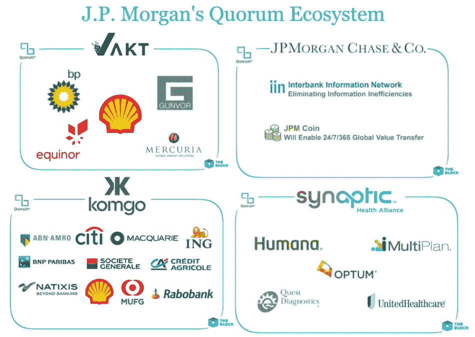
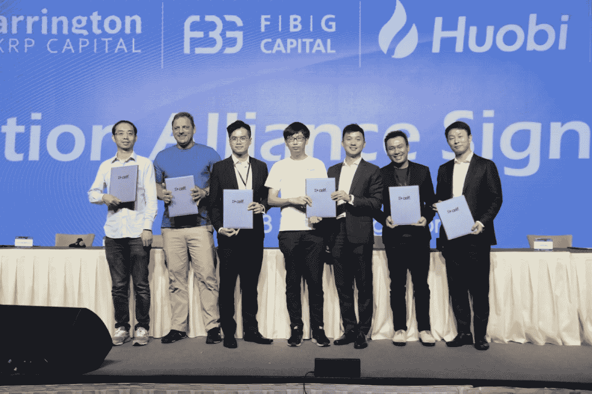

# BaaS(区块链即服务)市场正在升温。

> 原文：<https://medium.com/swlh/microsofts-azure-will-power-jpmorgan-s-blockchain-platform-a5a43a7656ee>

渴望从区块链技术中获利的公司蜂拥而至。让我们来看看。

5 月份最重要、最积极的消息之一是，微软宣布与 JP Morgan 建立战略合作伙伴关系，将企业应用推向新的高度。根据这一合作关系，微软将把摩根大通的“Quorum”作为 Azure 云平台的首选区块链。

Source: The Block

Quorum 以太坊在企业中的应用，它的设计考虑到了在一组有权限的已知参与者中高速、高吞吐量地处理私人事务。Quorum 是 go-Ethereum client (geth)的许可版本，由摩根大通与以太坊企业联盟合作开发，专为金融服务行业设计。

通过与 Azure 合作，微软的云计算客户将可以使用 Quorum 工具和技术。根据协议，Quorum 将成为第一个通过 Azure 区块链服务提供的分布式账本平台，使摩根大通和微软的客户能够在云端建立和扩展区块链网络。

除了作为第三方企业的现成区块链平台，Quorum 还将帮助推动摩根大通和微软自己的区块链程序和 DApps，如银行间信息网络、JPM 硬币和微软的 Xbox 版税支付流程等。

有传言称，微软继续进行合作，作为成为 BaaS 中最重要的参与者的第一步。**区块链即服务** (BaaS)是区块链和云计算的结合，被认为是商业界的后起之秀。简单来说，BaaS 是第三方服务提供商，将安装和维护**区块链**网络。

最近，亚马逊网络服务宣布通过其管理的区块链服务进入市场。IBM 也是如此，它正在推动其 Bluemix 云平台以及其 Hyperledger Fabric 区块链。

另一个推动企业适应的大玩家是 Aelf。近日 Aelf 正式发布了 Enterprise Beta 0.7.0，号称为开发者量身定制的“ ***【区块链的下一次进化】*** 。

除了发布 Enterprise Beta 0.7.0，Aelf 还出现在创新联盟成立的新闻中。

与 JP 摩根银行间信息网络类似，Aelf 创新联盟旨在建立一个大型国际区块链参与者联盟，帮助从初创企业到大公司的组织快速采用区块链。这些合作伙伴将为所有对探索和采用区块链技术感兴趣的企业提供咨询支持、宝贵资源、行业见解和经验。

总之，微软、亚马逊、aelf 等公司采取了正确的措施来帮助加快企业级的适应。这只是一个开始，很快我们将会看到更多由 Aelf、Amazon 等公司推动的更大规模的企业级改编的消息。

***免责声明*** *:本文不作为投资建议。你应该总是做你的研究，明智地投资你的资本。我不拥有令牌，也不会因为写这篇文章而获得任何形式的奖励。*