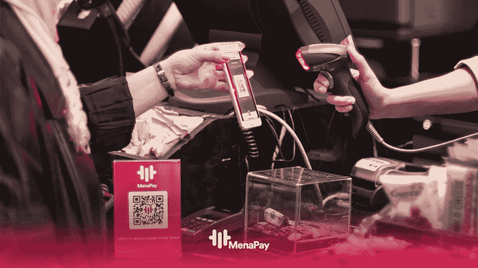

# 中东的免息支付平台在土耳其开发

> 原文：<https://medium.com/swlh/middle-easts-interest-free-payment-platform-developed-in-turkey-b49ab20a6418>

## 基于区块链的下一代支付平台 MenaPay 为伊斯兰金融机构提供快速、可靠的金融服务，这些机构容易受到难以获得银行服务的 MENA 地区用户的影响。

基于区块链的支付平台 *MenaPay* ，已在土耳其开发，将于 2019 年 1 月 15 日在整个地区推出，作为一种创新的支付方式，符合 MENA 地区 [*伊斯兰金融原则*](http://saudigazette.com.sa/article/551713/BUSINESS/Mideast-interest-free-payment-platform-developed-in-Turkey) ，难以获得传统银行服务。得益于区块链技术， [*MenaPay*](https://menapay.io) 支付平台使人们能够在日常生活的各个方面进行安全快速的支付交易，而无需银行，它可以在下载到智能手机的免费应用程序上工作，并作为中东和北非地区无法使用银行的用户的优先支付方式。

2018 年初，中东的成功商业人士从 seed 投资到土耳其的 MenaPay，其中包括 15 人的技术人员，在一年内，达到 35 人的团队已经完成了产品开发过程。 [*BADEER*](/menapay/menapay-have-met-150-foreign-investors-from-50-countries-at-the-badeer-i-d38660a8406c) 和[*Turkey block chain Summit*](https://insidecrypto.today/menapay-sponsors-revolutionary-blockchain-turkey-summit-2018)作为在投资者中享有盛誉的盛会，面对与会者的强烈兴趣，MenaPay 伊斯兰金融按照总部设在区块链的透明原则，带来了第一个不安全的支付解决方案，并应银行之请。

18 个国家的新共同货币:梅纳卡什

中东支付领域开启数字化转型大门的 MenaPay 支付平台，得益于区块链技术的可控性，可以轻松提供用户信任和系统透明性。在 [*MenaPay 支付平台*](https://www.menapay.io/#how-it-works) 中，资金转移和资金流入由独立审计公司控制。MenaPash 支付平台提供不超过 2 个见证系统的透明支付基础设施，MenaCash 通过区块链技术提供了一种安全、快速的方式来完成所有交易。

**MENA pay；电子商务购物、零售商店和个人对个人的转账业务在日常生活的每一个方面都是需要的，无需使用信用卡。**menash 平台上使用的货币为中东和北非地区提供了一种通用货币，每个地区包括 18 个不同的国家，每个国家使用不同的货币。这样，该地区的跨境转移变得更快、更容易。

**两个国家之间的汇款只需 5 秒钟**

[*梅纳佩*](https://www.menapay.io/#team-team) 奥尔汉·巴伊兰说

> MenaPay 支付平台旨在满足人们的日常需求，提供针对该地区的文化适应，并为其用户提供集成的业务系统解决方案。有了 MenaPay 二维码支付系统，区块链基础设施的所有交易最多在 5 秒钟内完成。通过创新的方法，我们将降低中东和北非地区的现金使用率，并利用区块链技术在中东和北非地区建立世界上最大的无现金社会。

强调了平台带来的价值。

Fast, transparent and secure payment by using MenaPay

**MENA pay 移动应用将于 1 月 15 日面向所有 iOS 和 Android 用户开放**

该应用程序包含 4 种不同的产品。使用 MenaPay 移动应用程序，用户可以在几秒钟内进入加密货币的世界，享受区块链基础设施的快速安全支付体验，并在日常生活的各个方面使用 MenaPay 作为主要支付方式。

借助 [*MenaPay 经销商网络*](/menapay/introducing-dashboards-merchant-and-reseller-2a3a5c51ac38) ，实现现金的数字化转型。它的目标是在中东和北非地区的许多地区提供，它与 50 多个工作场所达成协议，将在几秒钟内将现金转换为 menash(数字货币)。经财政部批准的工作场所将能够通过信用卡或从 MenaPay 基金会电汇获得 MenaCash，并在其工作场所出售 MenaCash。MenaCash 工作场所将从 MenaPay 基金会获得佣金，并将有一个额外的收入模型，并可能根据其客户的见解创建详细的报告。

**借助 MenaPay 商务平台，工作场所和商店将能够在一个面板上轻松了解客户的需求和消费行为，并跟踪自己的收入和销售情况。**

参与 MenaPay 经销商网络的商家和供应商可以轻松集成他们的 MENA pay[*API*](https://www.menapay.io/#products)以开始接收付款，可以通过手机和电脑轻松完成注册流程和个人资料验证。该应用程序的另一个特点是，MenaPay 开发支持团队通过板上的实时支持帮助供应商进行集成。

***关于***[***MenaPay***](https://menapay.io)***；***[***MenaPay***](https://menapay.io)***是中东和非洲第一个基于区块链技术的支付系统。MenaPay 通过加密的区块链网络提供支付，而不是传统的支付方式。这就是它如何为各类用户和日常生活的方方面面提供安全透明的支付网络。***

***MENA pay 项目于 2017 年 11 月启动，旨在为生活在该地区 18 个国家的 4.2 亿人提供高级支付服务。MenaPay 将把总收入的 75%分配给 MenaPay 代币所有者。这为加密货币行业设定了一个新标准，远远超出了用户和投资者可获得的常规激励水平。***

## 这篇文章发表在 [The Startup](https://medium.com/swlh) 上，这是 Medium 最大的创业刊物，拥有+409，714 名读者。

## 在这里订阅接收[我们的头条新闻](http://growthsupply.com/the-startup-newsletter/)。

