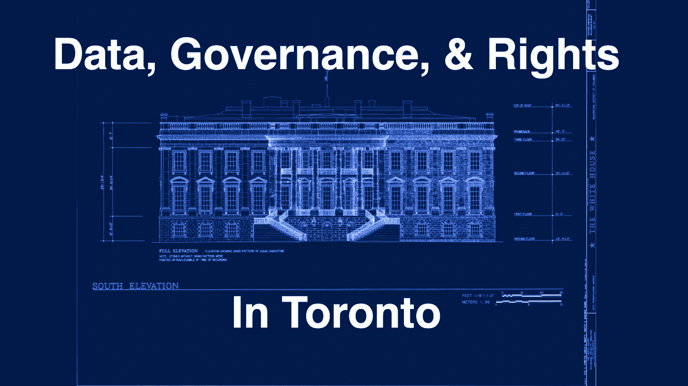

# MIDP:数据治理提案

> 原文：<https://medium.com/swlh/midp-the-data-governance-proposal-55272767dd40>

周一，Waterfront Toronto 公开发布了 Sidewalk Labs 备受期待的[主创新和发展计划](https://quaysideto.ca/sidewalk-labs-proposal-master-innovation-and-development-plan/)(MIDP)——本质上是他们对码头区的智能城市提议。已经有，而且希望会有更多的人热衷于这项交易。相反，在这里，我希望综合和更新一些冷的观点——特别是关于提案的数据治理部分，以[我对……的初步分析](/@McDapper/toronto-civic-data-and-trust-ee7ab928fb68)为基础