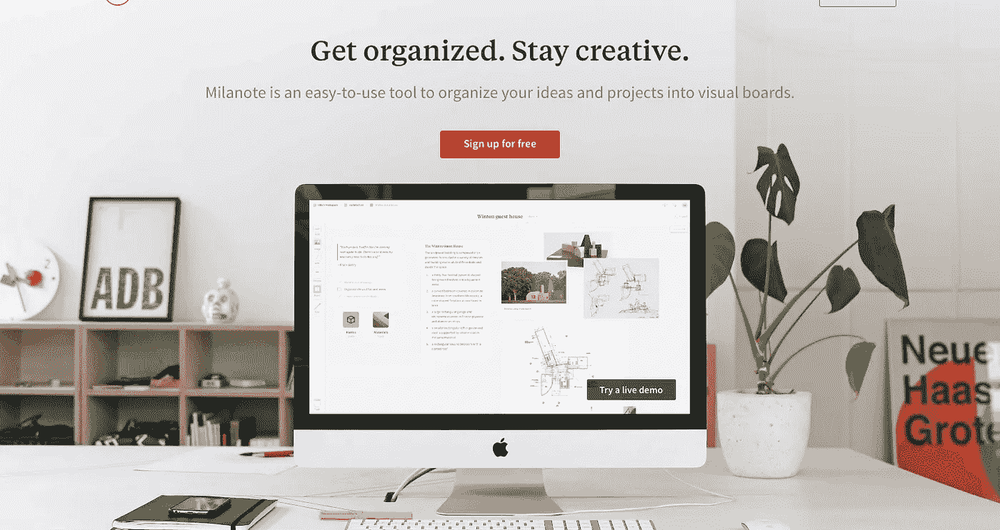

# 米拉诺特:UX 的首选武器

> 原文：<https://medium.com/swlh/milanote-ux-weapon-of-choice-e8615a4507a>

对于设计师来说，有很多工具可以帮助我们快速甚至无缝地创造出令人惊叹的东西，但有没有一种工具可以帮助你创造出伟大的东西，同时让你在创造的过程中保持有序呢？米拉诺特就是这种情况。

> “Milanote 是一个易于使用的工具，可以将你的想法和项目组织到可视板上。”
> ——据 Milanote 网站

