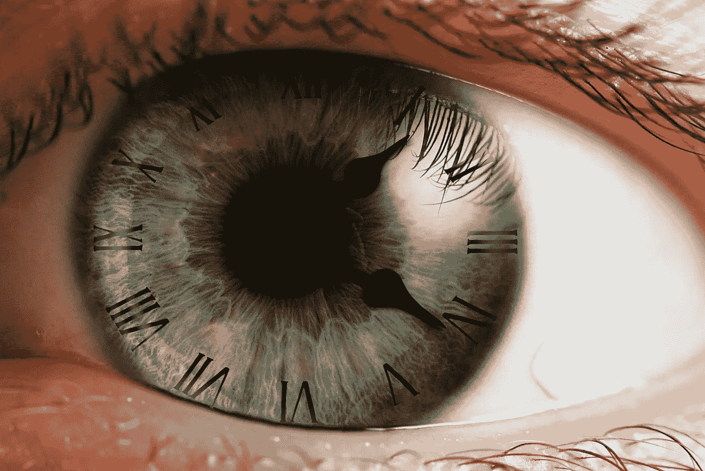

# 正念:在你的手腕上滴答作响

> 原文：<https://medium.com/swlh/mindfulness-ticking-in-your-wrists-66796eda8af7>

## 恐慌来袭时恢复镇静的秘诀

Image courtesy: Prashant Jethmalani

这件事发生在又一个糟糕的工作日。我对我的老板很失望，他根本不听我关于改进我们正在破解的代码的建议，并且更喜欢我的搭档的意见而不是我的。沮丧的想法爬进了我的心里——政治、偏袒、欺凌——所有这一切似乎…