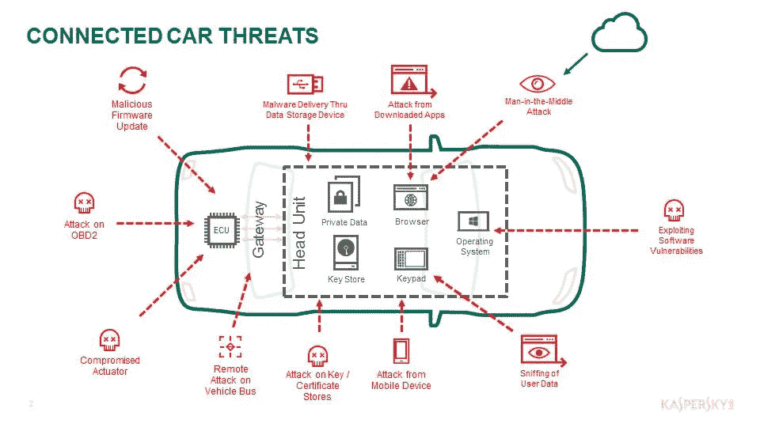

# 减轻无线车辆攻击

> 原文：<https://medium.com/swlh/mitigating-wireless-vehicle-attacks-125647a55fd2>

# 售后汽车插件解决方案中的安全漏洞

The image was taken from Kaspersky ([here](https://www.google.com/url?sa=i&source=images&cd=&ved=2ahUKEwjL6b-d3N7iAhUJzYUKHYDtDVMQjRx6BAgBEAU&url=https%3A%2F%2Fwww.smart2zero.com%2Fnews%2Fplatform-protects-vehicle-communications-against-hacker-attacks&psig=AOvVaw1UKw5XRkD6lIOp9Yk_vDgn&ust=1560249038716791).)

在过去的十年中，汽车行业已经看到嵌入车辆的计算机组件的数量大幅增加。今天，汽车实际上是轮子上的计算机，就像我们的计算机如何相互连接一样，我们的汽车也是如此。安全创新首席执行官 Ed Adams 指出…