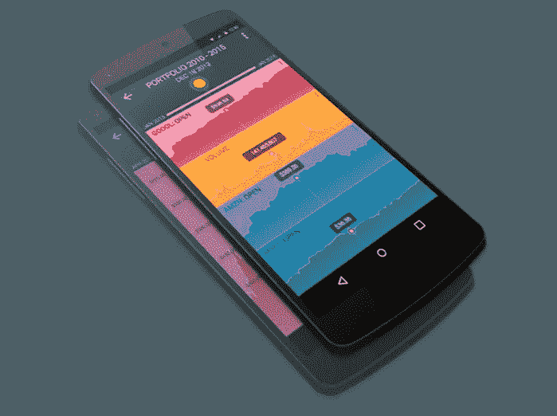

# 移动数据可视化设计

> 原文：<https://medium.com/swlh/mobile-data-visualization-design-18845fe6b660>

## 移动外形和设备的设计考虑

Example reference application- [click here to see an interactive version](http://www.brightpointinc.com/d3-mobile-web-application/)

> 世界广告研究中心称，到 2025 年，将近四分之三的互联网用户将只使用手机

在其 2019 年 1 月的报告中，世界广告研究中心[预测](https://www.warc.com/content/paywall/article/warc-datapoints/almost_three_quarters_of_internet_users_will_be_mobileonly_by_2025/124845)到 2025 年，72%的世界互联网用户将只使用手机。领先的科技媒体 ComScore