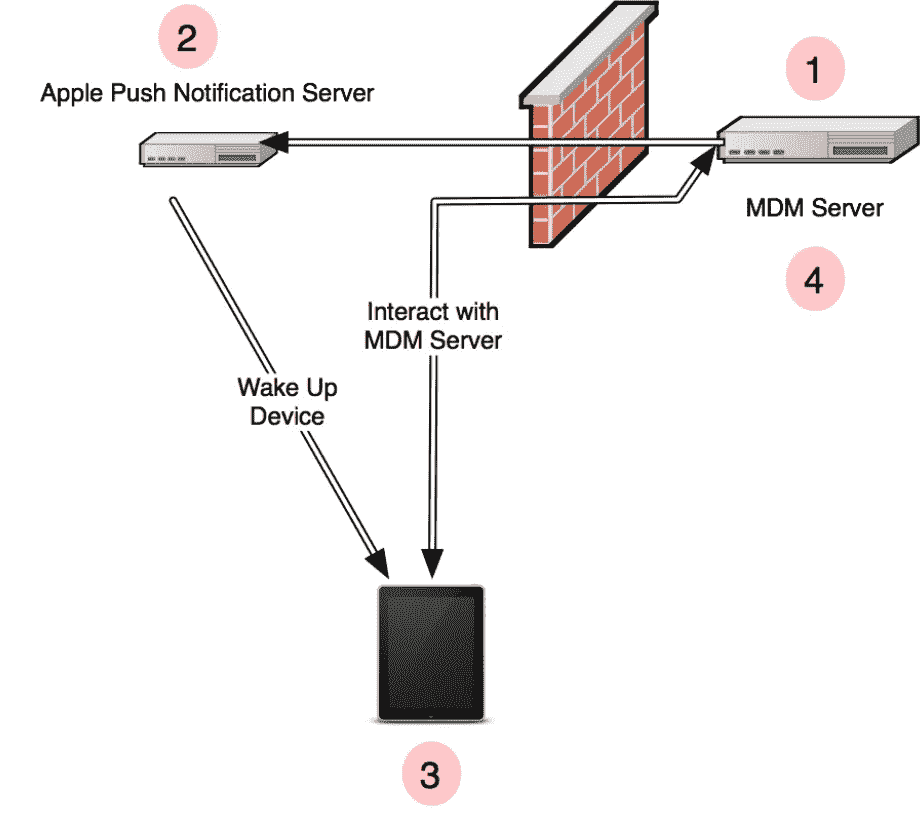
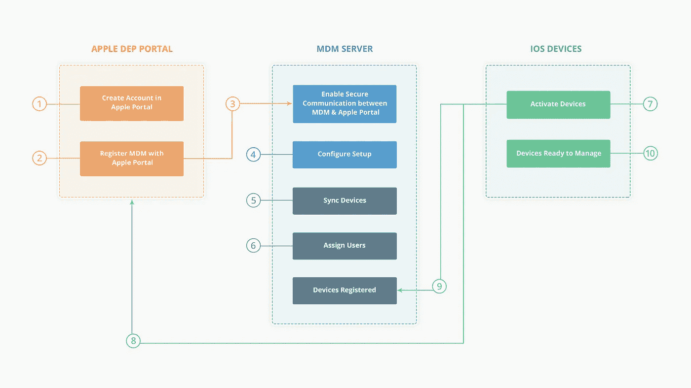
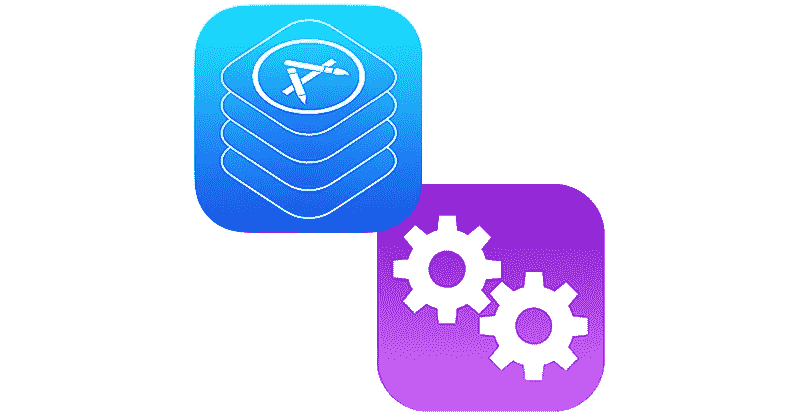

# iOS 版移动设备管理(MDM)

> 原文：<https://medium.com/swlh/mobile-device-management-mdm-for-ios-60448313dafb>

## 让我们来概述一下这个无客户端协议

iPad iPhone Security

最近几周，我一直在研究和搜索 MDM。这就是我要和观众分享的。MDM 已经成为一个热门话题，因为组织被迫将安全性引入组织。移动设备正在侵入企业社会的各个层面，使得远程管理和控制移动设备的需求变得越来越迫切。苹果提供了一些企业管理功能，首先是通过无线配置文件，从 2010 年开始，全面支持 MDM。

# 为什么需要 MDM？🤔

为了理解这一点，让我们举一个例子，考虑一个场景，您的公司有许多 iOS 设备，您必须集中管理它们，那么您将如何实现这一点？你可以尝试使用第三方 MDM 应用程序，例如: [***空中观察***](https://www.air-watch.com/) ，但这非常昂贵💰或者你将尝试实施苹果自己的企业部署方法，即“MDM”。所以我更喜欢第二个👍。

# 让我们了解一下 MDM 到底是什么？

移动设备管理(MDM)协议为系统管理员提供了一种向运行 iOS 4 及更高版本的受管 iOS 设备发送设备管理命令的方式。通过 MDM 服务，IT 管理员可以检查、安装或删除配置文件、删除密码，并开始在受管设备上进行安全擦除。

根据**苹果文档**:

> MDM 协议建立在 HTTP、传输层安全性(TLS)和推送通知之上。相关的 MDM 签入协议提供了一种将初始注册过程委托给单独的服务器的方法。
> MDM 使用苹果推送通知服务(APNS)向受管设备发送“唤醒”消息。然后，该设备连接到预定的 web 服务，以检索命令并返回结果。

因此，我的基本理解是，要提供 MDM 服务，我们需要部署一个 HTTPS 服务器作为 MDM 服务器，然后将包含 MDM 有效负载的配置文件分发到受管设备。

**关键特性**🏷:它允许管理员将配置文件推送到设备，无需任何手动干预。

# **基础知识**

MDM 服务本质上由三个元素组成:
1 .被管理的设备(iPhones、ipad、iPod Touches)📱
2。进行管理的服务器(各种 MDM 服务器)⚙
3。服务器唤醒设备的一种方法(APNS)🤨

MDM 有效负载可以放在配置概要文件(。mobileconfig)文件通过电子邮件或网页分发，作为无线注册服务提供的最终配置描述文件的一部分，或使用[设备注册程序(DEP)](https://www.apple.com/business/site/docs/DEP_Guide.pdf) 自动分发。

在任何给定时间，一个设备上只能安装一个 MDM 有效负载。注册 MDM 服务器后，MDM 服务器和 Apple Portal 之间将启用安全通信。这用于同步通过苹果 DEP 门户网站购买的设备的详细信息。

当您找到从 Apple portal 同步的设备时，您可以将其分配给用户。每当激活设备时，使用 MDM 施加的所有限制和配置都会自动通过无线方式(OTA)安装到您的所有设备上。通过配置 DEP，您可以确保在 DEP 下购买的所有设备一旦被激活，默认情况下都由 MDM 管理。在这篇博文中，看看它是如何与服务器一起工作的。🎉

# 注册后🤷

客户端设备和 MDM server 之间的每次交互都包含四个元素:
1 .服务器通过苹果
2 请求推送通知。苹果向设备
3 推送通知。设备连接到服务器
4。服务器和客户端交换命令和响应

MDM Architecture ([*Source*](https://i.stack.imgur.com/mXAT9.png))

除了托管配置文件，您还可以使用 MDM 来安装应用程序。通过 MDM 服务安装的应用程序称为托管应用程序。MDM 服务还可以控制托管应用及其数据在设备上的使用方式。😎

**注意⚠️**
必须获得 APNS 证书。这是 MDM 服务器与客户机通信的基础，没有它，MDM 服务将无法工作。

MDM 的一些巨大的 ***特性如下:***

1.  空中传播
2.  支持多种移动操作系统
3.  安全机制
4.  企业级应用管理

# MDM 命令周期🌐

MDM 协议的主要目的是**向 iOS 设备**发送命令**处理结果**。MDM 协议基于 **HTTPS** (安全 HTTP)，用于**交换称为属性列表** (plists)的 XML 消息。更多关于普利斯的信息，[请看这里](http://developer.apple.com/library/mac/documentation/Cocoa/Conceptual/PropertyLists/Introduction/Introduction.html)。

在 MDM 协议中，服务器不会将命令推送到设备。相反，**服务器使用苹果推送通知服务** (APNS) **来通知**设备新命令可用。

一旦设备收到推送通知，它就向 MDM server 查询命令，执行这些命令并将结果发送回 MDM server。

# ✍设备注册流程部

当服务器向设备提供特殊的配置描述文件时，设备注册到 MDM。该配置文件包含:

*   **MDM 有效载荷**

这是一个特殊的**负载**，它告诉设备它将由 MDM 服务器管理。它包含服务器 URL、推送通知主题和其他属性。有关 MDM 有效负载的更多详细信息，请参见 MDM 协议参考。

*   **设备身份证明**

移动服务器需要验证连接的设备。由于 MDM 是在没有用户交互的情况下自动完成的，因此普通的用户名/密码身份验证不起作用。移动服务器(作为 MDM 服务器)通过设备的身份证书来验证设备。这称为客户端证书认证，在服务器的 SSL 层完成。

How Apple DEP Works ([source](https://www.manageengine.com/mobile-device-management/help/images/dep.png))

这还没完，看看 DEP 的官方文件，你就会知道它将包含[【更多】](https://www.apple.com/business/site/docs/DEP_Guide.pdf)。😳。

# 创建简单的 MDM 服务器

>>要求📝

1.  APNS
2.  计算机编程语言
3.  网络连接

要发送推送，服务器需要与苹果的 APNS 服务器通信。这需要出站 TCP 连接到端口 2195 上的**gateway.push.apple.com**。最后，设备需要能够在 MDM 注册配置文件中定义的任何端口上联系 MDM 服务器本身。

# 一目了然🌟

*   MDM 检入协议允许设备联系您的服务器。
*   MDM 协议向设备发送管理命令。
*   你设计有效载荷的方式很重要。
*   DEP 可让您使用“设置助理”来配置设备。
*   苹果推送通知证书可以通过苹果推送证书门户生成。

# 最后的想法🏁

所有这些都在了解 MDM 的简短方法中涵盖了。我希望这篇文章激发了你对 iOS MDM 的更多了解，或者教会了你一些新的东西。真心鼓掌！！👏。我会在页面末尾留下一个链接列表，欢迎评论或给我发送任何其他有用的视频或链接。如果我在接下来的几天/几周/几个月回来，我会展示我学到的更多。要覆盖更多的草稿😎一会儿见！👋

# 有用的资源🔖

*   苹果部署计划:[deploy.apple.com](http://deploy.apple.com/)
*   iOS 部署参考:[help.apple.com/deployment/ios](http://help.apple.com/deployment/ios/)
*   macOS 部署参考:[help.apple.com/deployment/macos](http://help.apple.com/deployment/ios/)
*   商务 IT 资源:[www.apple.com/business/resources](http://www.apple.com/business/resources)
*   商业设备注册项目:【www.apple.com/business/dep 
*   商务支持:【www.apple.com/support/business 
*   推送通知故障排除:[https://developer . apple . com/library/archive/technotes/TN 2265/_ index . html](https://developer.apple.com/library/archive/technotes/tn2265/_index.html)
*   [https://medium . com/@ Joshua ajung/managing-your-mobile-devices-in-the-cloud-using-apple-own-MDM-solution-8a 588d 9724 b 6](/@JoshuaAJung/managing-your-mobile-devices-in-the-cloud-using-apples-own-mdm-solution-8a588d9724b6)
*   [https://medium . com/@ pra deep . misra/mobile-device-management-MDM-6466 D4 ca 665](/@pradeep.misra/mobile-device-management-mdm-6466d4ca6650)

## 这篇文章发表在 [The Startup](https://medium.com/swlh) 上，这是 Medium 最大的创业刊物，拥有+436，678 名读者。

## 在此订阅接收[我们的头条新闻](https://growthsupply.com/the-startup-newsletter/)。

