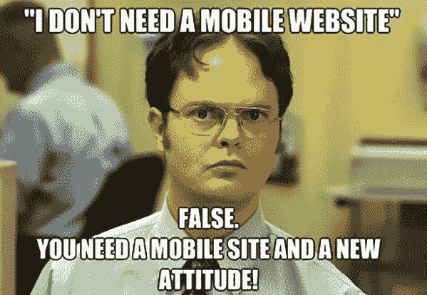

# 手机网站还是手机 App:选什么？

> 原文：<https://medium.com/swlh/mobile-website-or-mobile-app-what-to-choose-28d0cf19d93c>

公司越来越意识到要为他们的业务开发一个移动战略。但是移动应用程序开发的成本在大多数时候会变得过高。因此，在开发移动应用程序之前，让我们回答一个问题——如果一个移动网站可以达到类似的目的，会怎么样？移动网站和移动应用程序哪个更好？在这篇文章中得到这个普遍问题的答案。

你需要先开发什么——手机应用还是手机网站？

2016 年，估计全球 62.9%的人口已经拥有了手机，据[统计局](https://www.statista.com/statistics/274774/forecast-of-mobile-phone-users-worldwide/)预测，到 2019 年，全球手机用户数量有望突破 50 亿大关。[根据尼尔森](https://www.nielsen.com/)的一份意外报告，美国成年人现在有将近半天时间花在智能手机上。这些数据对企业至关重要。

移动存在是当前的需要。任何旨在实现移动展示的企业都有一个基本问题——移动网站(Web 应用)还是移动应用？那么，Web app 和手机 app 的初步区别是什么呢？网络应用是一个简单的网站，采用了移动优先的方法，旨在智能手机上观看和互动。另一方面，移动应用程序需要通过应用商店下载和安装，并且可以访问您的系统资源。因此，网络应用程序的功能类似于移动应用程序，但来自于手机浏览器的舒适性。

作为一家软件开发公司，我们被问到这个问题，无论是 Web 应用还是移动应用，相信我，几乎每周都有 5-6 次。但是问题不对！我们将在本文后面讨论是否开发移动应用，但是，**移动优先战略是必须的。简单地说，你绝对需要一个为移动设备配置的网站。现在我们已经解决了这个问题，让我换个方式问你——我有一个移动响应的网站。我还需要一个手机应用吗？好了，既然我们答对了这个问题，那么让我告诉你，有很多因素需要考虑，以帮助你调整最适合你的业务目标的移动战略，并帮助回答这个问题——移动网站还是移动应用程序？**

**移动网站:范式转变——为什么它对企业如此重要？**

让我们按点细分:

[1]自 2016 年以来，移动互联网的使用量已超过桌面使用量，2017 年移动流量占全球在线总流量的比例为 52.64%。所以，这让你知道拥有一个网络应用程序有多重要。公司必须以这样一种方式设计他们的应用程序，即网络可以适应不同设备的屏幕，以紧凑和舒适的浏览方式自动显示内容。

[2]您知道吗— [近 80%的客户会停止接触那些在他们的设备上显示效果不佳的内容，57%的互联网用户表示，他们不会推荐网站设计不佳的企业。移动首先改变了网站用户体验的模式，改善用户体验意味着更多的流量。](https://www.sweor.com/responsivewebdesign)

[3]此外，除非你是你所在领域的品牌，否则用户很可能会首先登陆你的网站，而不是寻找移动应用程序并下载它。如果你想开发一个交互式学习应用程序或社交媒体应用程序，考虑移动应用程序是一个选择，尽管在没有移动网站的情况下构建这些应用程序很少有意义。

在某些情况下，您可能只需要一个 web 应用程序或一个移动应用程序，而在某些情况下两者都需要。一个模糊的看法，我知道！！**让我们考察一些因素，让这个决定不那么棘手。**

**为什么需要开发移动应用——移动应用开发的优势:**

[根据 Statista](https://www.statista.com/statistics/271644/worldwide-free-and-paid-mobile-app-store-downloads/) 的数据，2017 年，消费者将 1781 亿个移动应用下载到他们的连接设备上。2022 年，这一数字预计将增长到 2582 亿次应用下载。让我们来看看移动应用相对于移动网站的一些内在优势。

**品牌塑造**

移动应用意味着品牌。应用程序是你品牌的延伸，也是你作为一家公司所拥有的价值。渐渐地，移动应用进入用户的个人空间，总是出现在他们的设备上，只需点击一下就可以访问，因此允许品牌开拓自己的市场，并为自己创造价值。

**量身定制的沟通方式**

移动应用程序允许用户根据兴趣、位置、行为等设置偏好，从而提供定制的内容。并且相应地定制所设置的偏好，向用户提供目标广告。在数据个性化的帮助下，定制的推荐和更新、基于位置的促销或交易等变得非常方便。

**利用设备功能**

移动应用程序可以访问设备的内置功能(摄像头、位置等)，这有助于增强客户体验。以推送通知为例。这些可以在任何时候发送，用户不必浏览移动应用程序或使用他们的设备来接收它们。它们可以显示最新的体育比分，下载优惠券，或者让用户了解某个事件，例如闪购。

**离线访问**

另一个至关重要的优势是离线使用它们的机会。由于应用程序安装在移动设备上，即使没有互联网连接，它们也可以继续提供对内容和功能的访问。

**那么，什么时候开发一个移动应用是有意义的呢？**

[1]拥有知道用户会频繁使用该应用的忠诚客户群的公司可以利用移动应用开发的所有优势。像亚马逊，Evernote 等。

[2]如果企业希望访问用户的设备功能，如 GPS、点击呼叫、照相机或扫描仪，那么应用程序将比移动网站更有效。比如 Snapchat，优步

[3]基于内容的动态互动论坛需要移动应用程序。例子:Magoosh，Byju 的。

[4]基于互动游戏的应用程序。说:Pubg，愤怒的小鸟

但是，并不是每个人都需要移动应用

对于小型企业或刚刚起步的企业来说，目标是在没有太多用户交互的情况下提供优质内容并建立更广泛的市场存在，开发一个响应迅速的移动网站将比成熟的移动应用程序更经济、更快、更方便。像 Yelp 和 Zillow 这样的知名巨头通过他们的 web 应用程序获得大部分流量。

做决定前要考虑的另一件事是成本。每个人在发展方面的预算都不一样。网站开发将比开发一个移动应用程序花费更少。

阅读更多:[如何降低移动应用开发成本](https://www.binaryfolks.com/blog/how-to-decrease-mobile-app-development-cost?utm_source=medium_towardsdatascience&utm_medium=Social&utm_campaign=content_marketing_jan2019_MobileWebsiteorMobileApp)

所以，在做任何决定之前，了解你的业务需求，了解你的客户群。如果你的目标主要是市场驱动，只是介绍市场，一个移动友好的响应网站是一个合理的选择。另一方面，如果你特别瞄准忠实客户，并为他们提供额外服务，移动应用可能会带来竞争优势。

移动已经成为我们生活中不可或缺的一部分，如果任何企业不考虑或利用移动存在战略，很明显会迅速消亡。当你的客户更喜欢手机上网而不是桌面站时，你难道不应该优先考虑你的努力，并引导他们记住手机用户吗？想补充点别的吗？请在评论中告诉我们你的想法。

*最初发表于:* [*二进制乡亲*](https://www.binaryfolks.com/blog/mobile-website-or-mobile-app-what-to-choose)

## 这篇文章发表在 [The Startup](https://medium.com/swlh) 上，这是 Medium 最大的创业刊物，拥有+415，678 名读者。

## 订阅接收[我们的头条新闻](http://growthsupply.com/the-startup-newsletter/)。

