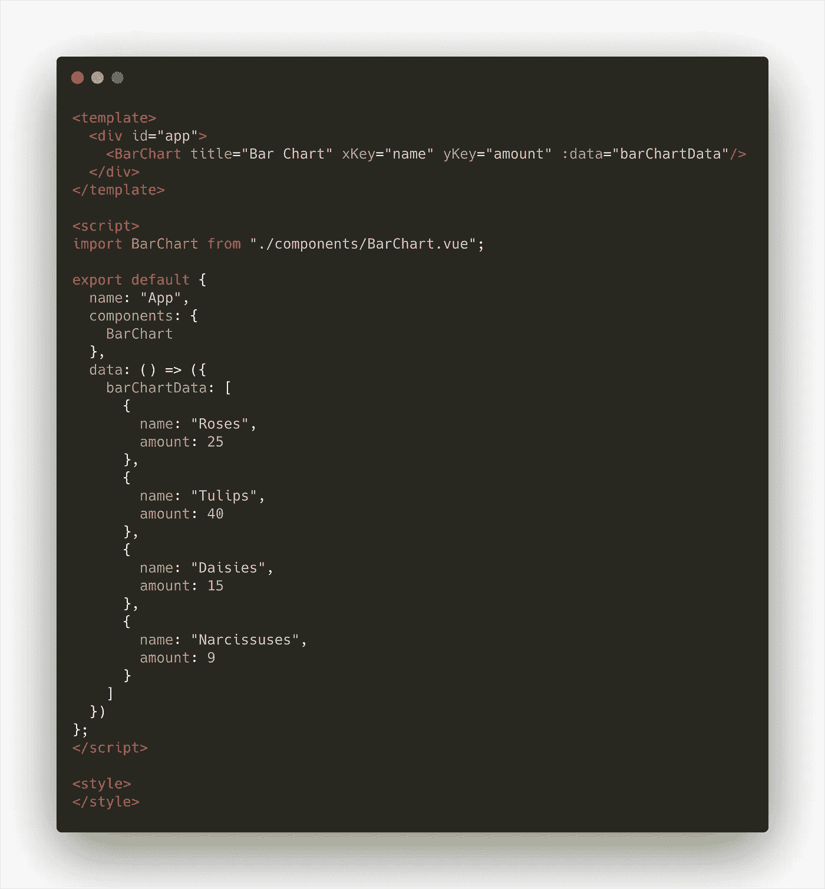
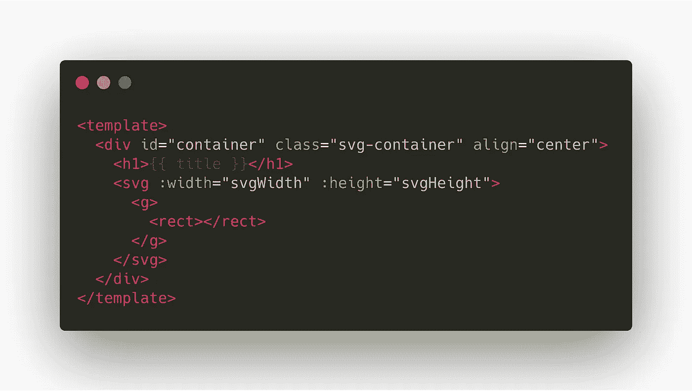

# 使用 Vue.js 和 D3 实现动态数据可视化

> 原文：<https://medium.com/swlh/modular-data-visualizations-with-vue-js-and-d3-87b37392a589>

# 背景

[源代码](https://codesandbox.io/s/d3-bar-chart-vuejs-okz1r?fontsize=14)

在 2019 年，几乎没有理由在投入之前给出 [Vue.js](https://vuejs.org/) 背景故事；它的[空前的受欢迎程度](https://trends.builtwith.com/javascript/Vue)已经让它在网络开发者中成为一个“家喻户晓”的名字，这不无道理。Vue 在帮助创建网络应用方面做了很多伟大的事情，但它最出名的可能不是“核心”技术本身，而是它创造的[开发者体验](https://2018.stateofjs.com/front-end-frameworks/overview/overview)。

易读性和易访问性是开发人员体验关键部分。由于 Vue 语法和模块化结构，能够更快地阅读和理解代码，这使得工作更容易理解，并减少了挫折感。由于这种优势，Vue 是与丰富/复杂库结合的理想框架。利用 Vue 的易读性和模块化，人们可以通过将它分解成更小的、可重用的片段，并用惯用的 Vue 风格包装固执己见的语法，来简化这样一个库的接口。

在我们例子中，最丰富的库是 [D3](https://d3js.org/) 。D3 是近年来最重要的 JavaScript 数据可视化库之一，在创建者 Mike Bostock 的带领下，开发仍然很强劲。D3 与许多其他库的不同之处在于无限定制的能力。它的低级 API 提供了对原生 SVG 元素的直接控制，但也带来了高学习曲线的代价。由于这种范式，我们将把 D3 和 Vue 结合在一起——使用 Vue 的动态数据绑定、清晰的语法和模块化结构来发挥 D3 的最佳性能。

The animated bar chart we’re going to build

# 该项目

我们将使用 D3 和 Vue 构建一个[基本条形图组件](https://okz1r.codesandbox.io/)。有大量[优秀的指南](https://bl.ocks.org/caravinden/d04238c4c9770020ff6867ee92c7dac1)可以帮助我们在普通 D3 中做到这一点，但是我们将会把重点放在尝试编写惯用 Vue 而不是惯用 D3 上。该项目的完整代码可以在 CodeSandbox 上找到[，并且将在指南的其余部分被引用。](https://codesandbox.io/s/d3-bar-chart-vuejs-okz1r?fontsize=14)

## 建立

首先，我们需要安装项目的依赖项。我们可以通过`npm i d3`简单地安装和使用所有的 D3，但是这会降低我们没有使用的所有模块的应用程序的速度，尤其是更重的`d3-geo`模块。相反，我们将只安装我们需要的 D3 模块。

The dependencies to install in your project

下一步将是创建我们的`BarChart.vue`文件，并提供我们的`App.vue`或其他父组件来呈现条形图。在本指南中，为了方便起见，数据将被定义在父`App.vue`文件中，但是在其他应用中，您可能希望通过 [Vuex](https://vuex.vuejs.org/guide/) 来处理获取/设置数据，尤其是当您从文件或其他外部来源加载数据时。

Project File Structure

## 应用程序组件

我们还将先发制人地将一些[道具](https://vuejs.org/v2/guide/components-props.html)传递给我们的条形图组件。第一个支柱是数据数组本身，但是另外两个支柱是我们如何在 D3 中定义数据模型。我们不是每次处理不同的数据集时都要写一个一次性的图表，而是通过传入我们希望 D3 处理的数据数组中的属性名称来保持事物的可重用性。

The App.vue file hosting our bar chart component

## 条形图组件定义

创建条形图组件从导入 D3 模块开始，并定义我们在`App.vue`组件中传递的属性。

Defining the bar chart component

之后，我们搭建 Vue 模板来接收 SVG 元素。注意，我们添加了单独的`<svg>` `<g>`和`<rect>`元素，而不是我们熟悉的 [D3 函数链](https://alignedleft.com/tutorials/d3/chaining-methods)。这将允许我们动态地将这些元素绑定到 Vue 组件中的数据，并利用 Vue 的反应能力。这里要强调的另一个元素是，我们将动态计算`<svg>`元素的宽度和高度属性——这样做是为了在所有可能的屏幕尺寸上保持内容清晰，并消除屏幕渲染。

Template scaffold

## 受关注的属性

我们在这里将只使用一个被监视的属性，那将用于我们计算的宽度。通常我们会使用 computed 属性来处理类似的事情，但是我们需要在元素呈现之后从 DOM 中提取信息，而 computed 属性在尝试这样做时会抛出错误。对于该属性，我们将获得条形图父级`
`的宽度，并将宽度设置为该尺寸的 3/4，以在边缘周围提供一些缓冲。

Reactive width property

## 计算属性

这些属性将是我们组件中最大的部分之一。在这里，我们可以将 D3 逻辑分解成更容易理解的部分，并在实时发生变化时更新/消耗它。属性的基本功能在下面的代码中进行了注释，但是为了更深入地理解 D3 功能的作用，请深入参考 [D3 源文档](https://github.com/d3/d3/wiki)或[D3](https://www.d3indepth.com/)。

Computed properties

## 创建酒吧

现在我们已经有了缩放函数和其他计算属性，我们可以开始在模板中添加条形了。我们将通过一个`v-for`指令来实现这一点——遍历数据项数组，并将它们的属性动态分配给 DOM 中的`<rect>`元素。注意，我们是通过之前传入的`xKey`和`yKey`道具来访问单个物品的。这将允许我们重用相同的组件，而不管下一个项目的数据集是否包含关键字“name”和“amount”。

这里要注意的另一个关键点是，这些条还不会呈现(`redrawToggle`)，当它们呈现时也不会有高度和 y 位置(`y`和`height`)。我们这样做是因为我们想要动画化图表，这需要在初始渲染后用 D3 转换添加这些属性。

Creating the bars

## 制作图表动画

为了使图表生动，我们将创建一些方法来包装和模块化我们的转换逻辑。绘制动画包括将正确的`height`和`y`值分配给已经延迟呈现在页面上的`<rect>`元素——创建从 x 轴“增长”的条形效果。

在`mounted`钩子中，我们将为触发绘制动画的窗口调整事件添加一个监听器，并将`<svg>`大小设置为相对于新的屏幕/窗口尺寸。我们不会立即触发它，而是等待 300 毫秒，以更加“确定”用户已经完成了调整窗口大小。

Implementing the animation methods and dynamic resizing

Methods for animating the drawing of the chart, and redrawing on window resize

## 式样

样式完全由您决定，通过 Vue 的作用域样式语法和 D3 的低级 API，您可以随心所欲地定制内容。您还可以将 CSS 动画与 D3 过渡和 Vue 过渡/动画混合使用，以获得更加动态/反应式的效果。对于这个项目，唯一真正的样式集中在`
`元素上，它决定了里面`<svg>`的大小和位置。

# 摘要

Vue 允许我们以一种干净和可重用的方式组织和构建我们的组件。它还创建了一个更易读的代码库，特别是对于初学者或任何不太熟悉 D3 的 API 或数据处理工作流的开发人员。适应 Vue + D3 风格需要一些练习，尤其是大多数在线示例都是传统的 D3 语法，但是这对耐心的编码人员来说是有好处的。一个动态的、可重用的数据可视化是一件非常强大的事情——它可以在一个数据驱动的世界中产生很大的影响。

[源代码](https://codesandbox.io/s/d3-bar-chart-vuejs-okz1r?fontsize=14)