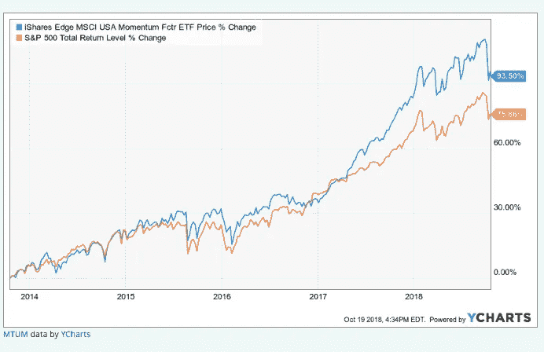
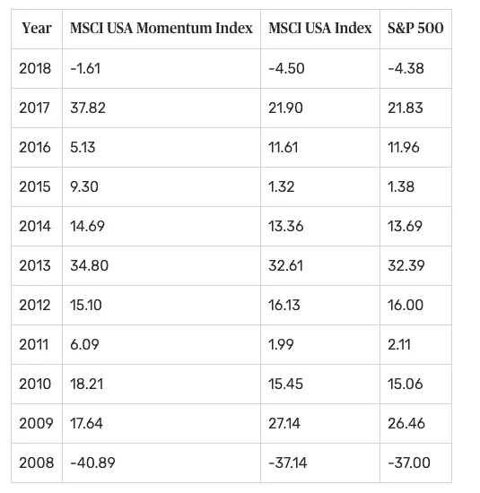

# 动量投资:像秘书处一样

> 原文：<https://medium.com/swlh/momentum-investing-be-like-the-secretariat-5d27521ba10>

几周前，我在看电影《秘书处》。 [秘书处](https://en.wikipedia.org/wiki/Secretariat_(horse))是一匹美国纯种赛马，于 1973 年成为 25 年来第一个三冠王。如果你还没有看过这部电影，这是一部必看的电影，你会从中获得一些有益的人生教训。

每个人都喜欢为胜利者欢呼和加油。想象一下观看肯塔基赛马会，这是一年一度的三岁纯种马比赛。比赛开始时，跑道最右端的那匹马领先于其他马。假设你和你的朋友打赌这匹马会赢。当这匹马大步迈向终点线并继续保持领先时，你会很兴奋，因为你的成功与这匹马的胜利息息相关。

这种推理形成了被称为**动量投资策略的基础。**

Source: [High Life Magazine](http://highlifemagazine.net/event/jandowae-races/)

# 什么是动量投资？

动量投资是一种基于这样一种理念的策略，即你可以通过在股票运行良好时买入并持有股票来赚取长期利润，也就是说，它们背后有动量，一旦它们开始失去动量就卖出。

> “我相信高价买入，再以更高的价格卖出，可以赚更多的钱。我试图购买那些价格走势良好、经常创出新高、相对强势的股票。”——理查德·德里豪斯在 2004 年告诉克莱恩的《芝加哥商业周刊》

# 高价买入，高价卖出

当时在加州大学洛杉矶分校安德森分校的 Narasimhan Jegadeesh 和 Sheridan Titman 在 1993 年发表在《金融杂志》上的一项研究指出，如果一个投资者买入过去的赢家并卖出过去的输家，他们将在 1965 年至 1989 年间获得“巨大的异常回报”。

作者为动量投资的成功建立了一个基本的时间框架，即 3 到 12 个月。换句话说，一只股票在过去 3 到 12 个月的相对表现通常可以预测它在未来 3 到 12 个月的相对表现。他们在这些窗口内测量了先前回报和未来回报的各种时间组合，发现交易它们是“平均相当有利可图”的策略。

动量投资与传统的长期买入并持有的投资方法背道而驰。这基本上与华尔街那句屡试不爽的老话相反，即投资者应该“低买高卖”。你卖掉输家，让赢家继续赚钱，同时把输家的钱再投资到其他开始上涨的股票上。

# 为什么有效？

动量投资寻求利用市场波动，在股票上涨时建立短期头寸，一旦有下跌迹象就卖出，然后将资金转移到新的头寸。在这种情况下，市场波动就像海洋中的波浪，你正在一个波峰上航行，但在第一个波峰再次下跌之前，你会跳到下一个波峰。

Source: [Momentum Investing for the Masses](https://www.anderson.ucla.edu/faculty-and-research/anderson-review/momentum)

考虑一下 iShares Edge MSCI 美国动量因子 ETF(股票代码:MTUM)。性能以上。该 ETF 遵循动量投资策略。在过去五年中(截至 2018 年 10 月 18 日)，iShares Edge MSCI 动量因子 ETF 平均每年上涨 15.5%。这超过了标准普尔 500 每年 12%的回报率。

> 投资者要么对重要信息反应过度，要么反应不足。因为，毕竟，我们只是人类。
> 
> Avanidhar Subrahmanyam 的特色研究

以下是从 2008 年(金融危机年)开始，摩根士丹利资本国际美国动量指数与其母指数摩根士丹利资本国际美国指数以及标准普尔 500 的年度表现对比。

Source: [Mometum Investing](https://www.thebalance.com/what-is-momentum-investing-4587982)

如你所见，摩根士丹利资本国际美国动量指数在过去 11 年中有 7 年击败了其他两个指数。然而，值得注意的是，在 2008 年金融危机期间，该指数的表现差于其他指数。这表明，在股市增长良好的时期，动量投资可以促进增长，但在股市低迷时期，动量投资无法很好地保护资本。

# 如何遵循动量投资法？

Source: [Momentum Investing](https://corporatefinanceinstitute.com/resources/knowledge/trading-investing/momentum-investing/)

动量投资需要一个严格的基于规则的方法来识别趋势、波动、过度拥挤和减少利润的隐藏陷阱。市场参与者经常忽视这些规则，被 FOMO 蒙蔽了双眼(害怕错过)。他们认为，当其他人都在记录意外利润时，他们会错过上涨或下跌。

开始时，可以遵循以下规则:

## 基于流动性的适当证券选择

从事动量策略时，选择流动性股票或 ETF。远离杠杆(2 倍、3 倍)或反向 ETF，因为复杂的基金结构导致它们的价格波动无法准确跟踪基础指数或期货市场。

例如，iShares Edge MCSI u . s . a . Momentum Factor ETF[股票代码:MTUM]和 SPDR 罗素 1000 Momentum Focus ETF[股票代码:ONEO]可以帮助人们使用动量投资方法，而无需选择个别证券。它们还能帮你省钱，因为 ETF 会自行调整它们的持有量，从而让你摆脱频繁买卖带来的佣金和税务负担。

## 风险管理

如果不考虑风险，动量策略就会失败。在买入股票之前，等待动量移动被确认。不要等到达到饱和才平仓。密切关注可能让市场大吃一惊的变化趋势、反转信号或消息。未能迅速平仓，从而错误地利用动量列车，将导致巨大的损失。

# 动量投资的好处

动量投资有很多好处，是明智的选择:

*   短期内获得巨额利润:动量投资可以带来丰厚的利润。例如，假设你买了一只股票，基于一份过于乐观的分析师报告或与你所持股票相关的积极消息，这只股票从 50 美元涨到 75 美元。然后，在股价自我调整之前，你以 50%的利润卖出。你在几周或几个月的时间里获得了 50%的回报(不是年化回报)。随着时间的推移，使用动量投资的利润潜力可能会大得惊人。
*   **利用市场的波动性:**动量投资的关键是能够利用波动的市场趋势。寻找正在上涨的股票进行投资，然后在价格开始回落之前卖出。
*   **趋势是可识别的** —运用动量投资策略，你使用过去的表现、移动平均线(20 天、50 天、200 天)和动量指标，如相对强弱和 MACD，来决定当前和未来的方向。通过一些研究，可以做出正确的投资选择。

# 动量投资的缺点

*   高成交量:买卖股票会增加交易和经纪费用，这是动量投资新手的主要担忧。
*   **策略不考虑公司运营** —动量投资在确定一只股票是否值得投资时，不考虑公司的运营成功。这种策略的计算完全基于公司在股票市场上的价格行为。

# 底线

有了正确的框架，如果操作得当，动量投资通常可以带来可观的回报。请继续关注我的下一篇文章，我将讨论如何使用华尔街专业人士常用的动量指标来构建这个框架。

如果你喜欢读这篇文章，请留下你的评论或点击下面的拍手图标以示感谢。如果你想让其他人从这篇文章中受益并帮助传播，请在你最喜欢的社交媒体平台上分享。谢谢你的时间。

# 我写的其他投资文章

*   *利用公司利润表进行基本面分析:*[https://medium . com/@ amrut . Patil 88/stock-investing-Fundamental-Analysis-Using-companies-Income-Statement-37 b0d 80531 f1](/@amrut.patil88/stock-investing-fundamental-analysis-using-companys-income-statement-37b0d80531f1)
*   滚雪球效应:如何利用股息增加你的财富？:[https://medium . com/swlh/the-snowball-effect-how-compound-your-wealth-use-股息-d92b719ffe79](/swlh/the-snowball-effect-how-to-compound-your-wealth-using-dividends-d92b719ffe79)
*   *利用公司资产负债表的基本面分析:*[https://medium . com/@ amrut . Patil 88/stock-investing-Fundamental-Analysis-Using-companies-Balance-Sheet-153531d 98 F8 b](/@amrut.patil88/stock-investing-fundamental-analysis-using-companys-balance-sheet-153531d98f8b)
*   *使用自由现金流量表的基本面分析:*[https://medium . com/@ amrut . Patil 88/stock-investing-Fundamental-Analysis-Using-Free-Cash-Flow-Statement-454 beaa 7 f 00](/@amrut.patil88/stock-investing-fundamental-analysis-using-free-cash-flow-statement-454beaa7f00)
*   *使用关键比率的基本面分析:*[https://medium . com/@ amrut . Patil 88/stock-investing-Fundamental-Analysis-Using-Key-Ratios-ed 02 f 32 e 88 AE](/@amrut.patil88/stock-investing-fundamental-analysis-using-key-ratios-ed02f32e88ae)

# 放弃

*以上文章的内容仅用于信息和教育目的。它无意成为投资建议。此外，我与这篇文章中提到的股票或 ETF 的任何公司都没有业务关系。请在投资前考虑所涉及的风险和您的个人财务状况，或寻求正式许可的金融专业人士的投资建议。*

# 关于我

Amrut 是一名全栈软件工程师，他热衷于设计和开发 web 和移动应用程序。他喜欢写关于技术、编码、投资、交易、金融和经济的文章。业余时间，阿姆鲁特喜欢了解上市公司的商业模式，并分析它们的财务报表。他坚信通过高质量的工作为人们的生活增加价值，并赋予人们掌控个人财务的权力。

## 这篇文章发表在 [The Startup](https://medium.com/swlh) 上，这是 Medium 最大的创业刊物，拥有+438，678 读者。

## 在这里订阅接收[我们的头条新闻](https://growthsupply.com/the-startup-newsletter/)。

