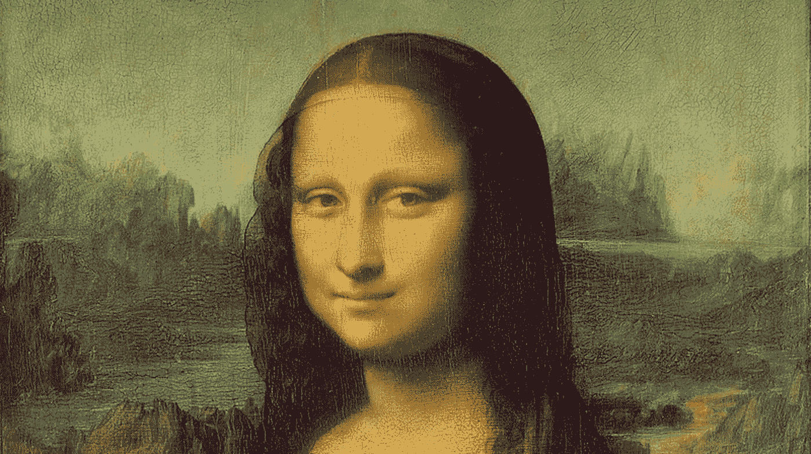

# 蒙娜丽莎的假笑暗示着谎言

> 原文：<https://medium.com/swlh/mona-lisas-smirk-hints-at-a-lie-4777628ec3ef>

What’s on her mind? Scientists have some new ideas. Image: Wikipedia/public domain

## 但是她在隐藏什么呢？

在莱昂纳多·达·芬奇创作了世界上最著名的画作五个世纪之后,《蒙娜丽莎》仍然吸引着艺术爱好者和任何一个瞥她一眼的人。包括科学家，他们和许多人一样，想知道画中的主体是否在微笑。2017 年，研究人员得出结论，她引人注目的复杂假笑实际上是一种微笑。现在有些…