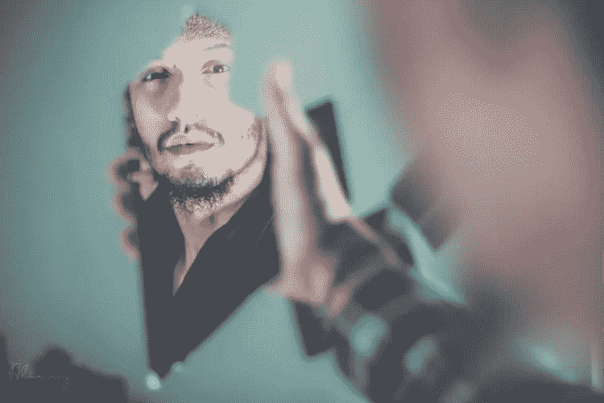

# 金钱是你灵魂的镜子

> 原文：<https://medium.com/swlh/money-as-the-mirror-of-your-soul-2624d6ef1640>

Photo by [Fares Hamouche](https://unsplash.com/photos/Xe9vkCD7_5g?utm_source=unsplash&utm_medium=referral&utm_content=creditCopyText) on [Unsplash](https://unsplash.com/search/photos/mirror?utm_source=unsplash&utm_medium=referral&utm_content=creditCopyText)

诗人告诉我们，我们的眼睛是心灵的镜子。然而，可以说，你的钱在这方面更有效，尽管不那么浪漫。不幸的是，你的金钱和你的精神之间的联系并不明显。这当然不是以“你吃什么就是什么”的方式来谈论的。例如，我们生产和消费食物的方式比我们的精神健康和生产方式更受关注