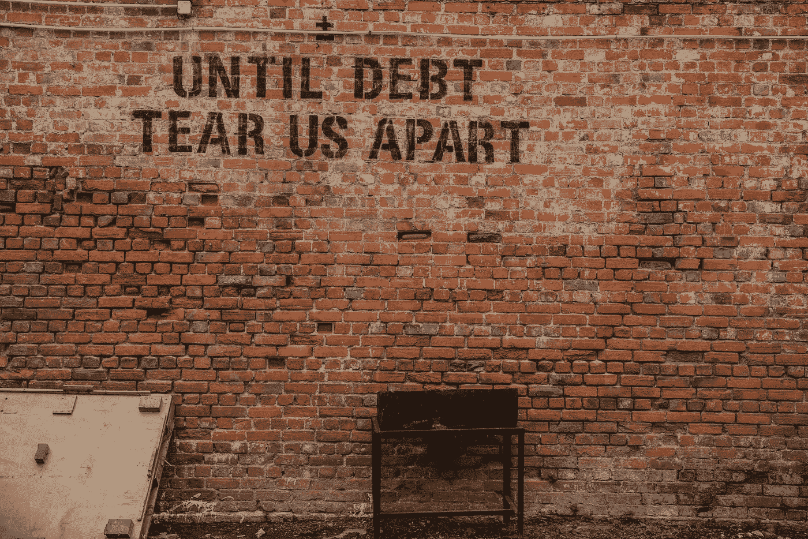

# 钱不是你所有问题的根源

> 原文：<https://medium.com/swlh/money-is-not-the-root-of-all-your-problems-a30756306e4f>

## 缺少的是。

Photo by [Alice Pasqual](https://unsplash.com/@stri_khedonia?utm_source=unsplash&utm_medium=referral&utm_content=creditCopyText) on [Unsplash](https://unsplash.com/search/photos/money?utm_source=unsplash&utm_medium=referral&utm_content=creditCopyText)

我的家庭已经在经济上挣扎了十多年了。

有过充满压力和绝望的时刻，有过我们不知道如何获得食物的时候，有过我们——四个孩子——不得不为基本需求出力的日子。