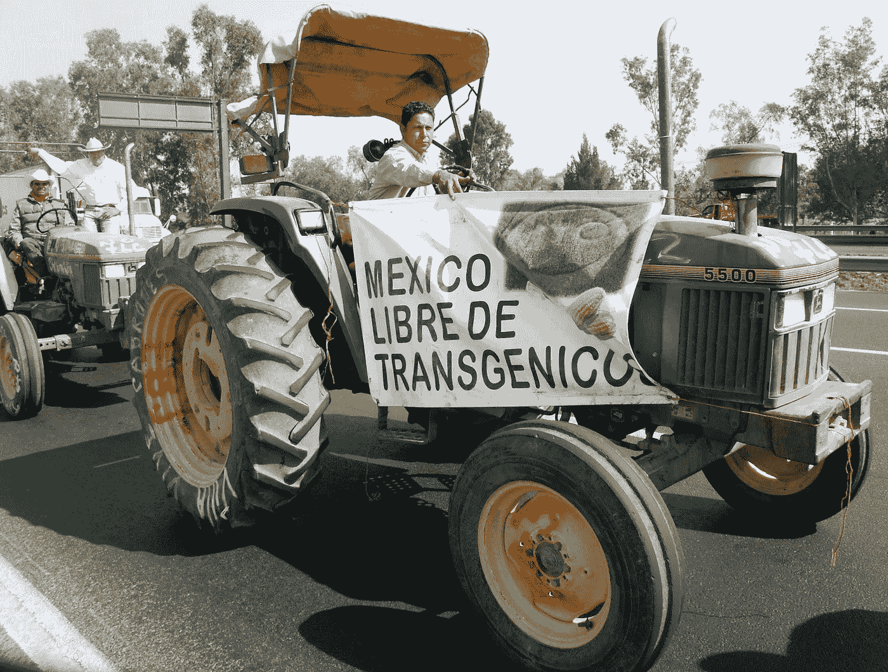

# 转基因思维的单一培养:我与孟山都在墨西哥的超现实遭遇

> 原文：<https://medium.com/swlh/monocultures-of-the-genetically-modified-mind-my-surreal-encounter-with-monsanto-in-mexico-49a123cae4b8>

Enrique Pérez S/ANEC

我惊讶地发现种子巨头孟山都几乎无处不在，我去研究我的书，吃明天。但我最接近的遭遇发生在早些时候，2014 年，在孟山都公司位于墨西哥的高层办公室里，我与该公司的六名高管进行了五个小时的会谈。孟山都和其他种子公司试图向墨西哥开放转基因…