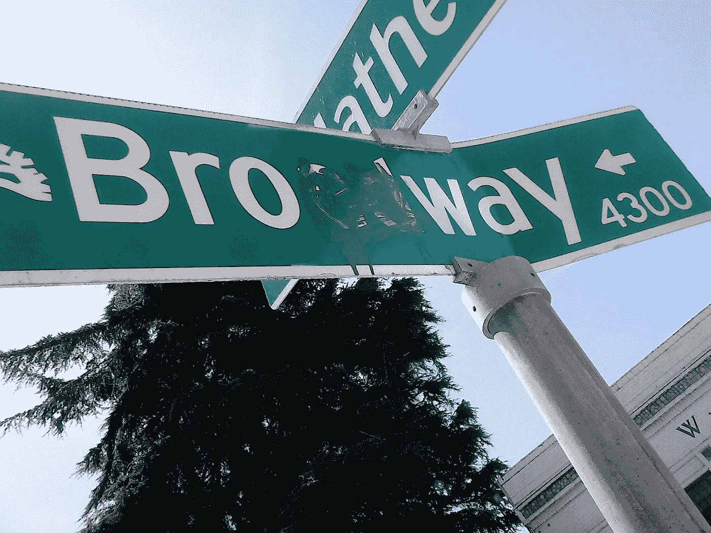

# 更多离奇的创业面试故事

> 原文：<https://medium.com/swlh/more-bizarre-startup-interview-stories-c71140ce6605>

## 仍在寻找我在旧金山的文化契合度

“我很高兴我们相处得很好，”这位创始人一边说，一边在 WeWork 的大会议室里为等候在外面的人们擦干黑板。“你现在想吃午饭吗？”

“当然，听起来不错！”我回答道。