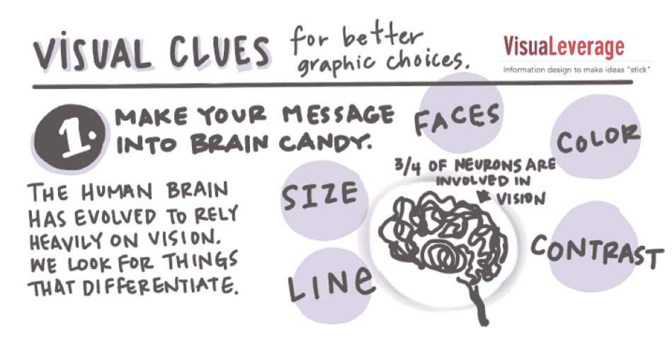
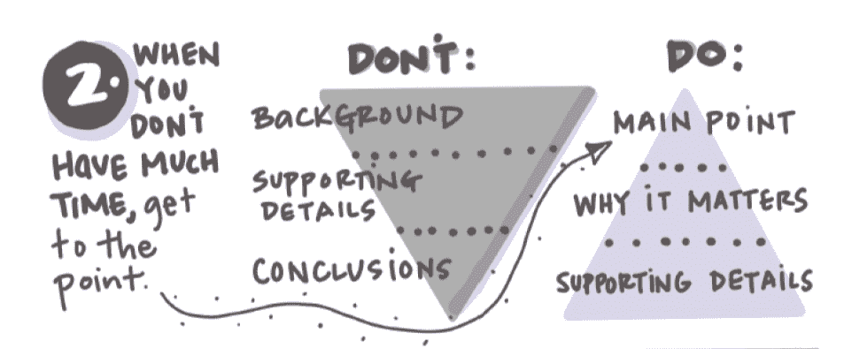
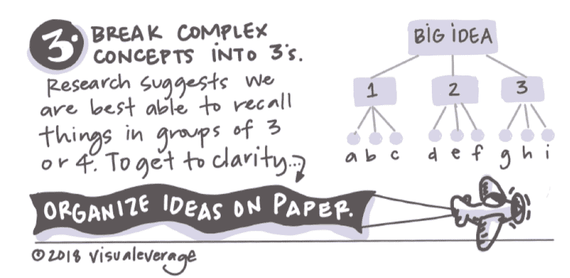

# 更多信号，更少噪音

> 原文：<https://medium.com/swlh/more-signal-less-noise-323580534361>

## *使用视觉传达意义，而不仅仅是信息*

每一天，我都尽量避免视觉乱说。当我超过定额时，我能看出来。我有了六年级时在夏季嘉年华上玩旋转木马时的感觉。

我的视觉策略实践， [VisuaLeverage](http://www.visualeverage.com/) ，源自我在医疗保健和公共卫生系统及其周围工作了 20 年的经验——这两个系统的复杂性可能会导致同样的恶心。太多伟大的想法因为沟通太复杂而失败，太多的“会议”浪费了宝贵的见面时间。我与客户合作，直观地交流要点，设计高度可视化的团队流程，让参与者充分参与进来。最常见的挑战是什么？坚持基础。

在这个信息过剩的世界里，视觉线索可以帮助我们驾驭复杂性。这里有三个使用视觉效果来创造更多信号，更少噪音的技巧。

**把你的信息做成“大脑糖果”为了吸引当今人类的眼球，请回顾一下漫长的进化历程。我们[进化成了高度视觉化的生物。事实上，第一个拥有光感受器细胞的生物出现在大约 7 . 4 亿年前。我们古老的小祖先第一次奇迹般地感觉到了照明对比(光和影)。这种视觉策略仍然是我们在世界上寻找出路的核心策略。](https://blogs.scientificamerican.com/thoughtomics/animal-vision-evolved-700-million-years-ago/?redirect=1)**

后来，简单的“眼睛”可以检测线条、形状、紫外线和颜色。直到 7.35 亿年后，第一批原始人类才开始关注这片土地。哺乳动物的眼睛已经走过了很长很长的路。早期人类的眼睛向越来越大的大脑传输复杂的视觉信息，越来越多地捕捉微妙的环境变化、社会线索和意义。早期愿景的关键基础仍然是我们看待当今世界的核心:

对比向我们展示了维度和方向:哪条路是向上的？
**线条**将我们的视线沿着边界和路径引向焦点。水平线可以让我们“接地”，而对角线有时会给我们一种旋转倾斜的感觉。
**大小**告诉我们很多关于重要性的事情。如果事情越大，它往往越重要。大小也让我们知道相对距离。(这只*剑齿虎比那只*剑齿虎更近吗？)
**颜色**会引发复杂的反应，所以要小心使用。面孔像其他线索一样吸引我们的注意力。我们生来就喜欢寻找面孔，所以我们会迅速地寻找认同和联系——几乎是在眨眼之间。

听起来熟悉吗？大概是因为前段时间艺人想通了这些“规则”。对比和线条，这两个我们在艺术课上学到的基本原则，给人类寻找方向和意义的大脑提供了“糖果”。实现清晰的最常见方式？削减开支，注重基础。

当你没有太多时间的时候，就从你的观点开始。当你的首席执行官告诉你她有三分钟时间听你的想法时，使用视觉效果，让第一印象变得最重要。信息三角形的尖端应该指向要点，而不是指向“结论”如果你包括一个战略视觉来总结要点，你就成功了。

**将复杂的概念分解成三个一组。**有证据表明，通过将大的想法分解成三个子概念，我们可以帮助人们理解和回忆关键点。[麦肯锡的“金字塔原则”](/lessons-from-mckinsey/the-pyramid-principle-f0885dd3c5c7)建立在芭芭拉·明托关于结构化的、令人难忘的沟通的原创理念之上。莫娜·沙拉比建议[对视觉信息进行排序](https://www.youtube.com/watch?v=b5C5dV9XVKo)以最大化理解。

额外提示:[把你的想法写在纸上](https://news.nationalgeographic.com/2015/07/2015704-datapoints-sketching-data/)也能帮助你更清晰地理解你的关键信息。这个练习也涉及到大脑的不同部分，增加你从更有创造性的角度思考的可能性。

当谈到增加信号和减少噪音时，简单的视觉效果可以大大吸引观众。并减少视觉乱说。

*关于视觉如何让复杂的想法变得更有用的更多信息，请访问*[*www.visualeverage.com*](http://www.visualeverage.com/)*。如果你喜欢这个故事，请鼓掌！这样做有助于确保其他人也能受益。*