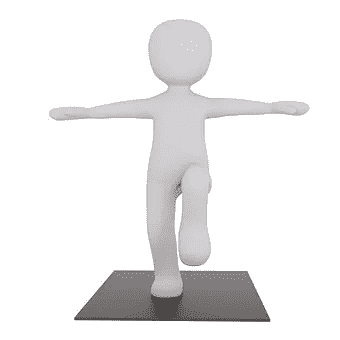

# 早上好，移动启动！

> 原文：<https://medium.com/swlh/morning-mobility-startup-a7da56107958>

Yoga Yoga Mat Exercise from Pixabay

简单易行的晨练，锻炼身体的灵活性和力量

对许多人来说，起床是一种痛苦的经历。我有一吨的关节炎和疼痛策划围攻我的身体的时刻，我的脚趾碰到地板下床。

战争开始了！

在过去的 20 年里，我采用了一个基本的计划来参与这场战斗，以更少的痛苦和更大的机动性出发…