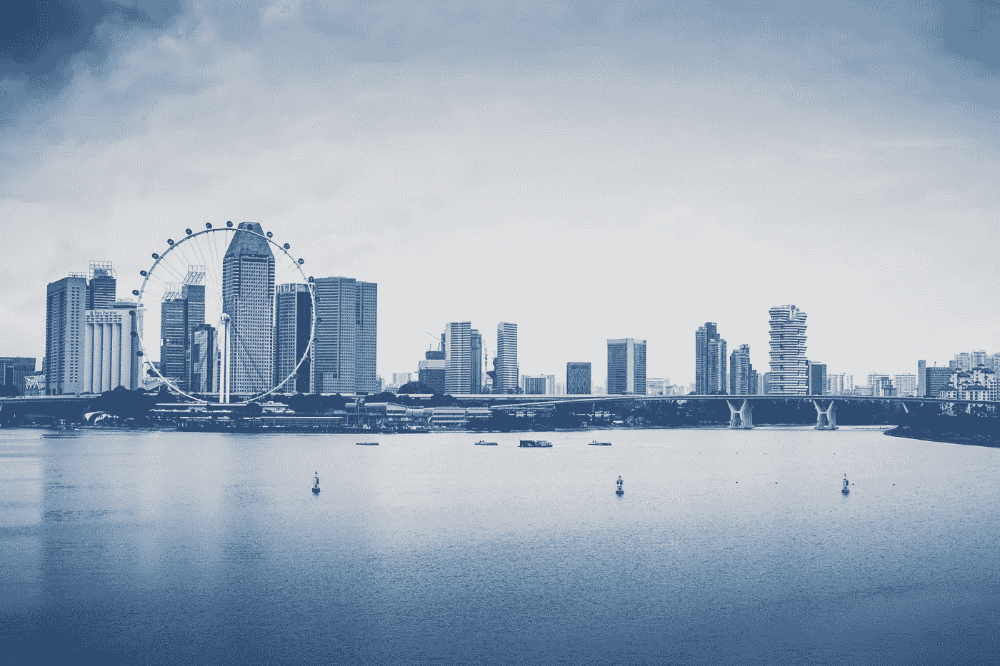

# 最受欢迎的亚洲科技创业城市

> 原文：<https://medium.com/swlh/most-popular-asian-cities-for-starting-tech-startups-3cd5799e643c>

你知道亚洲正在成为世界上最具创新性和最有价值的科技创业公司的家园吗？一些投资者已经开始向亚洲城市的科技创业公司投入资金。更重要的是，企业家正在建立他们的组织。你是否在想“为什么企业主对亚洲城市如此着迷？”

嗯，这种趋势背后的基本原理是因为强大的经济，相对较低的经营成本，健康的商业环境和受过高等教育的人口。众所周知，每个人参与竞争的目的都是为了获得最大的收入和利润。和在亚洲城市建立业务，使他们的梦想成为现实，没有任何可能的争议。

Image credits: [Mike Enerio](https://unsplash.com/photos/15Hb4VQjyBI?utm_source=unsplash&utm_medium=referral&utm_content=creditCopyText) on Unsplash

但现在真正的问题出现了，你想在亚洲哪个城市开展业务？事实上，每个地方都有自己的特点、优势和对事物的不同看法。例如，在中国，优先考虑的是从价格到价值再到关系。

没明白重点？不用担心！

让我们举个例子，这样你就能理解我的看法了！

假设你正在考虑在中国的商业世界里开展你的组织，那么你一定在寻找额外的利益，以便你能有效地经营你的业务。在中国，你不必担心财政问题。在中国，有太多政府支持的基金为初创企业提供融资。

事实上，世界第二大经济体(中国)最重要的风险资本资金来源是政府机构和国有企业。同样，在亚洲的各个地方，企业主也有不同的探索机会。

在这篇博客中，我们收集了亚洲主要城市的创业信息。坚持阅读，以启迪自己。不可否认的事实是，每个城市都提供一系列税收优惠、补贴和相关项目来支持企业家。

以下是一些最受科技初创企业青睐的亚洲城市，供它们选址和开展业务

## **1。北京**

作为中国不断扩张的首都，以及中国最著名的科技中心中关村的所在地，北京是在市场上创业的最佳地点之一。你知道[中关村](https://en.wikipedia.org/wiki/Zhongguancun)吗？它是一个技术中心，成立于 30 年前，宗旨是“向硅谷学习，复制硅谷”

事实上，这个中心包含了大约 9000 家科技公司，覆盖了北京西北部海淀区 488 平方公里的区域。最重要的是，这个地方还包括一些中国最重要的高科技公司，如在线搜索巨头百度、电子商务服务提供商 JD.com 和个人电脑制造商联想集团。

此外，由于这个科技中心靠近中国一些最负盛名的大学和研究机构，中关村在获得人才方面享有显著优势。在国务院的支持下，中关村为迁入的企业提供税收减免、资金和其他激励措施。

因此，凭借高效的融资渠道和受过高等教育的工作场所，北京诞生了许多估值至少 10 亿美元的独角兽初创企业。所以，如果你想在北京成为一名企业家，那么我们希望告诉你更多的事情，根据私募股权数据跟踪公司清科，这个地方去年也被评为中国风险投资的首选目的地。

## **2。杭州**

下一个你可以成立公司的亚洲城市是杭州。这个地方以前被罗马化为“杭州”现在，这个地方因成为中国最大的电子商务公司“阿里巴巴集团控股”而闻名此外，这座城市还因拥有在纽约上市的公司而闻名，这些公司发展了一个庞大的合作伙伴、供应商和高科技运营生态系统。

事实上，根据胡润百富 2018 年最新中国独角兽指数的记录，这座城市已经帮助 18 只独角兽成功上市。除了中国最大的电子商务阿里巴巴集团的中心，杭州还是支付宝运营商蚂蚁金融服务和全球第二大加密货币采矿设备制造商迦南创意的所在地。这一切都归功于杭州市政府，它帮助外国初创企业在该市的工业愿景下开发项目，并有资格获得高达 1 亿元的补贴。

## **3。新加坡**

除了杭州，新加坡也吸引了大量的企业家来此创业。事实上，成为东南亚创新中心的雄心甚至得益于大型全球企业成功建立地区总部。

还有一点我们要通知的是，近年来，主要的科技初创公司，如移动虚拟网络运营商 Circles 和叫车公司 Grab 已经成立。这背后的原因是对企业的慷慨资助和税收优惠。

此外，新加坡最近推出了一项新计划 EntryPass，为外国企业家在该市开办新企业提供了两年的时间。该计划还免除了新成立公司 35，800 美元的最低实收资本。

此外，该市还拥有约 40 个行业协会和商会，帮助当地企业提升业务水平，并在海外发展业务。所以，如果你想在亚洲城市建立业务，那么新加坡将是你最好的选择。

## **4。上海**

另一个著名的创业城市是上海。事实上，根据清科的数据，这个中国主要港口已经吸引了大约 427 亿元的风险投资。如果你想知道 2018 年上海发展了多少独角兽，那么我们想强调的是，根据胡润百富最新中国独角兽指数的报告，上海是这些快速增长的初创企业中的 42 家，仅次于北京。

尽管上海在吸引众多企业家方面做得很好，但上海政府现在还根据企业的规模和员工数量，补偿投资者高达 60%的初始资金。

此外，为了建立一个新的科技创新板，上海证交所推出了一项举措，以提高上海吸引科技初创企业和筹集大笔融资的能力。你想了解更多总部位于上海的知名科技初创企业吗？然后是自行车共享服务提供商 Hellobike 和 Liulishuo，后者运营一款人工智能英语学习应用程序，以及电子商务公司 Pinduoduo 和 red。

## **5。首尔**

你知道韩国政府一直在领导几个项目，让首尔成为创业公司的主要中心吗？是啊！由于他们的首创精神，现在首尔被公认为拥有最高的政府人均创业资助。此外，2017 年，政府设立了 90 亿美元的预算风险基金，利用公共和私人资本支持初创企业。

由于这些投资，包括互联网搜索巨头谷歌和 SparkLabs Global Ventures 在内的几家主要国际公司已经在该国建立了商店。

## **6。大湾区**

最后但并非最不重要的一点是[大湾区](https://theculturetrip.com/asia/china/articles/what-is-chinas-greater-bay-area-plan/)，这里因诞生了数家初创企业而闻名。这个地方得到了 11 个城市的帮助，这些城市有望最终发展成为一个综合创新和技术强国。

你知道这个地方的人口吗？这个地方大约有 7000 万人口，经济价值超过 15 亿美元。

***想了解大湾区整合了哪些城市？***

这个计划覆盖的城市包括香港、澳门以及邻近的广东省的其他九个城市——深圳、广州、东莞、中山、佛山、珠海、江门、惠州和肇庆。

GBA 致力于实现重大目标，包括建设连接广州、香港、澳门和深圳的创新走廊，以及简化海关和移民手续。事实上，深圳以腾讯控股有限公司而闻名，该公司运营着世界上最重要的视频游戏业务和微信，微信是中国无处不在的社交媒体和移动通讯平台，拥有超过 10 亿用户。

此外，世界上最大的电信设备制造商华为技术公司和世界上最大的无人机公司深圳 DJI 技术公司的总部都在这座城市。所以，都是关于深圳的。

但你知道“香港将在 2019 年初获得‘大湾区’蓝图吗？”

作为“通往中国的大门”和“东西方文化交汇的地方”，香港被列为亚洲最适合经商的城市之一。尽管香港在年度技术研发支出方面落后，在 10 个地区同行中在私人资金、人才和试点测试方面排名最后，但香港计划拨出 280 亿港元(36 亿美元)用于大学的研发和创新技术的再工业化。

总的来说，通过整合和利用本地区和世界各地的人才和资源，特别是在制造业、贸易和服务业，香港被誉为捕捉商机的最佳地点之一。

## **外卖！**

我们相信，现在你应该对亚洲最受欢迎的科技创业城市以及为什么越来越多的人倾向于在亚洲市场开展业务有了更好的了解。事实上，随着新举措和政府支持，亚洲的创业生态系统正在蓬勃发展。无论您是想在中国的亚洲市场开展业务，还是想拓展业务，请根据您的业务需求选择上述任何一个地方。

## 这篇文章发表在[《创业](https://medium.com/swlh)》上，这是 Medium 最大的创业刊物，有+435，678 人关注。

## 在这里订阅接收[我们的头条新闻](https://growthsupply.com/the-startup-newsletter/)。

