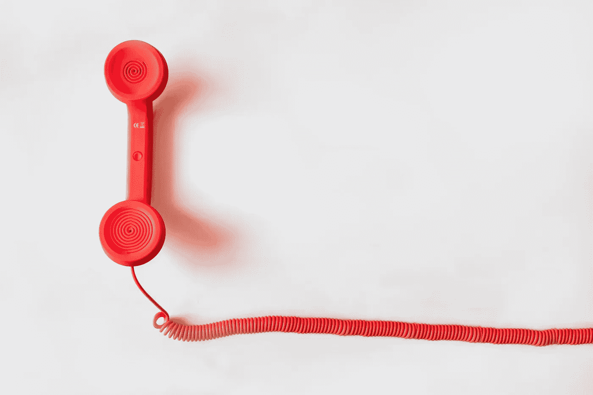

# 患有焦虑症的母亲

> 原文：<https://medium.com/swlh/mothering-with-an-anxiety-disorder-a81ca24ccc3e>

## 担忧在哪里结束……精神疾病从哪里开始？

[Life of Pix](https://www.pexels.com/@life-of-pix)/Pexels

我的宝宝睡着了。

这本身在当今是罕见的。她 13 个月大，几乎会走路，正在切几颗巨大的臼齿。大多数晚上，她每隔几个小时就起来一次…有时每隔 45 分钟。我应该感谢睡眠。但是，相反，我看着显示器，诅咒每一个屏幕闪烁，使人无法判断她是否只是采取了呼吸。她在呼吸吗？她不是吗？在我进去检查之前我能在这儿等多久？如果她没有呼吸，等多久算太久了？

“你没事吧？”我丈夫问，我跳起来，因为我以为他睡着了。很明显，我现在对睡眠的判断很糟糕。

“我很好，”我说。“简直疯了。”

这是我通常的反应，但我越来越怀疑这不仅仅是字面上的事实。我有焦虑症，为此我曾经服用药物。几年前我戒掉了，因为一位医生认为它可能会导致我的体重问题，还因为它干扰了我的睡眠。很多年来，我都很好，锻炼、冥想、和我的治疗师交谈。

然后，突然间，我不是了。

当我怀孕的时候，我让我的丈夫向我保证，他会在我出现产后焦虑的第一个迹象时提醒我。

“它会看起来像这样，”我告诉他。“我会对宝宝念念不忘。即使有机会睡觉，我也可能会停止睡觉。我很难放下思想，我可能会认为世界末日到了。会有相当多的讨论，尤其是在同一个话题上。”

"我怎么能看出那和你平时的行为有什么不同呢？"他问。

“你会知道的，”我冷酷地说。

但是后来，我们有了孩子，她很好，我也很好。事实上，尽管睡眠不足和生孩子带来的成千上万的其他生活剧变，我还是很好，这让我自己都感到惊讶。

“有产后得意忘形这种事吗？”我问我老公。“如果有，我想我有。”

“我认为我们有了最好的孩子，”他说，完成了我们的新的一系列。我们坐在一起，被她自己放的屁吓了一跳。

[Jaymantri](https://www.pexels.com/@jaymantri)/Pexels

担忧是从什么时候开始的？当然，几乎是立刻。但在很长一段时间里，这似乎很正常，就像任何新妈妈的担忧一样。当然，我们生活在一个焦虑的时代。唐纳德·川普是美国总统，他似乎准备通过把婴儿放进笼子里和 T2 把变性人赶出收容所来证明这一点。每天都有新的研究表明气候变化对人类构成了生存威胁[。海洋里充满了塑料。](https://abcnews.go.com/US/climate-change-end-human-civilization-2050-tank-report/story?id=63476644)

以下是我目前最担心的一些蓝筹股:

*   我会失去我的孩子。这种担心有多种形式:有时，我担心她会停止呼吸。有时候，我认为社会将会崩溃到某个地步，不知名的当局将会用武力把我们分开。
*   地球将会灭亡。见上文。不幸的是，现在没什么好担心的。
*   选举将在 2020 年被取消，或者被干扰到还不如取消的程度。相关的担忧:我努力争取的民主党人将继续在弹劾上拖后腿，直到为时已晚，无法除掉愚蠢的邦德恶棍总统，他宣布自己是终身领袖。
*   我的父母很孤独，15 年前离开家都是我的错。相关恐惧:邻居看到我不在身边照顾父母，认为没人爱他们。
*   我的大脑充满了垃圾，因为疯狂地扫描 Twitter 和 Google 新闻寻找新的恐怖事件，干扰了我思考、写作和生存的能力。

这些担忧给我带来的结果是:我变得如此，如此，如此疲惫。

"你认为我应该接受药物治疗吗？"一天晚上，在为关税问题哭了一个小时后，我问丈夫。

“也许吧，”他说。

[Negative Space](https://www.pexels.com/@negativespace)/Pexels

又是白天了。婴儿醒了。她和她爸爸在操场上。我在办公桌前，正要去工作。这比以前更难了，因为我的想法一直在打转。最近，我有了一个新的担忧:我不断的担忧会不会毁了她？只有令人担忧的专业人士才能在自己的焦虑中找到新的困扰来源。

昨天，我和我的治疗师谈了谈，他对药物通常非常保守，我告诉她我想继续服药。

“我认为这是个好主意，”她说。“而且可能不会永远。当你的生活充满压力时，你可能只是暂时需要它。后来，等事情平息了……”

“……当唐纳德·特朗普不是总统，地球不会灭亡，我的孩子不会整夜不睡？”

“是的，”她说。“当至少其中一些事情不再正确时，你可能会发现你不再需要药物治疗了。”

我昨晚就睡在上面——嗯，这几天睡得差不多了。我闭着眼睛，但是我很忙。我梦见我的家人与巴拉克·奥巴马共进晚餐，我们告诉他我们爱他，他哭了，我们也哭了。我梦见我们在逃离什么东西…僵尸，或者可能是一波辐射。我们在车里，冷藏箱里装满了给宝宝喝的牛奶，在我的梦里，我担心牛奶会冷多久……当牛奶喝完的时候，我们怎样才能得到更多的牛奶。

我醒来时感觉筋疲力尽，但比之前好了很多。

就是现在。我坐在我的办公桌前，但是我还没有工作。我正在用我那可笑的 80 年代风格的台式电话给我的医生办公室打电话。

*我不需要这么做，*我想。*我不需要整天、每天担心，直到我筋疲力尽。很快就会好的。救援马上就到。*