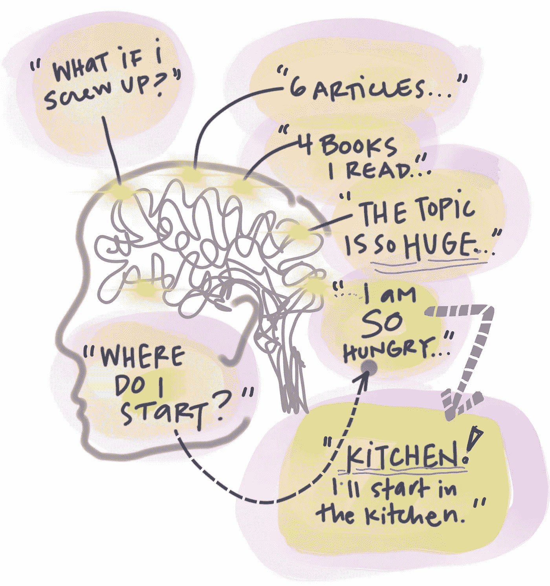
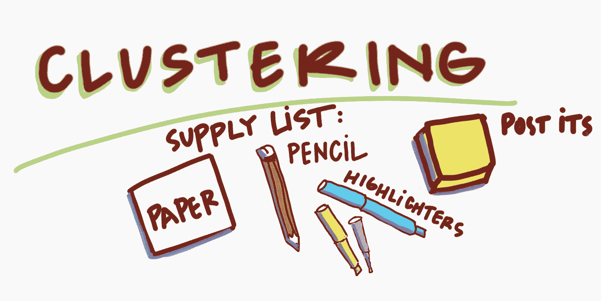
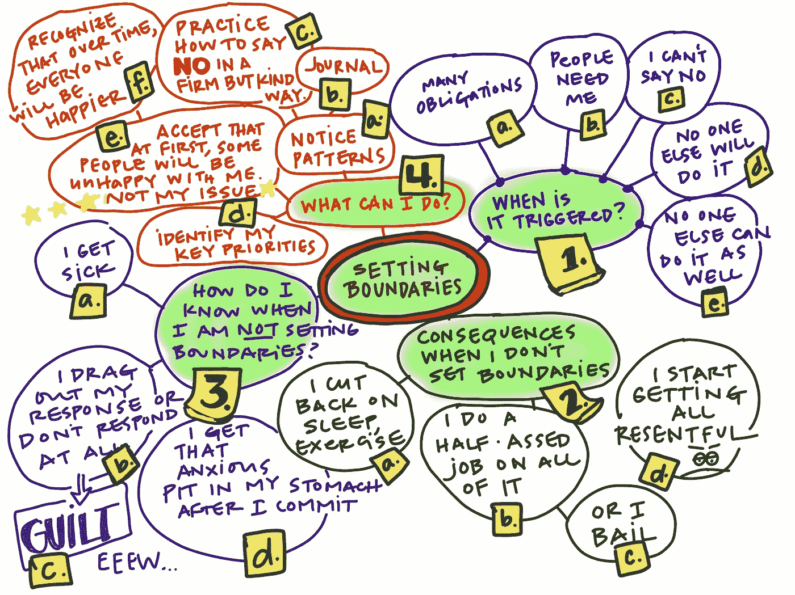
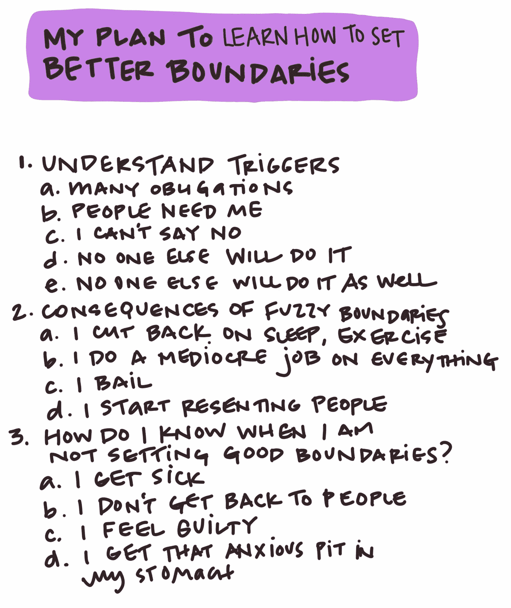
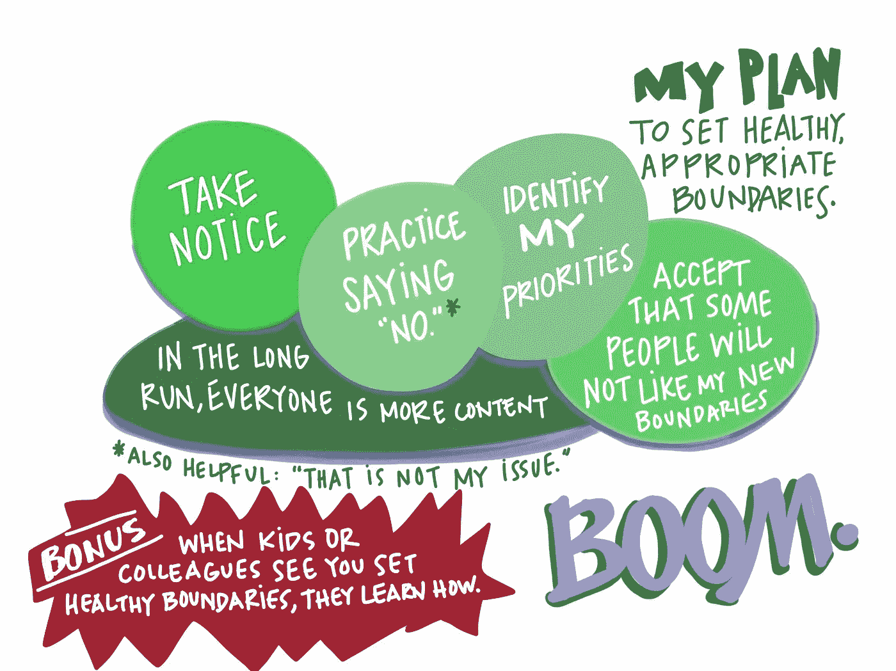

# 从冻结走向行动

> 原文：<https://medium.com/swlh/move-from-frozen-to-action-1b9b37d83971>

## 一种摆脱困境的视觉方法

有些时候，从想法到行动感觉是不可能的。在这个令人分心的世界里，这是可以理解的。大多数时候，[回避](https://www.inc.com/marla-tabaka/how-to-stop-avoiding-things-that-overwhelm-you.html)似乎容易多了，对吧？(厨房里好吃的零食？*方式*比直面棘手问题要好。)

但是生活突然闯进来，说做点什么。

信不信由你，一个简单的视觉技巧可以帮助你从想法走向行动。

g 代表了一种强有力的方法，可以帮助把复杂的话题分成更容易处理的部分。作家们长期以来一直将这种方法作为一种[写前技巧](https://users.humboldt.edu/tduckart/Clustering.htm)，搭建支架来指导他们的努力。

事实证明，这种方法不仅仅适用于写作。作为一种视觉技术，聚类可以帮助你分解一个复杂的想法，一个令人生畏的挑战，甚至是晚餐聚会的计划。为什么？它帮助您了解如何对步骤进行分类、排序和优先级排序。

我将带您看一个例子，在这个例子中，集群帮助我围绕一个持久而棘手的问题制定了一个计划。

You might be a sticky-note person or a highlighter person. Use what makes you happy.

几年前，一个朋友正经历艰难时期。她出现在我家门口想和我谈谈。很多。她在深夜、清晨、吃饭时——只要她觉得有必要，就会按门铃。当她不请自来地出现在平安夜时，我的亲戚们刚刚坐下来吃饭，我知道我让这种模式持续太久了。

(你可能会说:“你这个笨蛋！你为什么不告诉她？”听着。我住在中西部，在那里“中西部好”是一件事。大多数人不会互相指责。事情就是这样。克服它。)

在我的过去，在友谊和生活的其他一些方面，设定健康的界限被证明有点挑战性。几个朋友粗暴地对待我移情的自我，这次也不例外。但我在其他方面也不断犯同样的错误:对太多事情说“是”，限制睡眠和良好的营养以适应其他人的优先事项……你知道该怎么做。

听了我朋友几个小时描述她的困境(癌症复发，然后突然离婚——她的痛苦是有根据的！)，我笨拙、唐突地解释我需要界限，这让她很不舒服。

我需要用不同的方式来处理边界的事情。

我开始阅读如何设定健康的界限。我还从一位牧师朋友那里得到了一些很好的指导。但我仍然感到不知所措。我在剥洋葱，每一层都很滑。我应该从哪里开始？

我只是在一张大纸中间写了“设定界限”。在那里，我记下了我读到和听到的想法。把想法写在纸上感觉就像是和一匹问题野马一起爬进了斗牛场。我至少已经迈出了第一步。

你知道集群的好处是什么吗？它不是线性的。做这件事没有错误的方法。你可以移动想法，看看它们是如何相互联系的。你可以一个人做，除了你没人会看到，或者你可以和一个团队一起做。(不要担心，你运行的风险很低，它会变成一个集群！)

此外，研究表明，写下清晰具体目标的人比不写的人更有可能朝着这些目标采取行动。

随着我继续绘制图表，填充空白区域变得更加容易。我查阅了阅读笔记。主题从我的下载中浮现出来，所以我在纸上给它们编号:1。触发器。2.后果。3.未能在关系中设定健康界限的信号。还有一个:行动。

一个明显的第一步？注意它的发生。我能做到！意识到行动果园里有唾手可得的果实，这让我克服了惰性。看到我面前的想法比我花时间“在脑子里”，感觉被利用，或为“没有早点说些什么”而自责时感觉更具体。

我将图表变成了一个更有序的列表，这有助于“逐项列举”模式的来源。然后我拿着相对“凌乱”的图表，画了一张海报来提醒自己我的计划。极客？当然了。但通过以更有序的方式引出主要观点，我认为我更认真地对待了它们，认为它们是我自己和我的关系的“简单约定规则”。

感觉就像我已经设计了我的旗帜，现在可以立桩我的边界设置要求。我把海报贴在书桌上方的公告板上，提醒自己采取行动。

整个过程——从阅读，到和我的朋友交谈，再到画图表和海报——总共花了大约五六个小时。这种努力是一种有价值回报的小投资。

我的计划完美吗？没门儿。我还会犯错吗？绝对的。但是我*能*回忆起过去几年中几个非常具体的例子，那时我定义健康界限的努力得到了回报。

我仍然偶尔会参考我的海报，我经常使用聚类来帮助从想法到行动的转变。我希望你也能。

玛丽·戴维斯·米肖 *是威斯康星州麦迪逊市一家组织发展公司*[*visual everage*](http://www.visualeverage.com)*的创始人。她将研究方法与艺术相结合，利用视觉方法让人们充分参与决策、学习和创新。*