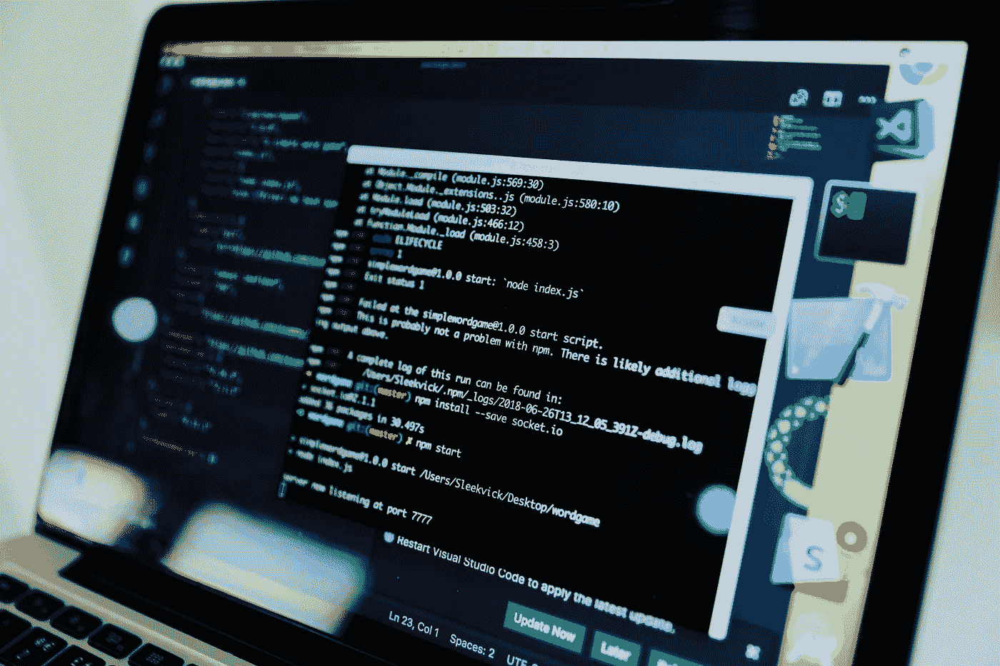
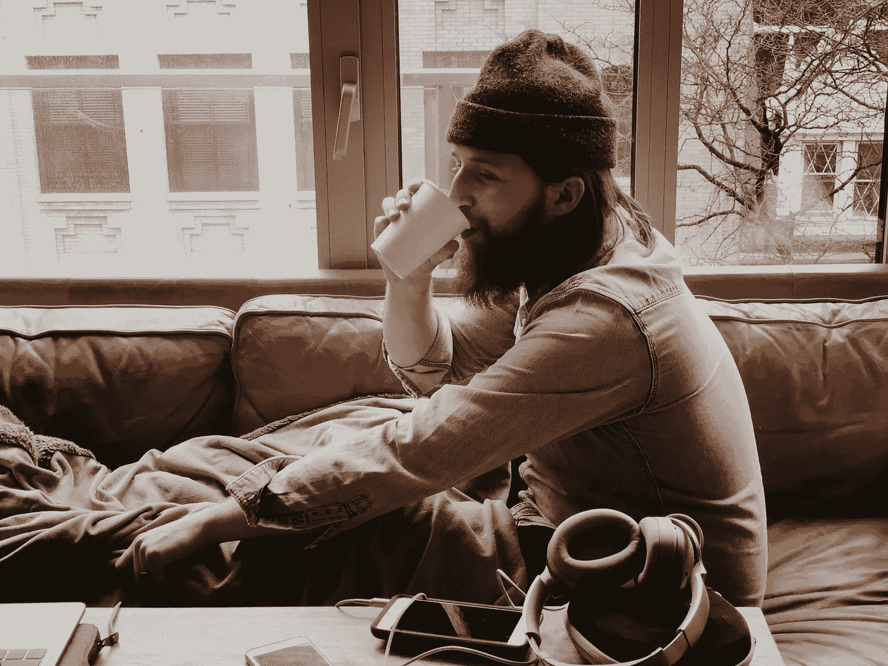

# 为什么我从工程转到了产品经理？

> 原文：<https://medium.com/swlh/moving-away-from-engineering-was-it-right-9e6ffb92b92b>

8 个月前，我放弃了全职的编程工作，成为了[环境洞察](http://mili.eu/)的一名产品经理。回想起来，我花了一段时间才做出这个决定。这是对的吗？

我在这里和这里写了我早期担任产品经理[的经历。](https://zackwan.app/day-50-transition-from-tech-lead-to-technical-product-manger/)

Photo by NESA by Makers on Unsplash

接近我没有全职编码的整整 8 个月，我反思了我的选择，并决定分享我生活中发生的变化。也许这可能会影响到其他人的转换或不转换？

# 一点点我自己

离开自己的创业公司后，我成为一家咨询公司的全职开发人员。然后，我在一家 B2B 公司担任首席开发人员，该公司专门构建在中国部署的定制仓库库存系统。然后，我被提拔到一家姐妹公司，成为了一家金融科技初创公司的技术主管。

总的来说，我花了 7 年时间做全职工程师。每天我走进办公室，打开笔记本电脑，开始编码。虽然随着我成为技术主管，我会参加更多会议，但这些会议通常仍然与技术方面的事情密切相关。

然后大约 8 个月前，我决定把[换成](https://zackwan.app/day-50-transition-from-tech-lead-to-technical-product-manger/)成为产品经理。

# 没有代码的旅程

回想起来，这 8 个月对我来说真的很刺激。随着我对产品经理角色的深入了解，我编写的代码越来越少。从每天提交代码到一整周不提交任何代码。开始的时候，感觉很好。我不再被要求我每天编码的产品时间表所束缚。

然而，几个星期过去了，我的一部分觉得少了些什么。这感觉就像是一种进入我工作的戒断综合症。我开始对工作感到不安。有一天，我觉得我喜欢成为工程团队的一员，解决困难的挑战，而不是有这么多的会议。

我觉得在某些时候，我的求知欲没有得到满足。有时候，我的开发人员陷入了一个有趣的问题。我喜欢马上去帮忙，但是我很清楚我不能这么做，因为这需要很多时间，我不能牺牲这些时间。

# 是什么让我早上起床？

尽管如此，我每天醒来都很兴奋。尽管无法应对技术挑战，但我发现有几件事让我兴奋不已。

Photo by Jon Tyson on Unsplash

我很高兴能够规划下一个功能的迭代。我还能够利用我的经验与工程师更好地交流，从而用更少的迭代来交付特性。我非常兴奋，因为我能够制定战略，并与每个人(设计、营销、内容、工程师)合作，协调将产品推向市场所需的所有活动。

我觉得定义产品战略和开发产品路线图的能力真的推动了我前进！

原来现在编码对我来说更像是一种爱好。如果我必须在开发产品和开发产品的战略和路线图之间做出选择，我会选择后者。

我觉得我做了正确的选择。我也很高兴我做出了改变。

如果你曾经想过离开工程，想想什么让你兴奋。编码通常不是主要的刺激，但解决问题才是。抛开所有其他条件，比如工资，公司福利等等。解决一个技术难题会比下一份工作提供的问题更能激励你吗？我想这会让你更接近答案。

# 感谢阅读！如果你喜欢，请稍等👏

我是[环境洞察](https://mili.eu/)的技术产品负责人。晚上，我是一个制造者、工程师和设计师。我喜欢学习和创造关于技术、产品和创业的新事物。你可以在[我的博客](https://zackwan.app/)或[推特](https://twitter.com/Zaccc123)上找到我。

## 这篇文章发表在 [The Startup](https://medium.com/swlh) 上，这是 Medium 最大的创业刊物，有+432，678 人关注。

## 订阅接收[我们的头条新闻](https://growthsupply.com/the-startup-newsletter/)。

