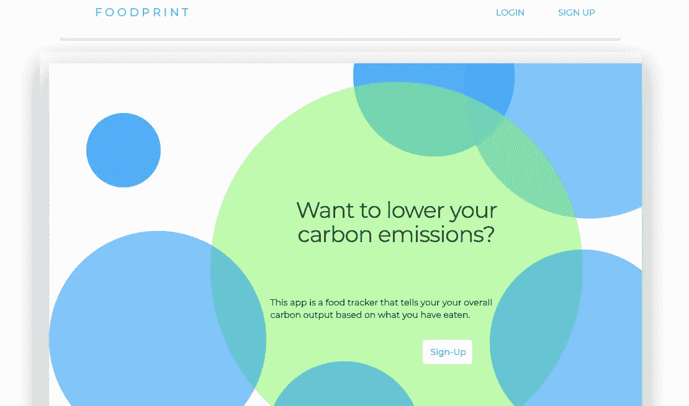

# 远离整体架构👋🏾

> 原文：<https://medium.com/swlh/moving-away-from-monolithic-architecture-8a19def7f7f9>

Nature has no problem with using monolithic architecture every once in a while.

当学习开发 web 应用程序时，很多时候程序员会从创建他们的服务器端架构开始。这种程序结构就像它听起来的那样:一大块巨大的代码或者谚语中的“[大泥球](https://www.mulesoft.com/resources/api/microservices-vs-monolithic)”

有很多成功的大公司，他们的主要产品都是从统一代码开始的，比如谷歌、网飞和亚马逊。然而，出于本文将要讨论的原因，所有这些公司都已经转向多个服务器端可执行程序，这些程序具有服务于给定应用程序不同部分的微服务和 API。

我们将讨论当您继续开发一个程序时，为什么从传统的、单一的服务器端结构转移到面向服务的架构是一个好主意。我们甚至会讨论为什么在开发过程的早期开始使用微服务是一个好主意。

Writing good, clean code is hard to do.

# 为什么单体建筑还是一个东西？🤷🏾‍♀️

让我们来讨论一下为什么开发人员可能首先决定从整体结构开始。通常，如果您有一个相对简单的 web 应用程序，它只处理几个进程。它将处理您的 HTTP 请求并执行一些内部逻辑。它可以查询和更新数据库，并向客户端提供 HTTP 模板。如果您仍在学习如何处理这些不同的项目，将所有代码存储在一个可执行文件中，或者将它们存放在一个存储库中(即使它们被分成多个文件)可能是有意义的。

FoodPrint, an environmental app by Panda Dreams.

# 通过使用整体架构进行学习📝

我做的最后一个应用程序， [FoodPrint](/@faith.chikwekwe/foodprint-carbon-tracking-for-your-eating-habits-7ddf624f8859) ，是一个学习的过程。它是用非常单一的设计建造的。我尊重关注点的分离，并根据[模型-视图-控制器架构](https://github.com/Make-School-Courses/BEW-1.1-RESTful-and-Resourceful-MVC-Architecture/tree/master/01.%20Request-Response%20Cycle%20and%20MVC%20Architecture#model-view-controller-10-min)的原则将我的代码组织到不同的文件中。然而，应用程序中只有一个可执行文件。每次更新这个产品，我都要重新部署整个网站。由于该产品的规模相对较小，并且只解决一个问题，所以到目前为止，这还不是太大的麻烦。然而，随着我向应用程序添加更多功能，我将不得不转向使用 API 和外部微服务的设计。

您可能坚持使用单一模型的另一个原因是，编写覆盖所有端点的测试要容易得多。如果您分析 FoodPrint 的[代码和文档](https://github.com/fchikwekwe/FoodPrint),您会看到我对所代表的各种端点进行了完整的测试。因为所有的 HTTP 请求和其他逻辑都包含在一个地方，所以考虑可能的边缘情况和处理问题就像切换文件一样简单。当你还是一个开发新手时，这可以帮助你解决问题。

Technical debt is not fun. Its also avoidable if you know what to do.

# 为什么要使用面向服务的架构？🤔

整体架构的一个主要问题是技术债务。技术债务可以被描述为使用一个简单但不可扩展的解决方案来获得短期利益。当你的产品扩展或者你的栈改变时，你最终会付出长期重构和代码返工的代价。许多开发人员同意，组织成[冲刺](/@faith.chikwekwe/foodprint-discussing-the-development-process-a6a55147dcc0)的敏捷开发过程是拥有基于用户反馈迭代改进的产品的最佳方式。通过制造技术债务来消耗未来的资源会破坏敏捷开发过程，因为这可能会导致花费几周或几个月的时间来重写不赞成使用的代码部分。

Bugs, crashes and security risks all loom large over the monolithic application.

# 减少崩溃和总体停机时间💪🏾

另一个原因是，应用程序某个方面的问题可能会引起连锁反应，甚至导致整个网站停机。您可以通过隔离不同的服务来创建更具弹性的程序。这将有望包含他们各自领域的任何错误、失败或安全漏洞。

最近我创建了另一个叫做[的应用程序，名字叫做](http://name-ly.herokuapp.com)。它是一个名称生成器，为用户创建唯一的名称，让他们可以选择将自己喜欢的名称保存到他们的个人资料中，或者浏览其他人保存的名称。这个应用程序由两部分组成:主 web 应用程序和一个 Markov 模型微服务来创建唯一的名称。虽然应用程序的主要功能(通过测验获得唯一的名称)取决于微服务和 web 应用程序两者的工作，但如果马尔可夫链中存在严重的错误，用户的个人资料和 web 应用程序中保存的名称不会受到影响。同样，微服务作为一个独立的 API，可以在主应用程序之外访问。如果我把 name-ly 从网上移除，开发者仍然可以使用 [name-ly API 的文档](https://github.com/fchikwekwe/name-ly-API)来获得通过 POST 请求发送的唯一名称。

Growing as a developer means better, more modular code that can stand the test of time.

在过去的几个月里，作为一名开发人员，name-ly 是我迄今为止最模块化的程序。随着我继续修复出现的错误并向程序添加功能，我知道我将有更少的技术债务需要处理，因为我决定为该应用程序创建并使用微服务。

你呢？你还想讨论一下面向服务架构的其他好处吗？作为一名开发人员，在学习增强设计的好处时，你有什么成长的故事吗？

[*Faith Chikwekwe*](https://www.linkedin.com/in/faithchikwekwe/)*是一名* [*后端 web 开发人员和数据工程师*](https://github.com/fchikwekwe) *，她目前正在 Make 学校提升自己的技能，并在旧金山湾区寻找实习机会。*

## 这篇文章发表在 [The Startup](https://medium.com/swlh) 上，这是 Medium 最大的创业刊物，拥有+414，678 名读者。

## 在此订阅接收[我们的头条新闻](http://growthsupply.com/the-startup-newsletter/)。

