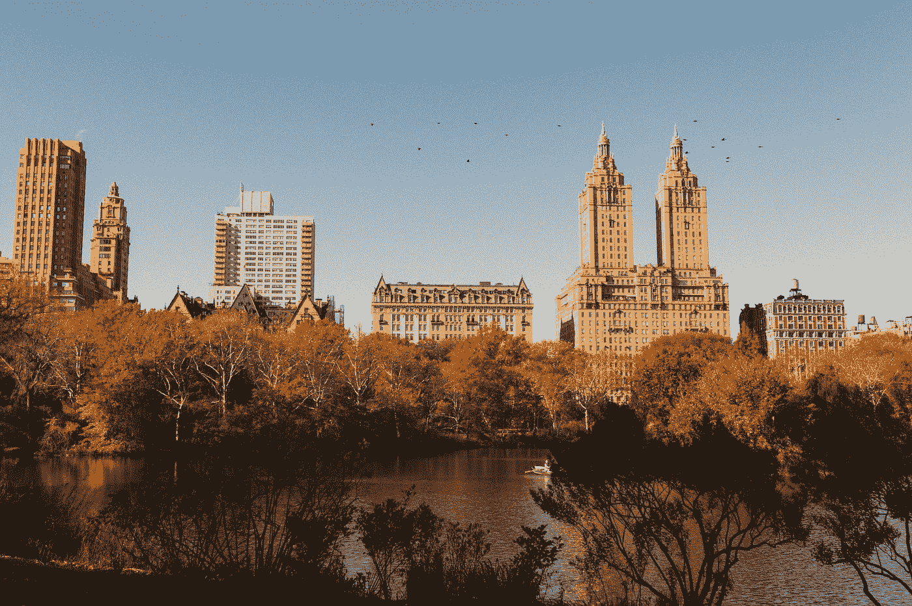

# 在《当他们看到我们时》中超越我们本能的愤怒

> 原文：<https://medium.com/swlh/moving-past-our-instinctual-rush-to-outrage-in-when-they-see-us-fa3076cc324d>

Photo by [Josh Couch](https://unsplash.com/@joshcouchdesign?utm_source=medium&utm_medium=referral) on [Unsplash](https://unsplash.com?utm_source=medium&utm_medium=referral)

在过去的几天里，我一直在看艾娃·迪弗奈的网飞悲剧《当他们看到我们的时候》