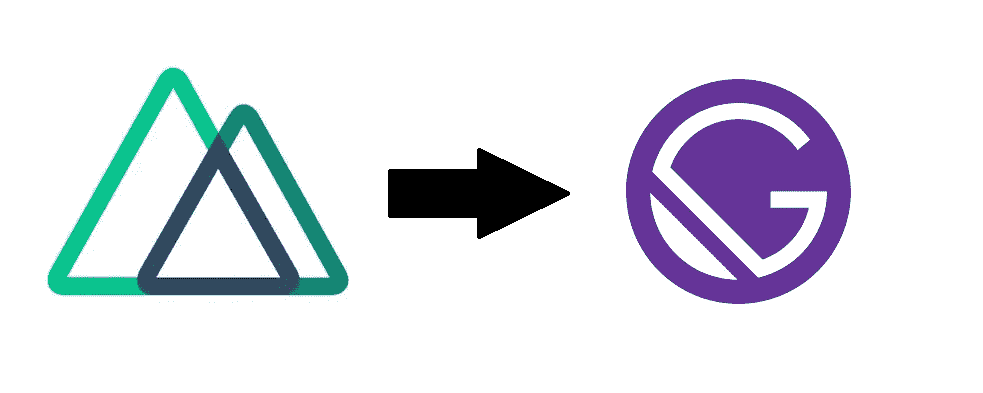

# 走向盖茨比

> 原文：<https://medium.com/swlh/moving-to-gatsbyjs-517053dd98b4>

## 我从把我的个人网站搬到盖茨比中学到了什么

有很多工具可以免费在线下载和使用。您可能希望只使用普通的 HTML、CSS 和一些 JavaScript。这就是我如何建立我的第一个个人网站的，除非你想了解前端功能或内容，这可能对你很有帮助。

随着时间的推移，我渴望将我的网站开发转移到工具方面更强大的东西上。这并不是因为那里的内容足够复杂，需要一个成熟的前端框架，而是因为我可以有一个地方用一些现代的框架、工具和抽象来练习我的 web 开发技能。web 开发领域发展如此之快，我想确保我有自己的沙箱来轻松地进行实验和学习。

# 静态站点生成器

由于我的网站基本上只是一个静态网页，带有一些 CSS 和 JS 用于响应和样式，我不觉得我应该达到像 Angular 或 Ember 这样的全功能框架。我希望我的网站由简单的内容驱动，而我会在 YouTube 和 Medium 这样的托管平台上托管更具体的内容，如视频和长篇出版物。

我发现[静态站点生成器](https://www.staticgen.com/)非常适合我的用例。简而言之，我将能够在开发过程中利用前端框架的现代特性，并发布普通的 HTML、CSS 和 JS 来为客户服务。因为我不期望在我的站点上有任何动态内容，所以我可以构建的内容没有任何限制。此外，托管一个静态网站要简单得多，因为像 [Github Pages](https://pages.github.com/) 这样的平台提供了免费提供静态内容的简单方法。

# NuxtJS:超越 HTML/CSS/JS

虽然 React 此时已经主导了 web 开发领域，但我更多地涉足了它的一个主流竞争对手:VueJS。今天，我或多或少开始喜欢甚至更喜欢 React，但当时我最初被 Vue 吸引是因为它与 AngularJS 的相似性。在这一点上，我有很多关于 Angular 的经验，但我还没有准备好跳到 React 的新热点上。

在研究一些流行的静态站点生成工具时，我遇到了 NextJS。它是由 Zeit 团队开发和维护的，提供了一个全功能的静态站点生成解决方案。这正是我要找的。一个小问题是它利用了 React。

经过一些更顽固的挖掘，我遇到了 [NuxtJS](https://nuxtjs.org/) ，它无耻地宣传自己是 NextJS，前面是 Vue，而不是 React。我高兴地拿起它，踏上了通往现代 web 开发之路。

一旦我对初始版本感到满意，我就生成我的静态资产，并将其推送到我的 [Github repo](https://github.com/Nirespire/nirespire.github.io) 中。就像我之前提到的，Github 对托管静态站点有很好的支持。他们关于 Github 页面的[文档，与 repos 的紧密集成，以及](https://help.github.com/en/articles/configuring-a-publishing-source-for-github-pages)`[gh-pages](https://www.npmjs.com/package/gh-pages)`工具使得开发和托管静态网站变得毫不费力。

网站 V2 完成。正如我所料，拥有像热重装和捆绑这样的现代工具和特性对我来说更好。我有我一直在寻找的现代网络沙盒。

# 盖茨比:崭新而闪亮

我第一次听说 GatsbyJS 是在 [SyntaxFM](https://syntax.fm/) 播客上(顺便说一句，这很棒，去订阅吧)。它与我在之前的研究中已经熟悉的 NextJS 进行了比较。我听到了很多关于盖茨比的好消息，但没有一件事让我想换个网站。当然，它是一个具有现代 web 开发工具和特性的静态站点生成器，但那是我已经拥有的 Nuxt！

几个星期后，我在网络上和其他开发者中听到了更多关于盖茨比的传言。我的工作场所有一个全天的盖茨比初学者研讨会，我有兴趣报名参加。通常我更喜欢在自己的时间里投入到新的框架中，但是我认为这是一个很容易的开始，因为它在社区中已经越来越流行了。我肯定错过了什么，对吧？在对框架有了一个快速的介绍之后，我们用 Gatsby 做了一些开发工作，那时我终于看到了所有的宣传是关于什么的。

## 插件

真正让 Gatsby 在开发者体验方面脱颖而出的是插件系统。其核心是，您可以用简单的老式 React 和 CSS 样式构建一个完整的 Gatsby 静态站点。除此之外，插件很简单，即插即用，你可以在开发过程中导入节点模块，使你的网站建设更加有效和易于管理。

就像我之前说的，我建立的网站真的很简单，只不过是一个登录页面，上面有我其他内容的外部网站链接。然而，盖茨比插件激发了一些很酷的想法来增强我已经有的东西。例如，除了在 Medium 上提供我个人资料的链接，我可以通过一些简单的配置插入 [gatsby-source-medium](https://www.gatsbyjs.org/packages/gatsby-source-medium/) 插件，现在我可以让我的网站自动显示我最新发布内容的预览。

同样，我也从来没有想过我为什么没有将谷歌分析整合到我的网站中来跟踪用户流量。虽然集成分析已经很容易了，但没有比使用[gatsby-plugin-Google-Analytics](https://www.gatsbyjs.org/docs/adding-analytics/)并将跟踪 id 放入您的 Gatsby 配置中更容易的了。在站点生成过程中，框架负责剩下的工作。

最后，浏览插件库的用户体验是一流的。每一个都链接到一个信息页面，如果你需要下载一些代码或提交一个问题，可以方便地访问相关的 Github repos。

## 渐进式 Web 应用程序功能

[渐进式网络应用](https://developers.google.com/web/progressive-web-apps/)或 PWA 是一类遵循特定标准或性能和可访问性的网络应用。总的来说，如果你按照 PWA 标准建立你的网站，你将使每个人更容易使用你的网站，不管他们的网络或硬件能力如何。

在我看来，更快的加载时间和更灵敏的响应行为是它出名的主要原因。React 团队的丹·阿布拉莫夫(Dan Abramov)谈到了 ReactJS 网站及其惊人的快速性能。

## 转换:开发者体验

尽管 Vue 和 React 在应用程序的结构方面有着截然不同的模式，但我的网站的简单性允许我基本上只是复制粘贴现有的内容。我从一个最基本的[Gatsby-starter-hello-world](https://www.gatsbyjs.org/starters/gatsbyjs/gatsby-starter-blog/)开始，并开始移动东西。我必须做的最大的手工工作是将我的 HTML 标记转换成 JSX，这是一个进步，因为它帮助我将标记模块化了很多。

页面之间的路由是隐式处理的。如果你把一个`home.jsx`文件放到你的`src/pages`目录中，Gatsby 会自动把它构建到`/home`路径中。CSS 和其他静态资产(如图像)是从`static`目录自动构建的，Gatsby 在捆绑和缩小幕后的一切以高效交付给客户端方面做得很好。我只需要担心一个页面，这个模型就像 Nuxt 一样，所以这里没有什么重要的东西需要学习。

根据谷歌的[灯塔](https://developers.google.com/web/tools/lighthouse/)分析器的测量，将我的网站切换到基本上开箱即用的盖茨比给我提供了相当显著的网络性能提升。我是凭经验发微博的。

## 越来越

我仍在探索，但我知道盖茨比很独特的一些东西，包括:

*   **GraphQL 支持**:基本上，应用程序中任何与数据相关的东西都可以通过运行在开发环境中的完整 GraphQL 服务器来访问。我前面提到的中型插件就是基于这一点。
*   **CMS 集成**:我希望最终将我的站点迁移到 BYOF，或者带来您自己的前端系统，在那里一个托管平台可以托管和服务我所有的数据和 API 需求，而我的 Gatsby 站点可以继续静态运行。Netlify 和 [Drupal](https://www.drupal.org/) 以及我雷达上的几个。

简单地说，我不后悔皈依盖茨比。我很确信炒作是真实的。Gatsby 是现代静态和渐进式 web 应用程序构建的一个非常可靠的选择。

我期待着用 Gatsby 提供的一套工具和插件来改进我的站点，以及用它作为我的静态站点框架的新鲜开发者体验。

如果你有任何想法或建议，请在 [Twitter](https://twitter.com/Nirespire) 上告诉我。也请关注我的[网站](https://sanjaynair.me/)上即将发布的新内容！