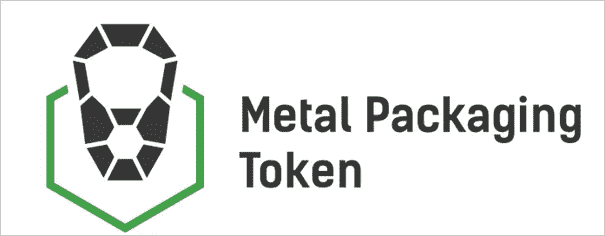
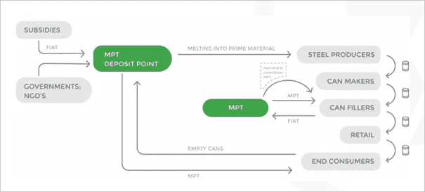
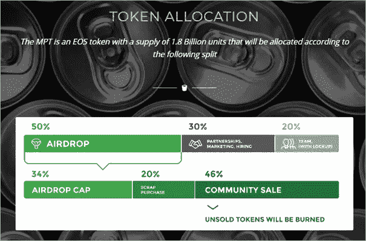

# MPT 将推出全球首个用于金属罐回收的区块链 dApp

> 原文：<https://medium.com/swlh/mpt-to-launch-the-worlds-first-blockchain-dapp-for-metal-can-recycling-9f6c6335b591>

在过去的十年里，塑料的产量大幅增长。过去 10 年的塑料产量相当于整个 20 世纪的产量。大众消费被认为是增长的主要原因之一。

塑料的生产，加上塑料污染，对环境有着重大的负面影响，因为它通常不可降解，而且生产需要大量的石油、天然气和煤炭。只有很小比例的塑料被回收，回收塑料从来没有被用于高质量的产品。

> 如果我们继续走这条路，环境将继续迅速恶化。如果我们现在不采取行动，我们留给后代的遗产将会受到影响。

使用破坏地球的塑料作为包装食物、饮料、化妆品和油漆的一种方法是使用金属。金属是一种环境友好的包装材料。金属和玻璃是唯一广泛使用的包装材料，具有无限的寿命，可以无限回收。多年来，金属一直被用于包装饮料、油漆、防腐剂、化学品和其他产品。

虽然像美国这样的一些第一世界国家已经有了金属罐回收行业(价值约 10 亿美元)，但许多其他国家还没有。

根据最近的[报告](https://www.prnewswire.com/news-releases/global-metal-recycling-market-research-report---forecast-till-2023-300724569.html)，全球金属回收行业预计到 2023 年将达到 4340 亿美元。即 8.04%的复合年增长率(CAGR)。亚太地区目前正主导着金属回收行业，这是因为其快速的经济增长、人口增长以及支持环境保护和废物管理的政策和法规。

> 仍然有许多国家告知利用金属罐回收的环境效益。是时候让全世界都意识到使用金属作为包装和回收的解决方案了。

一个有助于提高认识和改变现状的项目是[金属包装标识](http://www.metpacktoken.org/) (MPT)。MPT 是一个独特的全球项目，利用区块链技术来激励金属罐的回收，同时支持环境。

## **金属包装令牌**

金属包装令牌(MPT)由金属包装专业人士于 2018 年创立，提出了一个基于区块链的解决方案，以提高金属包装行业的成本效益，使其成为塑料包装的竞争对手。

MPT 的主要目标是减少或消除塑料和金属包装之间的成本差异，以便所有适合金属包装的商品都可以用金属罐包装。如果不提高回收能力，作为包装材料的塑料和金属的价格就不太可能持平。通过创造一个成本高效的供应链，金属包装的价格可以大幅下降。优化项目的供应链是区块链技术的一个流行用例。分布式分类帐技术提供了有趣的数据，并创建了关于回收的长期统计数据。MPT 打算发起一项金属罐回收行动，鼓励人们使用自己的加密货币 MPT。

## **EOS 区块链**

为了确保项目的扩展能力，MPT 团队经过慎重考虑，选择了 EOS 区块链作为他们的主链。MPT 将采用 EOS 的委托股权证明(DPoS)共识算法。EOS 使 MPT 公司能够实施智能合同并启动治理系统来防止项目集中化。EOS 的第 2 层侧链解决方案使 MPT 能够拥有多个与主链平行的侧链。侧链是一个独立的区块链，使用双向 peg 连接到其母区块链上。部署侧链的优点是可以有多个侧链而不会干扰其主链。每个侧链可以用不同的用例来部署。对于 MPT，该功能将用于根据特定地理位置部署侧链，因为不同地区的金属回收价格往往不同。

## **MPT 目标市场**

MPT 计划开拓的第一个市场将是终端消费者。针对这一特定市场，MPT 将制造 MPT 存款点，并为用户开发移动应用程序。参与的消费者可以在附近的存款点回收他们的金属罐，作为回报，他们将获得 MPT 代币。用户不需要获得区块链知识。他们只需要一个手机应用程序，附近 MPT 存放点的位置和他们回收的金属罐。

MPT 供应链由五层组成。第五层是最终消费者，这是项目的起点，也是最终为要解决的其他层付费的关键层。其他层是:

1.  钢铁生产商
2.  制罐工人
3.  罐头灌装机
4.  零售
5.  最终消费者

在规划项目的过程中，MPT 将与品牌所有者合作，分发 MPT 充电启动包。品牌所有者将免费获得他们的第一批 MPT 令牌。他们可以熟悉这个过程，比如在易拉罐上印上 MPT 的二维码。品牌所有者有权设定他们自己的激励措施和他们希望开始的罐数。除了与品牌所有者建立合作关系，MPT 还将在不同的司法管辖区申请政府补贴。

## **MPT 令牌结构**

将在 EOS 区块链上创建总计 1，800，000，000 MPT。30%的代币将用于合作伙伴关系、营销和新员工，而 20%的 MPT 供应将分配给团队，100%的锁定期为一年，从空投时开始。
MPT 剩下的 50%将在空投补给(大约 34%)、废品收购(20%)和社区销售(46%)之间分配。预计将有 414，000，000 MPT 在为期四周的社区销售中可供购买。

## **社区销售过程中异常透明**

在他们的社区销售中，MetalPackagingToken 采用了行业最佳透明做法。其中一个特征是被硬编码到代币契约中的独特的回购保证。任何在 12 个月内决定不使用或移动其 MPT 代币的社区销售参与者将能够激活担保并全额取回其买入费。将在社区销售中购买的代币转移到另一个 wallet 或 exchange 帐户将丧失回售 MetalPackagingToken 的权利。通过提供这种回购机制，MetalPackagingToken 为其社区销售参与者创建了一种独特的保护机制。这也意味着，只有在投资者通过在交易所交易“解锁”代币后，MetalPackagingToken 才能使用社区销售基金。

此外，所有未售出的 MPT，将在社区销售完成后立即被烧毁。关于社区销售的更多细节将由 2019 年的 Q1 在[官方网站](http://www.metpacktoken.org/)上发布。社区销售的象征性价格将在晚些时候确定。

> MPT 将可用于分散式交易所，如 Bancor、Chaince 和其他分散式 EOS dApp 交易所，以及其他集中式交易所。

## **结束语**

如果我们希望下一代人能够生活在一个体面的世界，我们需要开始更加关心环境。通过降低金属包装的成本、增加回收机会和激励个体回收者，MPT 在保护我们希望留给下一代的遗产方面做出了积极的改变。通过实现全球采用，MPT 将有很大的潜力大幅减少能源消耗和二氧化碳排放。MPT 拥有一支由金属包装行业专业人士组成的团队，以及一个与品牌所有者利益一致的项目，旨在减少我们星球的塑料污染，希望在人们的行动中创造一种行为改变，并提高对这一日益增长的问题的认识。

更多关于金属包装令牌的信息，请访问他们的[官网](http://www.metpacktoken.org/)或查看他们的[电报](https://t.me/joinchat/GHpqDxLMYCvr2_g9PvwRCw)频道。更深入的信息可以在[白皮书](http://www.metpacktoken.org/wp-content/uploads/2018/11/MPT-Whitepaper-1.0.4.pdf)中找到。如果阅读这篇文章，引起你的兴趣，你想为金属包装令牌项目作出贡献，那么开始提高对 MPT 的认识，甚至询问如何开始你自己的本地 MPT 侧链。

## 这篇文章发表在 [The Startup](https://medium.com/swlh) 上，这是 Medium 最大的创业刊物，拥有+418，678 名读者。

## 订阅接收[我们的头条新闻](http://growthsupply.com/the-startup-newsletter/)。

