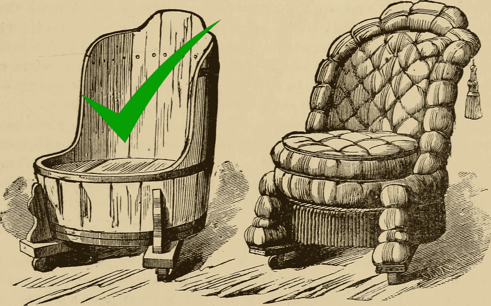
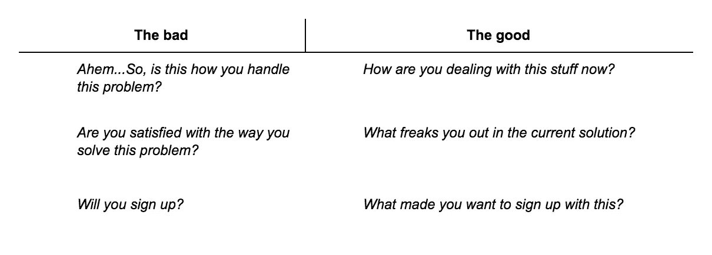
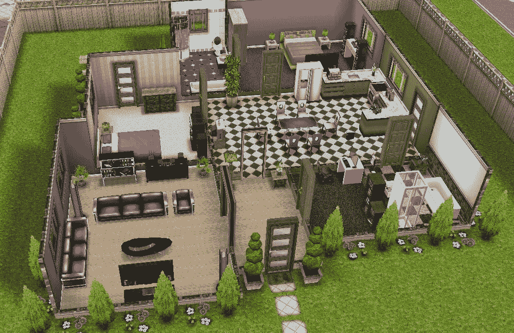

# MVP 搞定。下一步做什么？

> 原文：<https://medium.com/swlh/mvp-is-done-what-to-do-next-db46f8b0e905>

> 比方说，你有一个 MVP。在一个完美的世界里，你一个月就完成了。现在怎么办？花两个多月的时间来制作精美的东西，并让它像你希望的那样“完成”吗？或许在筹集资金之前先搁置？

不，伙计，它不会工作得很好。

“MVP 完成”阶段不是要干扰你从一开始就跳过的功能。没有一种东西你只做一次就完成了。更多的是不断测试市场并从中学习。

With something very small and simple that you can build in a damn month

在你花费数千美元让它起步之前，请注意这三个“如何进行 MVP”的步骤。

[*Purrweb*](https://www.purrweb.com/) *专门打造性能稳定的产品和 MVP。想试试吗？大家一起来讨论一下吧！想出一个执行计划，请通过***联系我们！**

# ***1。离开那里***

*房子办公室什么的。然后和真人对话。接触那些你认为可能会为产品付费的人，因为这样可以解决他们的问题。*

> *有 10 个人可以购买这个应用是一个好的开始。我是说除了你妈妈或最好的朋友之外的其他人*

*一旦你接触到潜在客户，让他们测试你的想法。它可能是你在午餐时给某人的演示或试用版。我的意思是给他们一些实实在在的东西。*

# ***2。沿途获得反馈***

*通过提问了解人们的感受和愿望。使用开放式问题的超能力来获得更详细的反馈。问一些不仅仅需要“是/否”回答的问题。*

**

*你不需要得到大量关于你的应用想法有多好的赞美。获得“好结果”并不意味着有一个好的对话。你需要的一切都是为了找到真相。即使很痛。*

*我说“了解真相”，意思是这样的:*

> *他们:“有点酷。爱死它了。(免费的赞美)*
> 
> *你:“哦，顺便问一下，你现在如何处理这个问题？”*
> 
> *他们:“你知道，我们没有这样的问题。我们根本不在乎。*

*最糟糕的事情是没有人可以交谈。虽然，即使有不好的或者没有答案，你仍然有所发现。因为一天真正的对话(至少，试着交谈)总比几周的哲学思考要好。*

*所以再说一遍，问任何重要的问题。因为你不是他们。因为他们会给你一个线索，告诉你什么该保留，什么该放弃。反之亦然。*

> *不要再进行哲学思考了，去了解真相吧。*

# ***3。测量结果并从中学习***

*获取反馈以使未来的迭代更好。*

> *功能性还可以，但是设计就是一场灾难？→提炼一下，给 app 一个审美的诉求。*
> 
> *10 个用户有同样的问题？→更有可能需要修复。*
> 
> *就一个用户遇到 bug？→确保它不是特定于该用户的设备。*

*有一件事需要澄清。这并不是因为有人“没有这个就不会买你的应用”，就要构建每一个功能。提炼 80%用户的需求。粗糙，但非常有用。*

**

*Dead simple 80/20 rule would save the situation here, huh?*

*至于所依赖的指标，答案很简单——视情况而定。这实际上取决于你的商业目标和你构建的产品类型——不管你选择什么(注册、评论等等)。)，应该是比较好理解的。是的，这只是一个 MVP，所以高数据会发生在其他地方。*

*如果这个想法失败了(糟糕的结果加上零或糟糕的反馈)，扔掉它。或者试试 pivot。事实上，在你成功之前，几乎总有一些事情是你可以做的。当然，只要你银行里有钱:-)*

# *MVP 和模拟人生不一样*

**

*This isn’t a game where you spend the whole time designing every nook and cranny*

*说到生意，没有像 ctrl-shift 这样的东西——无论什么样的欺骗代码都会给你带来无限的金钱。因此，只需推出最基本的“家庭”版本，并使用它。一旦你扩张，你就可以用颜色抖动，推倒墙壁。迭代地。一个房间接一个房间，这里和那里。*

*请按住那个👏🏼按钮下面几次，让其他首次创业者看到这个帖子。并在下面的评论中分享所有“在建立我的 MVP 后我做了什么”的经历:)*

* [## PurrWeb -为你的创业或 MVP 的开发团队

### 使用 React、React Native 和 Node.js 堆栈快速构建您的产品

www.purrweb.com](https://www.purrweb.com/) 

*Go follow purr web on*[*insta gram*](https://www.instagram.com/purrweb/)*| Like us on*[*脸书*](https://www.facebook.com/purrweb.agency/) *或*[*Twitter*](https://twitter.com/purrweb)*或*[*LinkedIn*](https://www.linkedin.com/company/purrweb/)

拥抱和喵喵叫♥

## 这篇文章发表在 [The Startup](https://medium.com/swlh) 上，这是 Medium 最大的创业刊物，拥有+412，714 名读者。

## 在这里订阅接收[我们的头条新闻](http://growthsupply.com/the-startup-newsletter/)。

*