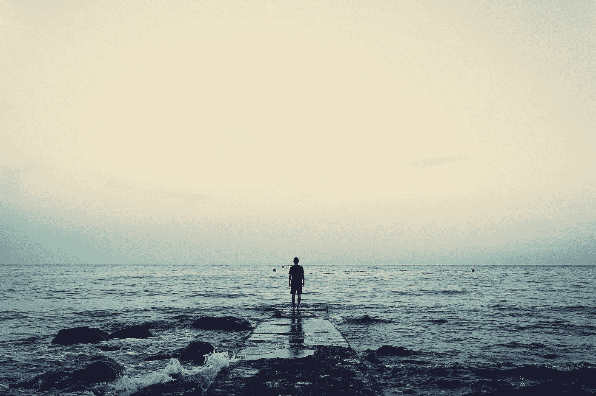

# 我的焦虑能让我在短码头上走很长一段路

> 原文：<https://medium.com/swlh/my-anxiety-can-take-a-long-walk-off-a-short-pier-d9fb75985d89>

我焦虑的背景噪音比老式日光灯的嗡嗡声还烦人。

Photo by [Joshua Earle](https://unsplash.com/@joshuaearle?utm_source=unsplash&utm_medium=referral&utm_content=creditCopyText) on [Unsplash](https://unsplash.com/search/photos/short-pier?utm_source=unsplash&utm_medium=referral&utm_content=creditCopyText)

总体来说，我不是一个焦虑的人。事实上，更多的时候，我是在与抑郁抗争，而不是焦虑。

至少，我以前是这么想的。但是正如老子所说，

> “如果你感到沮丧，你是生活在…