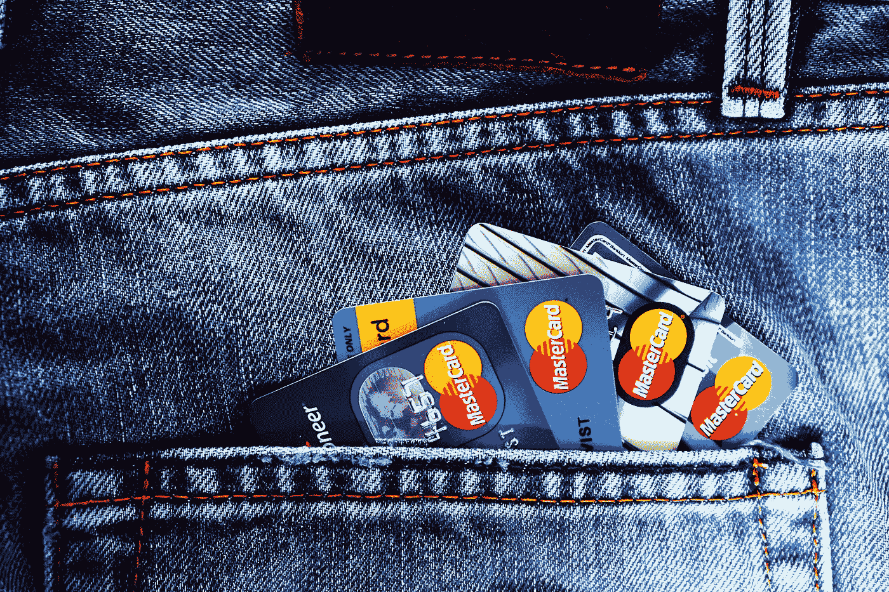

# 我的加密水晶球:2019 年区块链采用的 7 个预测

> 原文：<https://medium.com/swlh/my-crypto-crystal-ball-7-predictions-for-blockchain-adoption-in-2019-16f0977ab90f>

去年大约同一时间，我阅读了许多关于 2018 年区块链技术、代币和加密货币可能会发生什么的文章。他们中的大多数人都过于乐观了。现实反击了。然而，看到这些预测中的哪一个最终成为现实是非常有趣的。

> 今年，我敢于对**加密水晶球**有自己的看法，并陈述一些假设，这些技术及其在市场上的采用可能会走向何方。

Photo by ‪Dima Visozki‬‏, found on [Pexels](https://www.pexels.com/photo/clear-bubble-on-sand-1640034/)

> 在我看来，这是我们将在 2019 年看到 crypto 成败的消费者领域。

虽然有许多有潜力的有趣的 B2B 场景，但加密应用程序仍然需要解决许多用户体验(UX)问题，以赢得更广泛的受众和接受。

它通常是企业对消费者(B2C)领域，在这里你可以收集更多的反馈，更快地迭代并获得大量的动力。**我们已经做好了采取一些重要措施的准备。2019 年将是把 2018 年的这些基础发展带到现实世界的一年。**

我想让我的预测变得可以衡量，这样我们明年就可以回顾它们。我会用可衡量的目标结果来结束每个部分，这样你就可以在 2019 年底确定我和我的史诗般的失败。；-)

所以，我们开始吧:

# 1:移动加密钱包

Photo by [Matheus Bertelli](https://www.pexels.com/@bertellifotografia), found on [Pexels](https://www.pexels.com/photo/forced-perspective-photography-of-cars-running-on-road-below-smartphone-799443/)

移动钱包可能是将加密支付带入主流的最重要的一块拼图。当然，你不应该将大部分加密资产存储在这些钱包中，但移动加密支付是将加密带入日常使用并取代/增强现金或小额借记卡/信用卡法定支付的关键。对于临时用户来说，这些移动场景一定会变得非常简单。许多加密项目非常积极地实现这一目标。我们将在 2019 年看到许多竞争，以赢得大量用户的心:

*   大多数大型加密交易所已经做好了准备:看看比特币基地[的移动应用](https://www.coinbase.com/mobile)或者刚刚收购了 [Trust Wallet](https://trustwallet.com/) 的币安[。](https://support.binance.com/hc/en-us/articles/360010790652-Binance-Acquires-Trust-Wallet-A-Secure-Mobile-Crypto-Wallet)
*   但是，还有许多其他玩家试图征服移动市场。如果你想得到第一印象，看看这个移动比特币应用清单。如果你想更深入地了解，我推荐你去看看像[平衡](https://balance.io/)、 [Nimiq](https://nimiq.com) 、[请求这样的快节奏项目。网络](https://request.network/#/)或[电子神经](https://electroneum.com/)。我们将在 2019 年看到这一领域的巨大创新。
*   但我敢打赌，我们还会看到许多老牌金融公司试图加入这场竞赛——要么收购这些初创公司之一，要么用加密用例扩展其现有的移动产品。

## 我的第一个预测:

> 2019 年底，我们将在 iOS 应用商店的“金融”部分的前 20 名中看到至少 3 个移动加密钱包。

*【在撰写本文时(2018 年 12 月)* [*面包*](https://brd.com/) *为德国排名 58 的最高评级财经 app。】*

# 2:稳定币

Picture by [Tante Tati](https://pixabay.com/en/users/tantetati-77004/), found on [Pixabay](https://pixabay.com/en/stones-decorative-stones-ornament-944145/)

用户友好的移动钱包只是解决方案的一部分。我们不应该指望我们的父母或其他新手去“学习”一种新货币的估价和用法。密码的使用必须感觉非常类似于菲亚特的使用。如果你像我一样生活在欧元区，并经常在欧洲旅行，那么你就会知道用像欧元这样众所周知的统一货币支付是多么舒适。用美元支付也可以，因为我们都大致知道汇率。

> 但不断重新计算像比特币这样不稳定的加密货币对于日常使用来说是完全不可接受的。

这就是为什么我认为 2018 年稳定硬币的**崛起是采用大规模加密的一个非常重要的基础。稳定的硬币与众所周知的法定货币如美元或欧元挂钩。你可以像使用菲亚特一样使用它们，但不需要银行账户。**

稳定硬币有不同的实现方式:加密支持的，如 MakerDOA 的 [DAI](https://makerdao.com/dai) ，菲亚特支持的，如 Circle 的 [USDC](https://www.centre.io/usdc) 或[系绳(USDT)](https://tether.to/) 。

在 2018 年加密市场低迷期间，他们都经历了一些艰难的日子。2019 年哪家最成功，拭目以待。但他们中的哪一个将赢得这场竞赛并不太重要:对我来说，让他们中的一些人成功降低新用户的准入门槛绝对至关重要。

2019 年底，大多数加密新手不会通过购买 BTC 或瑞士联邦理工学院来进入加密，而是人们会无缝地将少量美元兑换到 USDC，并获得经验——如果他们认识到其中的差异的话。也许应用程序会将这种微小的差异抽象化。我们可能会在不知不觉中使用密码。

## 我的第二个预测是:

> 2019 年底，我们将在 coinmarketcap.com 看到至少 3 枚稳定的硬币进入市值前 10 名。

*【写作时(2018 年 12 月)* [*系绳(USDT)*](https://coinmarketcap.com/currencies/tether/) *排在第 7 位，***排在第 25 位，*[*true USD*](https://coinmarketcap.com/currencies/trueusd/)*排在第 27 位，我最喜欢的* [*戴*](https://coinmarketcap.com/currencies/dai/) *排在第 58 位。】**

# *3:通过你最喜欢的信使发送(加密)钱*

**

*Photo by [Tracy Le Blanc](https://www.pexels.com/@tracy-le-blanc-67789), found on [Pexels](https://www.pexels.com/photo/apple-applications-apps-cell-phone-607812/)*

*像 WhatsApp、微信和 Telegram 这样的即时通讯软件是目前使用最多的应用程序。虽然通过微信汇款在亚洲很常见，但在西方国家却很少见。加密将改变这一点。我们将开始通过聊天应用程序发送小额资金。[降落伞](https://www.parachutetoken.com/discover)的 [ParJar](https://www.parjar.io/) 项目是首批通过[电报信使](https://telegram.org/)发送加密硬币的项目之一。他们目前支持 18 种加密货币，其中比较突出的有 BTC、ETH、0X 和 BAT。这很容易，也很有趣——它将获得牵引力。*

## *我的第三个预测是:*

> *脸书将紧随其后，在 WhatsApp 或 Facebook Messenger 中提供加密支付功能，直到 2019 年底——我们很多人都会使用它们。*

*也许他们甚至会推出自己的 FB Token 来赢回用户群的一些喜爱？】*

# *4:加密支持的信用卡*

**

*Picture by [TheDigitalWay](https://pixabay.com/en/users/thedigitalway-3008341/), found on [Pixabay](https://pixabay.com/en/credit-card-charge-card-money-1583534/)*

*两年前，第一批加密支持的信用卡发行时引起了相当大的轰动。但 2018 年对于像 [TenX](https://tenx.tech/) 和 [Bitwala](https://www.bitwala.com) 这样的公司来说是艰难的一年。监管开始生效。大多数基于加密的信用卡服务都依赖于 [WaveCrest](https://www.wavecrest.gi/) 的平台，由于不符合 VISA 的问题[不得不关闭其服务。许多项目不得不重新思考和构建他们的解决方案，并建立新的合作伙伴关系。最后，这似乎奏效了:TenX 重回正轨，目前](https://thenextweb.com/hardfork/2018/01/05/spending-bitcoin-with-a-debit-card-just-got-a-lot-harder/)[为新加坡发行了第一张信用卡](https://blog.tenx.tech/en-2018-okr-update-and-summary-a92f1e72e23)，而 Bitwala 正在提供一个“区块链银行账户”和一张[借记卡](https://www.bitwala.com/card/)。*

## *我的第四个预测是:*

> *我们将在 2019 年看到超过 100 万张支持加密的借记卡和信用卡。*

**【我猜大部分会用在亚非拉南美的新兴国家。】**

# *5: NFTs 和加密收藏品*

**

*Photo by [Expect Best](https://www.pexels.com/@expect-best-79873), found on [Pexels](https://www.pexels.com/photo/bookcase-bookshelves-bookstore-business-351265/)*

*[不可替代令牌](https://en.wikipedia.org/wiki/Non-fungible_token)(NFT)无疑是区块链技术最具颠覆性的用例之一。你可能听说过 [Cryptokitties](https://www.cryptokitties.co/) ，这是第一批令人印象深刻的 NFT 用例之一。不可替换的令牌是唯一的，不可互换的，正如我们从常见的加密货币中所知道的那样。*

*平台可以使用 NFTs 将某个令牌链接到数字资产的某个实例。如果用户拥有该令牌，他就是数字资产的所有者。这项技术使我们能够引入数字商品的稀缺性:一个画家可以决定只发行 10 份他的数字艺术作品，每一份都由一个独特的 NFT 代表。如果有人购买第一份拷贝，这将被记录在区块链上。对于这位艺术家的粉丝来说，副本 1 可能比副本 8 更“有价值”。副本 1 的所有者可能会在以后决定将他的作品转售给其他人。他把他的 NFT 送给买家，以换取一些 ETH 或 BTC——包括基于区块链的权限管理和透明度。*

*NFT 最终实现了数字产品的真实产品用例。想象一下:你去年在 iTunes 上买了一首歌——现在你不再喜欢它了。你想把它转卖给一个朋友。目前不可能，因为您不拥有该数字资产。相反，你从苹果公司购买了这首歌的使用权。Apple 控制您的访问。我的观点是:音乐行业可能会随着 NFTs 而彻底改变。您可以公开证明您的所有权，因为您拥有 NFT，这在区块链上是公开的。*

> *许多人喜欢收集东西。NFTs 使这成为可能。*

*如果你读到“加密收藏品”:它们是由 NFTs 驱动的。*

## *我的第五个预测是:*

> *至少有一个总部位于 NFT 的艺术平台，如 [Maecenas](https://blog.maecenas.co/picasso-auction-nem-0x-makerdao) (图片)或 [Ujo](https://www.ujomusic.com/) (音乐)将在 2019 年获得关注，并在 2019 年底前拥有超过 100 万的注册用户。*

# *6:基于令牌的游戏*

**

*Picture by [ant2506](https://pixabay.com/en/users/ant2506-4830040/), found on [Pixabay](https://pixabay.com/en/nintendo-switch-nintendo-switch-2154437/)*

*游戏平台将紧随其后，推出自己的游戏内代币和/或用 NFT 代表游戏内物品。*

*玩家可以从游戏中提取这些资产，并在外部交换中转售给其他玩家，或者在另一个游戏中交换资产。如果你想更深入，看看像 Game.com 的、 [RadMule](/ostdotcom/how-radmule-labs-will-tokenize-the-70-3-billion-mobile-games-market-3d11b3f572a6) 或 [GamerToken](https://gamertoken.io/) 这样的例子。*

## *我的第六个预测是:*

> *我们将会看到至少 5 款成功的电脑游戏(每款都有超过 500，000 名用户)使用加密代币作为游戏中的货币，或者使用 NFT 作为游戏中的资产。*

# *7:忠诚度计划*

**

*Photo by [Kaique Rocha](https://www.pexels.com/@kaiquestr), found on [Pexels](https://www.pexels.com/photo/business-cafe-close-up-coffee-cup-311277/)*

*我们将看到区块链的忠诚度平台在许多层面和不同市场的崛起。[与目前的“积分系统”](/ostdotcom/blockchain-tokens-vs-points-programs-9-reasons-why-companies-and-customers-should-care-e18ef29135e6) a la [Miles & More](https://www.miles-and-more.com) 不同，它们通过使用区块链和代币提供了明显更高的透明度。它们的设计具有开放性，允许用户将他们的“积分”转移到其他平台。老牌玩家要么行动迅速，要么竞争会给他们带来沉重打击。像 [Simple Token](https://ost.com/) 这样的项目目前正在推出平台，让这变得非常简单。看看 [Carry Protocol](https://carryprotocol.io/) 想让[在 2019 年](/ostdotcom/recap-from-ost-live-with-carry-protocols-grant-sohn-blockchain-for-offline-retail-and-benefits-8986908edab1)实现什么。*

## *我的第七个预测是:*

> *2019 年，我们将看到至少 3 个重要的基于令牌的忠诚度系统，每个系统都拥有超过 100，000 名用户。*

# *摘要*

*所以，现在就这样吧——2018 年时间不多了。我需要尽快出版这个东西。希望你喜欢它！*

****鸣谢:*** *这个故事的鸣谢要归功于我的同事 Daniel Mö lle，当我向人们讲述区块链和代币的光明前景时，他总是挑战我的想法，并大声笑出来。；-)**

****免责声明:*** *本文无意成为任何形式的投资建议。如果你打算投资本文提到的某个项目，自己做研究并寻求专业支持。**

****延伸阅读:*** *如果你喜欢这个故事，你可能还想看看我早期的作品* [*【数字化市场民主化】*](/swlh/democratizing-the-digital-markets-787b749b3405) *或者我的* [*【区块链 vNext 系列】*](/swlh/blockchain-vnext-a-series-ff5469aa1f22) *。**

*也欢迎你在 [Twitter](https://twitter.com/sgrasmann) 上关注我或者通过 [LinkedIn](https://www.linkedin.com/in/sgrasmann/) 联系我(但是请告诉我你是通过 Medium 找到我的)。*

**

## *这篇文章发表在 [The Startup](https://medium.com/swlh) 上，这是 Medium 最大的创业刊物，拥有+405，714 名读者。*

## *订阅接收[我们的头条](http://growthsupply.com/the-startup-newsletter/)。*

**