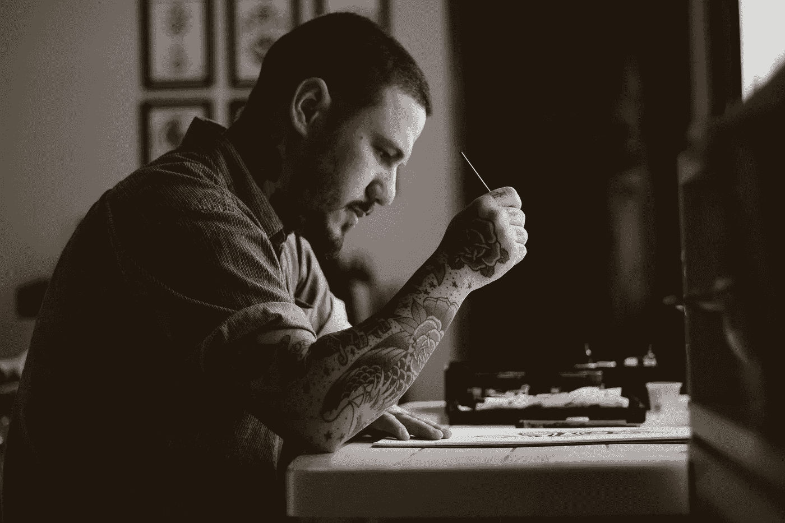

# 我女儿缠着我去参加写作班，我很高兴她去了

> 原文：<https://medium.com/swlh/my-daughter-bugged-me-to-join-a-writing-class-and-im-glad-she-did-a86e9bc073a1>

Photo by [Allef Vinicius](https://unsplash.com/photos/P2BoE6tb8ig?utm_source=unsplash&utm_medium=referral&utm_content=creditCopyText) on [Unsplash](https://unsplash.com/search/photos/writing?utm_source=unsplash&utm_medium=referral&utm_content=creditCopyText)

在我大女儿相当多的纠缠之后，我做了这件事。

我加入了一个写作小组。

实际上，这是一门写作课，但它也是一个写作小组。

我很开心。

我听了她的话。